Manual for Shopper v08.02

> © The Archifact Netherlands ICT Terms 2025 as published on Shopper's Website [www.shpr.nl](http://www.shpr.nl)

Manual for Shopper

Shpr (read: Shopper) is an adaptive procurement tool that integrates in your organization's workflows and helps to optimize these. Shopper facilitates in organizing the processes: Purchase to Pay (P2P), Contract to Pay (C2P) and Source to Pay (S2P). With Shopper you can proactively manage the result of procurement, based on your procurement strategy and policy. Regardless of whether purchasing is organized centrally or in a decentralized way, or if you want to change this. Shopper allows you to get started quickly and implement changes in short timelines.

### Help functions

In the online help you can navigate to the functionality you want to find out about, by following the [links]{.underline}. In addition to using the online help, there are also other options available in the application to get an explanation of what you see and what you can do with it.

Via the menu (top left of your window) - under the option settings - you will find the "Quick Reference Card", "Frequently Asked Questions" and the PDF version of the "Shopper manual". You can view or print these documents online.

On a detail screen you can see the explanation about an input field by moving the arrow of the mouse pointer over the name/text of the input field. A question mark will then appear (see image). If you click this, a pop-up is shown with the explanation about the input field.

If you are unable to resolve the issue with these help functions, or if you have a problem, please contact the Shopper Helpdesk. You may be asked for the version number of the application. You can request this by clicking on your username at the top right of the screen and then choosing the Shpr option.

### General functions

\>\> [Login, user settings and absence](#login-user-settings-and-absence)

\>\> [Homepage & menu](#homepage-menu)

\>\> [Home dashboard](#dashboard-home)

\>\> [Use of the other screens](#use-of-the-other-screens)

### Purchase process 

\>\> [Order requisition](#request)

\>\> [Supplement](#supplementing-requisitions-shopper) requisition items

\>\> [Approve requisitions](#approve-requisitions-in-shopper)

\>\> [Place the order](#place-order)

\>\> [Receive](#to-be-received) ordered items

\>\> [Installment payments to be released](#installment-payments-to-be-released)

### Status requisitions

\>\> [From request to receipt](#from-request-to-receipt)

\>\> [Invoices and payment](#invoices-and-payment)

### Offers and Contracts

\>\> [Quotation process](#quotations-dashboard)

\>\> [Contract process](#contract-process)

\>\> [Contract request](#contract-requests)

\>\> [Contract Approval](#contract-approval)

\>\> [Activate contract](#activating-contract)

\>\> [Approve contract offtake](#_Afname_accorderen_Contract)

\>\> [Contract invoice processing](#contract-invoice-processing)

\>\> [Contract management](#contract-management)

### Budget control

\>\> [Annual budgets](#annual-budgets)

\>\> [Budget types](#budget-dashboardreporting)

\>\> [Budget control dashboard](#budget-dashboardreporting)

### Procurement

\>\> [Catalog management](#catalog-management)

\>\> [Overviews & Reports](#_Overzichten_&_Rapporten)

\>\> [Dashboard](#_Dashboard)

### Warehouse

\>\> [Warehouse management](#warehouse-management)

\>\> [Stock management](#stock-management)

\>\> [Pick-up from warehouse](#pick-up-from-warehouse)

\>\> [Using Scanner in warehouse](#using-scanner-in-warehouse)

### Finances

\>\> [Incoming invoices and audit trail](#incoming-invoices-and-audit-trail)

\>\> [[Accounting](#accounting)](#accounting)

\>\> [Invoices dashboard](#dashboard-invoices)

### Administrative tasks

\>\> [Organization](#organization)

\>\> [Employees and authorizations](#employees)

\>\> [Signing authority / Power of attorney](#signing-authority-power-of-attorney)

\>\> [Workflow](#workflow)

\>\> [System parameters](#system-parameters)

\>\> [Email notifications](#e-mail-notifications)

\>\> [Countries and currencies](#email-frequency)

### Mobile

\>\> [ToDos via the mobile application](#todos-via-the-mobile-application)

# Logging in to Shopper

## Login, user settings and absence

You can access the application by logging in with your username and password. If you exceed the number of login attempts, your user account will be made inactive. In this case contact your administrator to reactivate your user account and reset your password.

If Shopper is installed with Windows Authentication/Single-Sign-On (SSO), the user will access Shopper via Windows. When you open the application, you will immediately see the \>\> [home page](#homepage-menu). If the user in Windows is not known in Shopper, then a login dialog appears in the browser where you can log in with a Windows user who is known in Shopper. (This can be prevented by creating the user under the same name in Shopper.)

The login remains active as long as the application is used and/or until the (session) time-out occurs (time-out period of the browser cookie).

### Changing password

If you are logged in and have access to the menu, you can choose the menu option change password in settings. You will then be asked to enter the existing and new password.

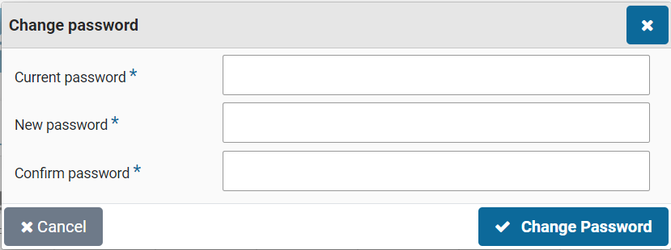

The password changing option only applies to a Shopper login. If Windows authentication (SSO) is used, then this does not apply.

### Multi-Factor Authentication (MFA)

If Multi-Factor Authentication (MFA) has been set for an employee, the login (using username password or Windows Authentication) will require to additionally provide an authentication-code. This authentication-code is obtained using a third-party authentication App. This authentication-code serves as a one-time-only password for gaining access to Shopper. Windows Authentication can also be combined with MFA. In this case the MFA is started when opening the Shopper application.

The first time the MFA is used for an employee, the account must first be registered in the designated mobile authentication App.

Supported Authentication Apps:

- Google Authenticator

- Microsoft Authenticator

- Configure MFA_FreeOTP_LinkText

- Yubico Yubikey

- Authy

Depending on your mobile phone, the app can be downloaded and installed using the Apple App-Store or the Google Play-Store.

**Note**: If you don't have the App available or decide to install the App at a later stage, then use the "**Cancel**" button to postpone the account creation with the authentication App. You will be returned to the Shopper login screen.

Open the authentication App and Scan the QR-Code displayed by Shopper (see screenshot here on the left). Next the authentication App will create the "Archifact-iShopper" account, with the name of the employee in the subtext.

**Note**: If the authentication App requests an account type, then select "Other".

The authentication App will display an authentication code, that need to be entered in the corresponding field in Shopper (at the bottom of the screen).

Press the "**Send**" button to verify the authentication code and to have Shopper establish the MFA-connection to the corresponding user account for the employee. If successful, the user is redirected to the homepage of Shopper.

The authentication code consists of a set of 6 digits that changes every 30 seconds. The digits result from a SHA1 algorithm, making it unlikely that this code can be deducted within these 30 seconds. Additionally, the employee will be inactivated if the maximum MFA login attempts are exceeded, just like with the password login.

Note: If the user account of the employee in Shopper is reactivated (for example after deactivation caused by exceeding the maximum MFA login attempts) the password is also reset, forcing the user to specify a new password. Additionally, it is required to use the authentication App and recreate the account. Depending on the authentication App used, it can be required to first remove the existing account.

Once the account is created in the authentication app and it is activated in Shopper, the consecutive MFA logins will request the 6-digit authentication code to be entered, based on the code obtained using the authentication App. Press the button "Verify" to validate the authentication code and upon success get redirected to the Shopper home screen.

If you do not have the authentication App available at that time, use the link "Cancel" to abort the MFA login attempt.

**Note**: The code changes every 30 seconds. The authentication App will indicate if this is about to happen. Keep this in mind when entering the code in Shopper. If the code is changed before you can press the "**Verification**" button in Shopper, the code will be rejected, and you will have to enter the new code shown in the authentication App.

Just as before, each rejected authentication code will count as a failed login attempt (regarding the maximum number of login attempts). Cancelling the MFA verification does not count as a login failure.

**Note**: If you are no longer in possession of the mobile phone with the authentication App of if you reinstalled the authentication App and the Shopper account is no longer available in the App, you will have to request the Shopper administrator to reset your account/password, allowing you to restart the account registration process, using the authentication App.

### User settings

In the User Settings you can choose your user settings. In the screen dialog you can set your personal preferences for using the application.

Here you can set, for example: what is shown on your homepage; if you want to track the requisitions made by your co-workers (Checkbox "Show own requisitions only"); which notifications you want to receive (Checkbox "success notifications" & "CC own orders"); if you want to open the shopping cart directly if you are authorized for only one organizational unit and cannot perform requisitions for projects (Checkbox "Open cart directly"); and in which language you want to work.

### Absence

In the user settings you can also specify your absence in the "Absence/Delegated" section. When registering your absence, you can specify which employee may perform your duties during the absence. This employee assumes - for the specified period - your tasks & access rights and therefore does not have to possess these him/herself.

The absence already entered is listed in the list below. You can pre-register your absence for several periods. All registered absences are listed.

If you do log in during a specified period, you will not have access to your tasks and access rights. So, if you are back earlier than "Up to and including" of your absence. Then you have to reset this to regain access to your tasks and permissions.

When an employee has delegated tasks and associated authorities to you, you will find this mention in the section "Delegated by".\
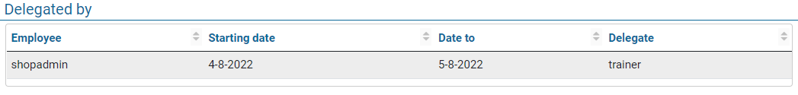

If you have been delegated by several employees, these will all appear in this list. The related ToDos for these tasks can be found in the ToDo process flow on \>\> [Dashboard Home](#dashboard-home) or at the other ToDos, combined with the ToDos for your own task.

### Dashboard Graphs and Charts

In the user settings you can also specify which graphics are displayed on dashboard home. The graphics for your dashboard are displayed in the list and with checkboxes you can indicate what you do and do not want to be displayed.

If no graphics are relevant to you, the list will be empty.

### Quick access

The user settings include the option to add quick access buttons to menu-items. Select the data module "Quick access\" and mark the checkbox for the menu-item for which a quick access button should be provided. The menu items you can choose from are delimited by the role for which you are authorized in Shopper. More information on where to find the quick access buttons on the screen, see **Quick access** under \>\> [Use of other screens](#use-of-the-other-screens).

# Shopper homepage

## Homepage & menu

After logging in, the application opens by default with the homepage for "Dashboard P2P" or "Dashboard Contracts", as described under \>\> [Dashboard Home](#shopper-home-dashboard).

It is recommended to use the application - by maximizing the window - in full screen mode. The layout of the homepage and menu may differ per user. However, the components below are a fixed part of every start screen (homepage).

### Menu

On the left side of the screen is the menu bar with the main menu. In the menu you will find the features to which you have access - based on your access rights. The menu items in the main menu are identified by their own symbol (see below).

When the main menu is expanded, the text is also displayed next to the symbol. The main menu can be collapsed and expanded via the menu button (as shown above). If your screen has a limited resolution, it is recommended to collapse the menu.

The color of the menu is linked to the administration you work in. In other words, the color changes if you choose a different administration (see also **Title bar**).

After choosing a menu item in the main menu, a submenu is expanded. There you can choose the function you want to use. Some menu items also have a submenu from which you can choose.

**Note**: Some menu items are linked to license modules. In other words, if you have not purchased this license, this menu item is not applicable.

  ---------------------------------------------------------------------------------------------------------------------------------------------------------------------------------------------------------------------------------------
        Home:           This menu item will take you back to the homepage
  -------------------------------------------------------------------------------------------- --------------- --------------------------------------------------------------------------------------------------------------------------
        Settings:       This is the submenu for settings and support

       Shop:           This is the submenu for the order functionality

      Dashboards:     This is the submenu for displaying dashboards

       Budget:         This is the budget control submenu

     Quotation:      This is the submenu for quotations

       Contract:       This is the submenu for contracts

      Finances:       This is the submenu for invoicing and financial administration

      Procurement:    This is the submenu for procurement

  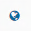     Organization:   This is the submenu for the setup of your (procurement) organization

      Process flow:   This is the submenu for the setup of the authorized signatory scheme, roles and workflows (that direct the process flow)

     Warehouse:      This is the submenu for warehouse

       Supervisor:     This is the submenu for supervisor

      Management:     This submenu can appear on all menus and is only available if you have a management role

      Reports:        This submenu appears in various menus and provides access to the related reports

     Orders:         This submenu appears on several menus and provides access to functionality in relation to orders
  ---------------------------------------------------------------------------------------------------------------------------------------------------------------------------------------------------------------------------------------

### Title bar 

At the top of all screens, you will find the title bar. The title bar contains several buttons and flags regarding the active administration, the logged in user and other activities as explained below.

| Column 1 | Column 2 |
| --- | --- |
| #### Shopper logo | Opens the homepage |
|  |  |
| #### Active administration                                                                                                                                        | The active administration is shown here. If you want to switch administration, press this button, and select the relevant administration. The color of the screen layout varies per administration. If there is a flag in an administration, then there are ToDos that require attention. Also, when an administration is selected, the adjacent tag will be **red** in the list. |
|                                                                                                                                                                   |                                                                                                                                                                                                                                                                                                                                                                                   |
|                                                                           |                                                                                                                                                                                                                                                                                                                                                                                   |
|                                                                                                                                                                   |                                                                                                                                                                                                                                                                                                                                                                                   |
|                                                                           |                                                                                                                                                                                                                                                                                                                                                                                   |
| Column 1 | Column 2 |
| --- | --- |
| [Other ToDos ]{.underline} | Under this tab you find a list indicating the total number of other ToDos that still need to be completed. These are ToDos that are not part of the regular process within the ToDo process flow. |
| \ | Pressing this button folds out the list of other ToDos -- subdivided by type, with an indication of the number of outstanding tasks per specific ToDo. By clicking on a ToDo, you enter the related details screen to be able to follow up on these ToDo(s).\ |
|  | In addition, this list can show the ToDos from the process flow ToDo of other administrations. They are displayed in the color of this administration. When you choose such a ToDo, you automatically switch to the relevant administration where you can find this ToDo in dashboard with this Process Flow ToDo. |
| #### Active shopping cart                                                                                                                                         | The button with active shopping carts is located at the top right and is only shown if you still have shopping cart(s) open. An indication is shown of the number of shopping carts. By pressing this button, the shopping cart is opened, or you can choose which shopping cart to open.                                                                                         |
|                                                                                                                                                                   |                                                                                                                                                                                                                                                                                                                                                                                   |
|  |                                                                                                                                                                                                                                                                                                                                                                                   |
| Column 1 | Column 2 |
| --- | --- |
| #### Install as App | This button opens the Shopper application in a separate browser window which can then function as an individual app. |
|  |  |
| #### Active user                                                                                                                                                  | The button shows the username of the logged in employee. Pressing the button opens a submenu with the menu options: Logout (not available with SSO), toggle/switch between the mobile and web view of the application and the Shopper information (including version number).                                                                                                     |
|                                                                                                                                                                   |                                                                                                                                                                                                                                                                                                                                                                                   |
|                                                                           |                                                                                                                                                                                                                                                                                                                                                                                   |
+-------------------------------------------------------------------------------------------------------------------------------------------------------------------+-----------------------------------------------------------------------------------------------------------------------------------------------------------------------------------------------------------------------------------------------------------------------------------------------------------------------------------------------------------------------------------+

In all screens, below the Title bar there is a second bar with buttons for accessing the menu and help. The button for the active shopping cart also appears on the requisition screen.

| Column 1 | Column 2 |
| --- | --- |
| #### Menu button | With this button you can collapse or expand the menu. |
|  |  |
| #### Help button                                                                              | This button opens the online help.                                                                                                                                                                                                                                                                                                                                                                                               |
|                                                                                               |                                                                                                                                                                                                                                                                                                                                                                                                                                  |
| ####  |                                                                                                                                                                                                                                                                                                                                                                                                                                  |
| Column 1 | Column 2 |
| --- | --- |
| #### Shopping cart | This button is located at the top right (left of the help button) for the requisition screen. On the button is an indication with the number of items in the shopping cart for which the requisition has not yet been confirmed. By pressing the button, the shopping cart is collapsed or expanded. Sometimes it is practical to collapse the shopping cart to see the full display of the catalogs on a low-resolution screen. |
| ####  |  |

### Shortcuts

It is also possible to move around screens without using the mouse:

- The tab or shift + tab key can now be used to navigate through all elements on the screen.

- Arrow keys to change state switch selection.

- Space + enter to open a dropdown box.

- Arrow keys to select the date in the calendar view.

- Tab keys to walk through the process steps in the process flow ToDo and status flows on the dashboard.

- Escape to close a popup message.

- Control + Home goes to the homepage.

- Control + M opens the menu.

### Site Map

As part of the "Home" menu the site map can be selected.

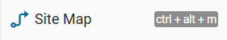

This will present an overview of all the menu items, listed within the menu structure. You can open a menu item by selecting the corresponding link.

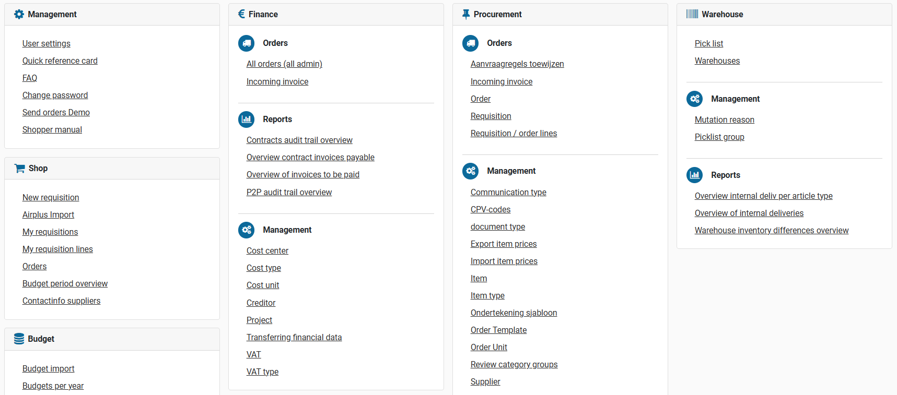

### In progress

When a button or action is taken from the Shopper application a spinner will be shown. In case it takes longer than expected a "Still pending" popup is displayed informing you about the waiting time.

# Shopper Home Dashboard

## Dashboard Home

The Process flow is shown on the Dashboard Home for all purchased license modules. Dashboard home is comprised of several tabs that only show the process flow for one license module, such as the P2P dashboard, contracts dashboard and quotations dashboard. You can switch between them by clicking the corresponding tab at the top. Upon returning to the homepage the dashboard that was last used will be shown.

If there are ToDos on another dashboard that require attention, there is a red flag with an exclamation mark. You can then choose this dashboard to follow up on these ToDos.

The homepage only shows the process steps and dashboards to which you have access rights. So, the setup of the dashboard and the process flow may be different for you than for your co-worker.

**Note:** In the user settings the standard tab can be set by assigning the default home page as "Dashboard P2P", "Dashboard contracts" or "Dashboard quotations"). To change the default homepage, see **User settings** under \>\> [Login, user settings and absence](#login-user-settings-and-absence)).

### ToDo process flow

The ToDo process flow is a visualization of the process. It is made up of a sequence (flow) of the process steps shown in a process flowchart. These process steps are connected using arrows that indicate the order in which these steps are processed. This order is determined by the dependencies in this process and cannot be changed. However, the role assignments and workflow setup will result in different actions that need to be performed for the steps "Supplement" and "Approve". For more information see under \>\> [Workflow](#workflow).

The number of pending actions (ToDos) for the tasks assigned to you, are listed under the respective process steps. If you are not authorized to perform a task, the corresponding process step will not be visible/available in the process flow ToDo.

Below is the example of the ToDo process flow for the P2P purchasing process. The starting point of the process flow is the logo of your company/organizational unit. In this example the image/logo with the Archifact chameleon. (The logo may differ depending on the administration.)

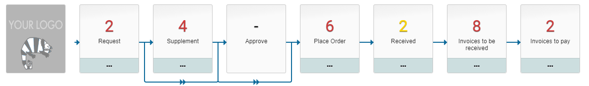

If there is a pending action (ToDo) that you can perform, there is a number listed at the relevant process flow step. This number represents the number of ToDos in this process flow step. The color of the number indicates the **urgency** or the **type** of the most important ToDo. By clicking on the ... (three dots) below the process step, you will get a detailed description of the color coding. Hovering your mouse pointer over the colored box will clarify the urgency or type.

 

Selecting the relevant process flow step opens a screen where you can perform the ToDo. You can only choose process steps that contain a number. Except for the "Requests" process step, this one is used to request a new requisition or to complete a one that has not yet been submitted/confirmed.

### Global information (optional)

This section is displayed for employees who are authorized for the role "[P2P-Beheerder]{.underline}" (Orchestrator), as part of the echelon "P2P-Inkoop". In this section you will find several diagrams that show how the purchasing process is performed. The composition can differ and can be customized for each implementation.

Consult \>\> [Login, user settings and absence](#login-user-settings-and-absence), section "**Graphics dashboard**" about the possibilities to limit the displayed graphs to your personal choices.

# Shopper screen layout

## Use of the other screens

### General screen layout

After choosing a process step on the home dashboard, or after choosing a menu item, a (detail) screen is opened. The content and layout of these screens differ per function, but the structure and operation are in accordance with the description below.

By default, these screens are made up of several main sections: 1) "the List", 2) "the data Modules" and 3) "Details". Above these sections is 4) "a search bar". Optionally, there is also 5) a list of the relevant requisition-/order lines. There may also be 6) action buttons visible with which you can initiate the processing indicated on them. On top (below the reported active administration) the "Quick Access" buttons.

Note: In this manual, references to the items in the "Modules" section (2) are made using the name "Data module".

### Search bar and list

On the left side of the screen, you'll see the list of those items that are relevant according to your role and access rights. For example, a list of orders for which you can perform a (follow-up) action.

If many items apply, you can narrow the list of items through a search. Enter the search criteria and with the "Search" button (magnifying glass) you will perform the search on the items in the list. The list then shows only those items that match the search criteria you entered.

The button with the three dots gives you more selection fields for the search, so that you can also search the data in a data module.

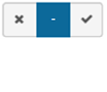The indicator for state may be checked as "Yes", by selecting the checkmark, or as "No", by selecting the cross. You switch the state by clicking the item. The dash stands for no choice, in other words it is not included in the search criteria.

If there are a lot of items in the list, a narrow bar with three dots may appear at the top of the list. If you click on it, you will be given the option to specify a filter to limit the number of items in the list.

The list is limited to those items that contain this text anywhere in their data. So not just to the data that you can see in the list itself.

**Note**: the filter can only be applied on what is in the list. What is in the list depends on the specified search criteria and the maximum number of lines (500) to which the list is limited. If you cannot find an item, adjust the search criteria to shorten the list.

You can also expand the list to create a table, in which more information becomes visible so you can narrow down your choice. For this view read the "Spreadsheet screen" section.

### Quick Access

The Quick Access buttons are positioned to the right of the button used to collapse or expand the menu. To setup the Quick Access buttons, see **Quick Access** under \>\> [Login, user setting and absence](#login-user-settings-and-absence). The Quick Access button reduces the number of clicks needed to access the referred menu-item, because you don't have to drill down in the menu structure to access it.

### Modules and details

For the selected item from the List, the data for the relevant data Module is shown in the right section of the screen. You can choose a data module from the list of modules that are shown on this screen. If you want an explanation of a data field, you can click with the mouse pointer on the name/text of the field to get more information about it.

Whether the data can be edited depends on the status, the relevant function of the screen and your access rights. Editable data has a white input field and data that cannot be edited is shown in [gray]{.mark} in a dashed frame. If an input field is mandatory, an asterisk will appear next to the name of this field. Mandatory fields must be completed before you can save the data.

Different data modules may apply to an individual item in the list. This is determined by the item type and the function of the screen. There are two types of data modules:

A data module for which one-to-one data can be displayed.

A data module with multiple data entries. If multiple items apply you will be provided with a list of items instead of the details of the one item. By selecting an item from the list, the resulting (detail) screen is opened with the data modules and data that apply for it.

### Requisition-/order lines

If applicable, related items are also displayed at the bottom of the data module, such as the relevant requisition-/order lines for a requisition/order. With a filter and by means of which you can scroll here. You can also set the number of lines/rows per page. (See also **spreadsheet screen** later in this text for how to operate this part)

### Screen controls

On the screen, you may see the following buttons:

*General buttons*:

> The "Home" button will take you back to the homepage. You will be notified if any edits have not yet been saved.
>
> The "Back" button will take you back to the homepage. Also, here the warning if edits have not yet been saved.
>
> The "Search" button opens a dialog to select the entry from a list, which is then entered in the relevant entry field. (See also **spreadsheet screen**)
>
> The "Open" button opens the detail screen of the item entered in this input field. You can then view or change the details there.
>
> The "Expand" button shows a list of items that can be selected for this input field (dropdown), with the option to search in this list.
>
> The "Upload" button allows you to add a document or image. You can choose a file that is on your computer.
>
> The "Download" button allows you to view, print or save a document or image to your computer.
>
> The "clear" button clears the input field or removes the selection of the file (for an image or document).

*Buttons for a short list of items:*

> The "Expand" button displays the list of items -- as an overview in table form -- in full, so that more details are clear. (See also **spreadsheet screen**).
>
> The "Collapse" button closes the expanded overview (spreadsheet screen) and takes you back to the details screen.

*Other controls:*

| Column 1 | Column 2 |
| --- | --- |
| #### Date field |  |
| In a date field, you can press the calendar symbol or place the cursor in the field to display the calendar for the date selection. |  |
| If no date has been entered yet, the calendar shows the month and year for today. |  |
| Otherwise, the month and year of the entered date will be displayed. With the arrows you can go to the next or the previous month. By pressing month & year in the middle a pop-up is shown for the choice of the month. You can use the arrows to go to the next or previous year. By pressing the year, a pop-up is shown for the choice of the year. |  |==============================================================================================================================================================================================================================================:+
| #### Dropdown                                                                                                                                                                                                                                                                                                                                           |                                                                                                                                                         |
|                                                                                                                                                                                                                                                                                                                                                         |                                                                                                                                                                                                                                               |
| When entering data via a drop-down, you can select an item from a list. If the field was previously filled in, this value can be deleted by clicking the cross.                                                                                                                                                                                         |                                                                                                                                                                                                                                               |
|                                                                                                                                                                                                                                                                                                                                                         |                                                                                                                                                                                                                                               |
| By clicking on the down arrow, a list will appear in which you can 'scroll', if applicable. If you have a long list, you can also narrow down the list by searching for a letter combination.                                                                                                                                                           |                                                                                                                                                                                                                                               |
|                                                                                                                                                                                                                                                                                                                                                         |                                                                                                                                                                                                                                               |
| By clicking on the item from the list, the item is selected and filled in for this field.                                                                                                                                                                                                                                                               |                                                                                                                                                                                                                                               |
| Column 1 | Column 2 |
| --- | --- |
| #### Action buttons |  |
| These buttons have different functions. The script on the respective button indicates the function. If you have changed data in the screen, you must first save it before you can use the action button. |  |
| #### Save                                                                                                                                                                                                                                                                                                                                               |                                                                                                                                                      |
|                                                                                                                                                                                                                                                                                                                                                         |                                                                                                                                                                                                                                               |
| The changes made, are confirmed, and saved.                                                                                                                                                                                                                                                                                                             |                                                                                                                                                                                                                                               |
| Column 1 | Column 2 |
| --- | --- |
| #### Cancel |  |
| The changes made, are reversed and the operation aborted. |  |
| #### Filter                                                                                                                                                                                                                                                                                                                                                                                                                                                                                                                                                                                             |
|                                                                                                                                                                                                                                                                                                                                                                                                                                                                                                                                                                                                         |
| You may see three dots at the top of a list. You can open the filter field by clicking these dots. The list below will then be limited to what is selected by the filter, where the filter is a string of punctuation marks that appear somewhere in the name or description in the list. You can hide the filter field by clicking the three dots.\                                                                                                                                                                                                                                                    |
| **Note**: the filter is limited to what is in the list. What is in the list depends on the specified search criteria and the maximum number of lines that can be displayed in the list. If you cannot find an item, adjust the search criteria to shorten the list.                                                                                                                                                                                                                                                                                                                                     |
| Column 1 |
| --- |
| #### Prefill fields |
| The search bar can contain prefill fields that provide a selection of items based on the text that is entered. The entered text is used as a mask to make the selection. Entering part of a word will include all items that contain this word. You can select the item that you want to search for. If you want to search for multiple items that confirm to the typed text, use the escape key to hide the list of selected items. The text is then displayed encapsulated by % symbols. |

### Spreadsheet screen

On a spreadsheet screen, the data for an item is displayed in columns, with one line for each item. You can scroll horizontally and vertically if not all the data fits on the screen. A search bar is usually available at the top to reduce the number of rows to the items that meet the specified selection criteria (see also **Search bar**). Additionally, the data on this screen can be exported to MS-Excel.

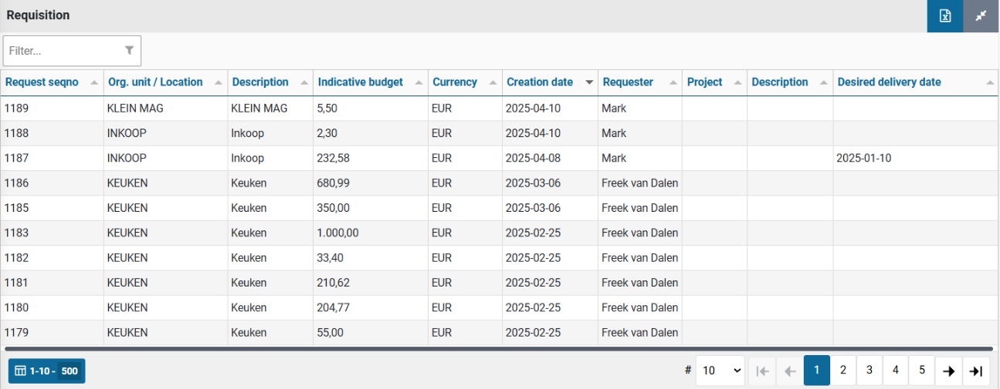

The following buttons are present on the spreadsheet screen: 

| Column 1 | Column 2 |
| --- | --- |
| #### Number of rows per page |  |
| If many records / rows are selected for display, this will be split into several pages for you to browse. In the field "Page Size" you can indicate how many rows you want to see per page. This change will be remembered the next time you use this screen. |  |=========================================================================================================:+
| #### Filter                                                                                                                                                                                                                                                                                                    | 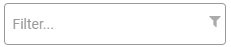                |
|                                                                                                                                                                                                                                                                                                                |                                                                                                          |
| The filter limits the number of selected records to those records that contain the text of the filter. The filter works on all fields/columns shown and additionally filters what has already been selected via the search bar.                                                                                |                                                                                                          |
| Column 1 | Column 2 |
| --- | --- |
| #### Sort button | 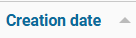 |
| Above each column is a sort-button. The sort-button allows you to display the records sorted from a to z or from 0 to 9, starting from this column. Clicking this button a second time reverses the sort order, i.e., from z to a or from 9 to 0. The arrow next to the label indicates the sorting direction. |  |
| #### Displayed records and total number of records                                                                                                                                                                                                                                                             |                  |
|                                                                                                                                                                                                                                                                                                                |                                                                                                          |
| At the bottom left is a counter that indicates which records are shown on the screen. In addition, the number of records selected in total.                                                                                                                                                                    |                                                                                                          |
| Column 1 | Column 2 |
| --- | --- |
| #### Browse |  |
| At the bottom right of the page navigation, where the colored box indicates which page is displayed, you can go directly to a page by checking the box with that number. With the buttons to the left and right you can move left or right or jump all the way to the first or last page. |  |
| #### Close                                                                                                                                                                                                                                                                                                     |                  |
|                                                                                                                                                                                                                                                                                                                |                                                                                                          |
| Close the screen with the cross in the top right corner. Applicable only when the spreadsheet screen is expanded / displayed on a flat screen.                                                                                                                                                                 |                                                                                                          |
| Column 1 |
| --- |
| #### Collapse |
| Using the button with the two arrows facing each other, you can collapse the spreadsheet overview en return to the list view with the data modules. |
| #### Export data to Excel The export button is located at the top right of the spreadsheet screen (next to the collapse button). Using this button will export the data on the spreadsheet screen to MS-Excel.                                                                                                                                                                                                            |

# Shopper Basis

## P2P dashboard

The P2P dashboard can show the process diagrams for "Process flow ToDo", "Status requisitions (read only)", "Process flow management" and the "Global Info" section, depending on your role assignments within the P2P process.

The process diagrams visualize the process steps that apply within your organization for the life cycle of an order / requisition. The flow of the process steps is fixed and visualized by the connecting arrows. For conditional process steps, an arrow is displayed that extends below the process step. So, these are only run through if they apply to a specific order.

### Process flow ToDo

The purchasing process for P2P is a sequence of necessary actions/activities (ToDos) - to request an order (requisition), to supplement it, approve it, sent it to the supplier (order) and to handle receipt and payment - whereby these ToDos are grouped within different process steps corresponding to the related tasks (Request, Supplement, Approve, order, etc.). The various process steps that are available in the process flow ToDo diagram depend on your role in the organization.

For a general explanation of the operation of the ToDo process flow, see \>\> [Home dashboard](#dashboard-home)

Based on the workflow setup for your organizational unit or project - in reference to the source, content, and amount of the requisition - various ToDos can apply, that consecutively complete and approve the request. See the option for the workflow setup under \>\> [Workflow](#workflow).

### Tasks / Process steps P2P

\>\> [Request](#request)

\>\> [Supplement](#supplement)

\>\> [Approve](#_Accorderen_bestelling)

\>\> [Place Order](#place-order)

\>\> [Received](#to-be-received)

\>\> [Invoices to be received](#invoices-and-payment)

\>\> [Invoices to pay](#invoices-and-payment)

### Status requisitions 

You can follow the progress of the requisitions in the process diagram that is displayed under the "Status of requisitions (read only)". Here too you can open the corresponding screen by selecting the process step, but these screens only provide insight for inspection, and you cannot change or add anything.

For more details on the status of the requisition, read: \>\> [From request to reception](#from-request-to-receipt) and \>\> [Invoices and payment](#_Facturen_en_betaling_1)

The numbers in this process flow diagram represent the number of requisitions / orders in this state. A requisition / order consists of one or more requisition-/order lines, where an order line is first a requisition line, until the requisition is fully approved and can be sent to the supplier as part of an order. The color coding of the numbers is the same as with the ToDo process flow. By default, you will only see the status of the requisitions that you have submitted. You can also see the status of the requisitions from your co-workers in the same department by de-selecting the checkmark "Show own requisitions only" in the user settings.\
See user settings under \>\> [Login, user setting and absence](#login-user-settings-and-absence).

**Note**: you will see the requisitions from your co-workers that have the same limit type authorization for submitting requisitions and then only for the organizational units that you share with them.

### Process flow management

As a team leader, manager, or board member, you can also inspect the progress of requisitions submitted by the employees under your control (i.e., who work within the organizational units assigned to you and that have the same or lower power of attorney as yourself).

In this way you can monitor the progress of the requisitions made by these employees. Even if they are on vacation, sick or otherwise absent.

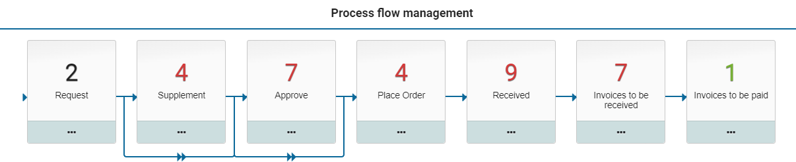

The process flow management is only shown for employees in the role "P2P-Bestuurder" (Board member), in respect to their power of attorney, as part of the echelons "P2P-Manager" and "P2P-Directie" (Board). In other words, this employee has a limit type for approval that is higher than the corresponding limit type of the employees for the same organizational unit.

### P2P-Workflow 

The process step for "Supplement" and "Approve" can be setup with a workflow that can differ between organisational units or projects. A default workflow is set as part of the system parameters or setup the financial administration, that applies to all organisational units and projects that have not been setup with their own workflow.

**Note**: the workflow setup for a project takes dominance over the workflow setup for the related organizational unit.

Additionally, a workflow can be setup for an item type, that takes dominance on requisition lines of this item type. Hence, if a workflow is setup for an item type, then this workflow is used for all order lines of this item type regardless of the organizational unit or project for this requisition line.

**Note**: the other requisition lines within the same requisition (that have another item type) will stick to the workflow that is setup for the organisational unit, project, financial administration, or system parameters.

The image below presents an example of the workflow concatenation for supplement and approve, based on the best-practice workflow scenarios.

**Note**: The workflow for supplement and approve can be setup independently from another. Hence other permutations of the example below are supported within a best-practice setup.

> Workflow 1: This workflow is part of the Shopper base licence. It is comprised of the workflow type Supplement: "None" (Geen) and the workflow type Approve: "Basic" (Basis).
>
> [Workflow type: Approve -- Basic]{.underline}\
> The requisition -- depending on the workflow options and the authorized signatory scheme -- needs to be reviewed and approved. This can involve two workflow steps: "Financial approval" and "Budget approval". The financial approval needs to be performed by an authorized signatory (with the required power of attorney) and the budget approval requires authorized budget holder. Depending on de power of attorney scheme the financial approval step may have to be performed by multiple employees to satisfy the required number of signatures/ approvals.
>
> 
>
> Workflow 2 The workflow steps for "Financial Supplement" and "Procurement Supplement" require an additional license module "Procurement Supplement" (SHOPMOD-AI).

[Workflow type: Supplement]{.underline}\
The requisition lines -- depending on their completeness and source - need to be supplemented. This can involve two workflow steps: "Financial supplement" and "Procurement supplement". The financial supplement has to be provided by the finance department (regarding the booking details for the order line) and the procurement supplement has to be provided by an employee of procurement (the purchasing department).

**Note**: The booking details are -- besides their use for handling the invoice -- also required to determine the designated budget for the budget control in Shopper. This workflow step can also be used to supplement requisition lines for requisitions that originate form OCI (external catalogue). Also see **Derive item type** under \>\> [OCI Link](#oci-link) in the chapter on the administrative tasks.

[Workflow type: Approve]{.underline}\
The requisition -- depending on the workflow options and authorized signatory scheme -- needs to be reviewed and approved. This can involve multiple workflow steps: "Financial Approval", "Board approval" and "Budget Approval". The financial and board approval need to be performed by an authorized signatory (with the required power of attorney) and the budget approval requires authorized budget holder. Depending on de power of attorney scheme the financial and board approval step may have to be performed by multiple employees to satisfy the required number of signatures/approvals.

> Workflow 3 Identical to workflow 2, except for the "Board approval" that is replaced by a "Extra approval". Always requiring additional approval(s) on top of the financial approval.
>
> 
>
> Workflow 4: Identical to workflow 2, with the addition of a supplement workflow step "Business Supplement" regarding requisition-lines of a specific item type, requiring a domain expert (e.g., ICT) to be involved in the supplement workflow.
>
> The workflow-step for "Business Supplement" requires an additional license module "Procurement Supplement" (SHOPMOD-IA).
>
> 
>
> Workflow 5 -- None/Implicit approval: The requisitions can be made without the need for supplementing or approval of the requisition.

**Note**: An elaborate description of the best-practice workflow P2P is provided as "P2P-Workflow Supplement" and "P2P-Workflow Approve" in the chapter \>\> [Workflow](#workflow).

# Order requisition in Shopper

## Request 

To ensure budget control, signatory power, and power of attorney (approvals) are applied according to company policy before an order is sent to a supplier, a requisition must be submitted. This is the first step in the purchasing process, as also shown in the process flow diagram on the P2P dashboard.

Employees authorized for the role "P2P-Aanvrager" (Requester) as part of the echelon "P2P-Medewerker" (Employee) can start a request by clicking on the process flow step "Requests" or via the menu option "New requisition" in the menu "**Shop**".

A requisition starts by selecting the organizational unit and/or project. You will only be able to choose from the organization units (departments/location) and projects assigned to you. Additionally the selectable projects/cost units can be restricted based on the selected organizational unit. Additionally, you have the option to specify a specific "desired delivery date". With the button "Request" you confirm the choice, and the requisition dialog is opened.

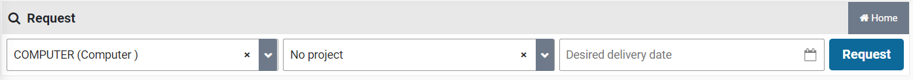

**Note**: You need to first select an organizational unit before the "Request" button can be used

**Note**: If you choose to skip the requisition dialog -- as can be specified in the user settings -- you will not be able to select a desired delivery date. To do so, you need to first disable this option in the user settings if you want to specify the desired delivery date.

If shopping cart(s) already exist, you will see a list of existing shopping carts.

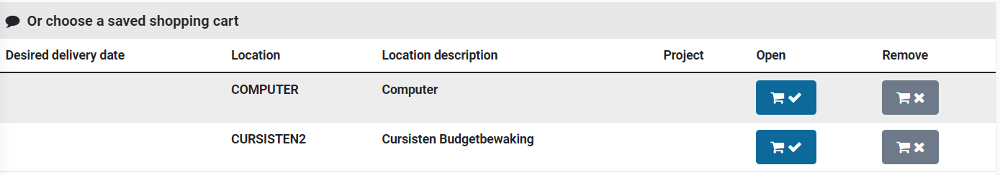

You can then choose the desired action in a shopping cart:

Show the shopping cart and continue adding or removing items. You go to the request screen and continue working with this shopping cart.

Or delete the shopping cart if it no longer applies. All requisition lines of this shopping cart will be deleted.

The existence of shopping carts can also be determined by the indication on the top right part of your screen (to the right of the "Other ToDo's"):

Select this shopping cart indication to directly open the shopping cart. If there is more than one shopping cart, you will be presented with a list of shopping carts. From this list you can select the shopping cart you want to open.

**Note**: If you make a new requisition for an organizational unit that already has a shopping cart for it, the existing shopping cart will be opened containing the already existing requisition lines.

### Request screen

After choosing a shopping cart or entering a requisition for a new shopping cart, you can manage the contents of the shopping cart via the request screen:

In the request screen there are several ways to request an item for requisition:

1.  **Search in internal catalogs\**
    You choose an item from the list shown at the bottom left (see further explanation about the internal catalog in the explanation under the application screen).

2.  **Search in external catalogs\**
    You choose a supplier and in so doing open their website. There you can choose items. After confirmation, the shopping cart from this website is transferred to Shopper.

3.  **Free request\**
    You have: found an item elsewhere; a price estimate or quotation. Then you can enter this via the "**Free request**" button. You will find this button at the bottom left of the overview of the shopping cart. (See also **Change item in shopping cart**)

The offer in the internal catalog is defined by procurement (your purchasing department) with items from different suppliers. By clicking on an item in the internal catalog, the details of this item are displayed in a pop-up. You can scroll and browse through the internal catalog (see also the explanation about the operation of a **spreadsheet screen** under \>\> [Use of the other screens](#use-of-the-other-screens))

 You can request the items from the internal catalog by entering the quantity in the relevant item line in the column of the same name and pressing the shopping cart button.

If the shopping cart is opened, it is possible that (with a lower resolution or a too small size of the browser window) the display of the shopping cart covers part of the request screen (and thus the button with the shopping cart). You can then collapse the shopping cart to see the full request screen. You can also collapse the menu for more screen space. (See also **menu bar** in \>\> [Homepage and menu](#homepage-menu)). *Another option is to adjust the zoom factor of your browser to allow for more room for the full screen to display.*

In the internal catalog you can limit the displayed items to the offer of one supplier. This can be done by choosing a logo from the list. Alternatively, you can use a search or filter.

You can limit the displayed items by entering a search query. Enter the search criteria and press the "search" button (magnifying glass). You can also check "Previously ordered items" to quickly repeat an order for previously ordered items.

You can also quickly find the desired items by entering (part of) the name of the item in the filter.

**Note**: It is possible that the list of items in the "internal catalog remains empty" (or is limited to the previously ordered items). You can then do a search to retrieve the list of items. This can be a choice when setting up Shopper if the list of items is very long to avoid unnecessary waiting times (it can then take longer to build the request screen).

### Shopping cart

The items you have selected will be added to the shopping cart. This is displayed on the right part of the screen. If you do not see the shopping cart, it is collapsed.

You can expand the shopping cart using the shopping cart button\
(see also **menu bar** in \>\> [Homepage and menu](#homepage-menu))

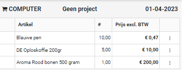

At the top is the organizational unit and optionally the project for which you are adding entering requisitions. The contents of the shopping cart are shown below with a requisition line per item. Selecting a requisition line will open the details view for it, allowing you to make changes. Or:

  --------------------------------------------------------------------------------------------------------------------------------------------------------------------------------------------------------------------------------------------------------------------------------------------------------
  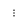   Select the three dots on the right side of the requisition line to open a pop-up menu, with the menu-items "Change", "Postpone" of "Remove".
  -------------------------------------------------------------------------------------------- -----------------------------------------------------------------------------------------------------------------------------------------------------------------------------------------------------------
      You have the option the [change]{.underline} the requisition line (see dialog box under **free request**);

      Or [postpone]{.underline}, meaning this requisition line will not be included in the requisition when using the button "**Confirm requisition**". It remains in the shopping cart for future requisition;

     Or [remove]{.underline} it from the shopping cart.
  --------------------------------------------------------------------------------------------------------------------------------------------------------------------------------------------------------------------------------------------------------------------------------------------------------

**Note**: if you select the requisition line, the "Change" dialog box is opened directly, without the need to first select the three dots and use the pop-up menu.

A status indicator is displayed in front of the requisition line:

  ---------------------------------------------------------------------------------------------------------------------------------------------------------------------------------------
     This requisition line has been postponed
  --------------------------------------------------------------------------------------------- -----------------------------------------------------------------------------------------
  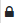    This requisition line has been rejected

        For this rejected requisition line, the "Rejection comment" check box has been checked.
  ---------------------------------------------------------------------------------------------------------------------------------------------------------------------------------------

When all required items have been added to the shopping cart, you can submit the contents of the shopping cart with the button "**Confirm requisition**" at the bottom right.

After confirmation, you will receive a detailed overview of your requisition, grouped by supplier, for checking. You can use the "Back" button to return the application screen for any adjustments.

If applicable, you can specify a different delivery address at the bottom of this overview. You can also indicate whether you want to receive an email when the complete notification of receipt for this application -- at this delivery location -- has taken place.

If applicable an if you are authorized to, the check box "Send whole as a separate order" will be available. You can check this box to indicate that this requisition (as a whole) is to be processed as a separate order and that it cannot be merged with other requisitions for the same supplier.

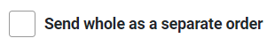

If you are authorized to, you can also use the check box "Requisition not public". This will indicate that other employees within the same organizational unit - for which the requisition is requested - cannot see this requisition when viewing the "Status requisitions" and it will also not be listed when viewing the requisitions or orders using the menu "Shop".

After checking, you can approve the requisition with the button "Apply definitive". Next the requisition will be processed according to the applicable workflow. This workflow can include the process flow ToDo steps for "Supplement" and "Approve" before the order can be placed and the receipt registration can be performed.

The status of the processing can be found in the process flow diagram on the \>\> [Dashboard Home](#dashboard-home) under the "Status requisitions". If you have disabled "Do not show success reports" in \>\> [User Settings](#login-user-settings-and-absence) , you will also see a pop-up with the status of the processing after the "Apply definitive".

You can also confirm at another time. At that moment in the process flow diagram, choose the process step with the shopping cart to continue (see also \>\> [Homepage and menu](#homepage-menu)).

### Declined requisition

If the requisition for an item has been rejected (the number in the process flow step of the shopping cart is then red), you can find it in a shopping cart with the rejected items for this organizational unit/project. You can find the reasons for rejection by choosing to change the rejected item in the shopping cart (Field "Rejection note").

 In the shopping cart there is a padlock in front of the rejected item.

You can make the required change and mark the checkbox "Note reviewed" to indicate that you have seen the reason for rejection. After saving, the padlock next to this item in the shopping cart will disappear. If you want to cancel the requested item, you can choose to remove the item from the shopping cart.

As long as there are still items in the shopping cart with this padlock (that are not postponed), the button "Confirm requisition" is not available. You will first have to change the item in the shopping cart and put the checkbox at "comment read" or else remove the item from the shopping cart. The "comment read" checkbox is below the comment provided by the employee who rejected the requisition. (See also the screen dialog under **free request**);

### Free request (Create requisition line)

If an item is not in the catalogs or if you have a quotation for the purchase of a product or service, you can enter this via the request screen by using the button "Free request". This dialog box is also used if you are changing an item (requisition line) in the shopping cart or when following up on a rejected requisition line. In these cases, the fields are prefilled with the existing data of the requisition line.

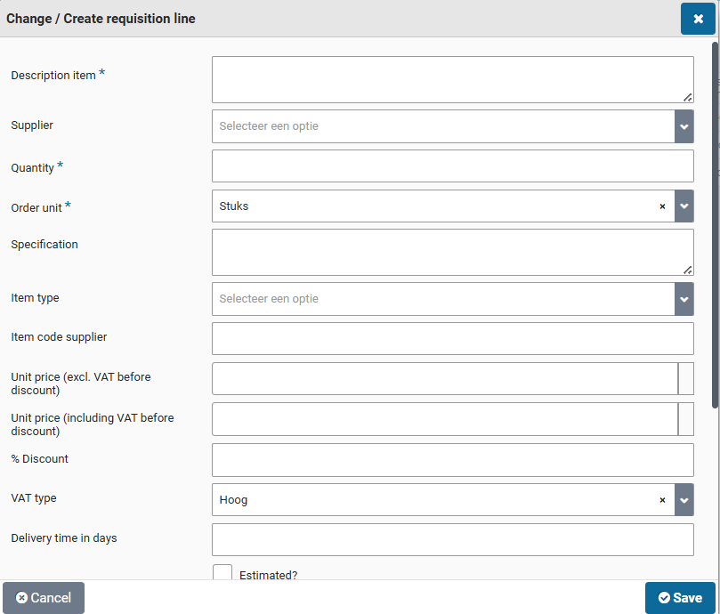

When entering a free request, you can specify the desired item that you want to order (see screen dialog below). The required fields are Description item, Number, Order unit. An employee from procurement (the purchasing department) then needs to complete the requisition.

Additional data about the requisition can also be entered if available. Including the item code used by the supplier, unit price (price per unit) and when applicable the % discount. The unit price can be entered including VAT as well as excluding VAT (when pressing "Save" the other one will be calculated). If you are familiar with the item type (in relation to how this requisition line should be booked financially) it can be specified. The VAT type is derived from the item type, but you can adjust the VAT type if necessary. All the provided data that will be submitted after "Apply definitive" can be validated and supplemented or changed by procurement (purchasing department) and the financial department. Assuring all requirements of the procurement and financial policies are satisfied.

If your organization monitors annual budgets, it is possible that the available budget (Budget available) will be shown in relation to the costing type (category) derived from the item type, combined with the costing unit and costing center for this requisition. An overview of the available budget space per cost center/cost unit is available via the menu "**Shop**" under "Budget period overview"

You can also fill in additional fields or add them to existing requisition lines. For example, you can enter a comment to the supplier (in the field "Specification") or add a "Internal explanation". This explanation internally therefore does not go to the supplier!

In case you have a quote from the supplier, you can add the quote as an attachment. You can then enter the quantity and price per order unit or enter the number "1" as the number and the total of the price quote (even if it includes multiple items).

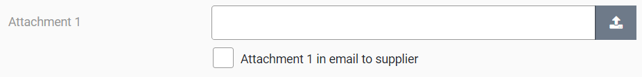

You can add an attachment using the button with the symbol for "Upload file". You can also indicate whether or not this should be sent to the supplier in the email. After uploading a file, the option is offered to add another file. You can add a total of 3 documents if needed.

If an item is temporarily delivered with an extra discount, you as a requestor can specify this discount percentage on top of the price stated in the catalog. For example, for a (short-term) promotional period, the standard price in the catalog can remain unchanged and the promotional discount can be specified with the requisition.

If an additional discount has been agreed by procurement (the purchasing department) with the supplier, it will be adopted here and displayed in the "% discount" field. If applicable, you can still adjust this percentage.

The delivery time in days is prefilled with the value, which is defined for this item in the Shopper internal catalog. For the external catalog (OCI), the value can be provided by the webshop/supplier (using the field OCI NEW_ITEM-LEADTIME). The number of days can be entered manually or updated if required. this option is only available if the support is also set up.

If the actual cost of the item is not yet known, you can check the "Estimated?" checkbox. You can then adjust the price upon receipt, so that the automatic processing of the invoice matching can then be done. This only applies to a free request and this option is only available if the support is also set up.

If the item in question has to be assessed separately - compared to other items that are ordered from the same supplier - you can check "Exclusively in order". A separate order will be placed for this item once it has been supplemented and approved. For example, if you want to order an item urgently or if you want to receive a separate delivery. This option is only available if its support is also configured.

If your organization works with other cost types for booking an order as an investment, the checkbox "Investment" is available. You can then indicate this should be booked as an investment during the free request or when changing items in the shopping cart.

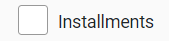

If it concerns an order that has to be paid in installments or that will be delivered in parts, you can indicate this by checking "Instalments". This is only possible if you have chosen an item type that allows 2 or more decimal places. If the decimals are not sufficient, you will see an error message and you can contact an employee from procurement (the purchasing department). This also requires the unit price to be dividable by the number of instalments.

If it is unknown how many instalments will be delivered a paid, leave the number of instalments empty. (For example, if you agreed on a total amount, but there is no set amount for the individual offtake per instalment.)

If you know in advance how many installments will be delivered and paid, you can enter the number of installments. Then press the "Save" button to make these terms visible. By default, an even distribution over all installments is applied. If applicable, you can adjust the distribution over the terms and also the name of this term. The last installment is always calculated so that the total distribution always comes out at 100%.

After modifying an instalment, you first need to save it, before you can modify the next instalment. The percentages of the other instalments will be calculated adjusted.

You can also remove an instalment if it is not needed.

When you have finished entering the distribution you have to close the dialog by pressing the cross at the top right of the screen dialog. If you change the installments or the number of installments, you must first press "Save" again to update the installments.

If you change an item in the shopping cart or after you have saved a free request, the "Copy" button becomes available. With this button you can add the same item again in the shopping cart and you can adjust and save it (if necessary).

**Note**: after using the copy button, the data of the copy is displayed in the window. Transactions you make will then only apply to the copy. If you want to change the original, you will have to choose it again for change in the shopping cart.

**Note**: The window remains visible after using the "Save" button so that you can use the "Copy" button. You can then close the window with the cross at the top right.

### Direct order

If an item is needed immediately (for example for a time-critical production process), it can be specified in the requisition line that the item must be ordered immediately. To do this - when changing the item in the shopping cart (requisition line), or when filling in a free request - check the "Direct order" checkbox. If this checkbox is selected, then the requisition - after final confirmation - is immediately transferred to the process flow ToDo step "Place order". Any approval is handled separately in relation to the invoice processing, so that the order can take place immediately.

**Note:** It is not always possible to request a direct order. This is only possible for organizational units and item types that have been set up for this purpose. As an employee, you also need to be explicitly authorized to request a direct order. Only if all these conditions are met, the checkbox "Direct order" is available for the relevant organizational units and item types.

If after the final confirmation of a requisition - for a direct order - the order can be automatically processed, then the order will be immediately visible to you at the ToDo process step "To be received".

**Note**: Payment of the invoice is only possible after receipt has been reported and, if applicable, the approval of the order has been carried out by the employees concerned. For more details, see **Approving direct order** at [Invoices and payment](#invoices-and-payment).

# Supplementing requisitions shopper

## Supplement

The process step "Supplement" applies for a [requisition line]{.underline} depending on the workflow setup. This setup can differ per financial administration, organizational unit, project, and item type (of the requisition line).

Supplementing is conditionally and depends on the minimal set of required data (as specified for the completeness check). This can apply for a free request, for requisitions from the internal catalog where prices of discounts were modified or for requisitions from other sources (e.g., external catalog). . It can also apply if the field specification or internal explanation is provided as part of the requisition line. Additionally, requisitions for a specific supplier could always need supplementing

Employees who are authorized for the role "P2P-Aanvuller" (Supplementer) can follow up the ToDos for this process step, as part of the echelon "P2P-Inkoop" and "P2P-Financiele administratie". The ToDo for supplementing will be assigned to the employee with the corresponding expertise and authority. As such multiple employees can be involved in completing all supplements.

Take for example the requisition for an ICT item, where this requisition needs to be supplemented for relevance by an ICT employee with expertise in this domain, before procurement (the purchasing department) supplements the requisition data. Possible preceded by a supplement from the finance department regarding how the resulting order/invoice should be booked (supplement the item type).

For information on setting up the Completeness-check and the supplier (regarding supplementing), please read "**Completeness type**" in \>\> [Workflow](#workflow) and "**Supplier**" in \>\> [Catalog management](#catalog-management).

### Supplement ToDo

Selecting the process step "Supplement" -- from the process flow ToDo -- presents the following screen:

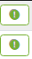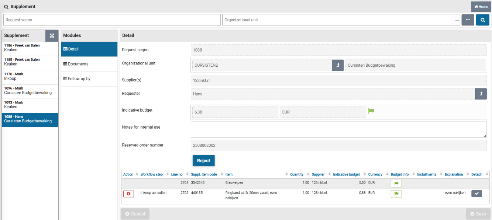

On the left of the screen is the list of item requisitions that can be supplemented (ToDo's). Choose the requisition you want to assess from the list and select the requisition line that needs to be supplemented. Requisition lines that need to be supplemented are marked with an exclamation mark. The color of the exclamation mark corresponds with the urgency/priority reflected in the process flow ToDo for this step. Next to the explanation mark you can see the required workflow step.

**Note**: The requisition itself stays in the state "To be supplemented" until all requisition lines are complete, and no more supplementing is required.

In the "General" data module you can see all the details of the requisition (read-only), including the budget indicator (if applicable). Additionally, you can enter "Notes for internal use". For example, to indicate the progress or to describe what still needs to be done to supplement this requisition.

**Note**: If budget control is active the budget indicators are also visible for each requisition line. See process step \>\> [Approve](#approve) for more details on the budget indicators.

The button "**Reject**" or "**Approve**" can be used to approve or reject the requisition (as a whole). To reject or approve an individual requisition line, first select the requisition line and then use the "**Reject**" of "**Approve**" button. A rejection reason must be supplied when rejecting.

**Note**: The approval button is only available when for all requisition lines the completeness conditions have been satisfied.

**Note**: it is possible that certain requisition lines can only be supplemented by another employee or that the same requisition line also needs to be supplemented by another employee.

**Note**: If a requisition line has an exclamation mark, it still needs to be supplemented, however if you do not have the required role authorization to perform the workflow step indicated for the requisition line, you can view this requisition line, however you cannot modify, reject, or approve it. (i.e., the button "Approve" is only available once all required data fields have been entered and then only for an employee that has the role authorization for "P2P-Aanvullen" (Supplementer) combined with the expertise type that corresponds to the indicated workflow step), as part of the echelon "P2P-Inkoop" (procurement).

For the requisition line in the column "**Detach**" a small button with a checkmark can be visible. Using this button you can disconnect the requisition line that still needs to be supplemented, allowing it to be processed separately from this requisition.

**Note**: the "Documents" data module will contain the documents that were provided during the requisition, or it can be used to add additional documents.

### Supplement the requisition line

Upon selecting the requisition line, you will be provided with the details of this requisition, with the option to supplement them:

In the "General" data module will find all the details of the requisition line. You can supplement or modify them. For example, provide the supplier, item type or correct price.

The required action that needs to be completed to supplement the requisition line is stated at the field "Still to be completed". Once this field is no longer shown, the requisition line still needs to be "Approved" or "Rejected". A rejection reason must be supplied when rejecting.

If needed the fields location and project can be modified, allowing for this requisition line to be booked on a different cost unit/cost center combination, based on the related organization unit and project.

**Note**: The fields location and project cannot be modified once a order number has been reserved for the requisition and only those items can be selected for which the user has access.

Further down you will find the price related details. These can also be changed in which case you have to check the "Deviating price" checkbox next to "Deviating price" check box.

For free requests -- to which no item from the internal or external (OCI) catalog is linked, the checkbox "Deviating price" is selected by default. You need to then check the "Approve" checkbox before you can approve the supplemented requisition.

Note: Only when all "**Still to be completed**" actions have been completed, the "**Approve**" button for this requisition can be used. If you want to reject the requisition line for this item, use the button "**Reject**", that will require you to enter the rejection reason.

When an item that is submitted using the free request ends up in the supplement step, the button "Create item" can be used to add this item (including all details) to the internal catalog for this supplier. This way you can amend your internal catalog or establish one based on submitted requisitions.

When an item that is submitted using the internal catalog ends up in the supplement stap (for example if the price was changed), the button "Change default price" can be used to update the price for this item in the internal catalog. Allowing you to keep the catalog up to date.

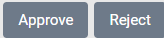

After the addition, you can confirm the addition with the "**Approve**" button. If you choose not to complete the application for this item, but to reject it, you can do so via the "**Reject**" button, where you can enter a comment about the reason for rejection.

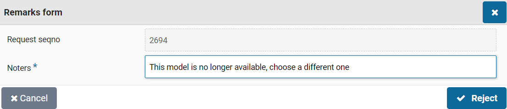

### Reserve order number

In case you want to inform the supplier up-front about an order that will be placed, while the requisition for it still needs to be supplemented, you can make use of the "**Reserve order number**" button. This is only possible if all requisition lines of the requisition are with a single supplier. If the requisition contains requisition lines for multiple suppliers, then this button is not available!

When using this button, the order number is generated and assigned to the requisition. The order number will then be shown (data module "General") at the field "Reserved order number".

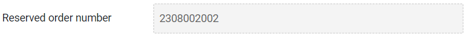

**Note**: this button is only available if all requisition lines end up at the same supplier and only if the indicator "Reserve order numbers possible" is set under \>\> [System parameters](#system-parameters).

**Note**: Using direct orders, it is also possible to reserve an order number.\
See Direct order under \>\> [Requests](#request).

**Note**: The button "**Reserve order number**" can only be used once and is therefore hidden after it has been used. A requisition with a reserved order number can no longer be merged with other requisitions for the same supplier at the process step "Place order".

# Approve requisitions in Shopper

## Approve

The process step "Approve" applies for a requisition depending on the workflow setup. This setup can differ per financial administration, organizational unit, and project (in regard to the requisition). The workflow can include several approve steps, including a financial approval, board approval, budget approval and other relevant approvals that apply within your organization.

Financial approval is required if the total amount of a requisition (i.e., the sum over all requisition lines) exceeds the order limit of the requester (i.e., the limit type for the role assignment "[P2P-Aanvrager]{.underline}" (Requester) of the employee who made the requisition). The ToDo "Approve" is then assigned in the process flow to an authorized signatory (i.e., an employee with the role "[P2P-beoordelaar]{.underline}" (Approver) that has the power of attorney for approving the total amount within the corresponding organizational unit), as part of the echelon "P2P-Manager" or "P2P-Directie".

Depending on authorized signatory scheme the financial approval step may have to be performed by multiple employees to satisfy the required number of signatures/approvals (like with the four-eyes principle). This is often applied for a board approval for requisitions that exceed a certain amount. The board approval for your organization can be given as part of the financial approval, but it can also require a separate board-approval step.

**Note**: It is possible that you are an authorized signatory, but that other employees with lower signing authorizations will handle the approval, so that you do not have to carry out this approval.

Depending on the Shopper configuration, one or more approvals are required to authorize the requisition from the authorized signatory. The process step "Action by authorized signatory" will then be repeated until all required approvals have been obtained. The audit trail will reflect all approvals and rejections for the requisitions.

### Approve ToDo

Selecting the process step "Approve" -- from the process flow ToDo -- presents the following screen:

On the left of the screen is the list of requisitions that can be approved by you (based on your power of attorney). Choose the requisition you want to Approve from the list and view the data in the various data modules so you can make your decision to approve or reject this requisition.

You can view all the details of a requisition, such as who made the request (field "Requester"), the designated department/location (field "Organizational unit"), who has provided approval so far (field "Already approved by") and which approval need to be given now (field "Approve step").

**Note**: If no approval has yet been obtained, the field "Already approved by" is not visible.

If budget control is active, you will find a indicative budget amount for each requisition line, reflecting the amount that will be allocated for the corresponding budget. (Read more in the section below on "Approve or reject")

Under "Notes for internal use" you may find an explanation about the previous action(s) (regarding the processing or approval of this requisition). You can also enter your own comments here or adjust/expand the existing comment. See **Approve or reject** for more details.

**Note**: The "Notes for internal use" that is specified in the shopping cart for a requisition line is accessible via the "Requisition lines" data module of the requisition. This note is also listed in the overview of the requisition lines (at the bottom of the Detail data module) in the "Item" column. The text of the explanation is concatenated after the description of the item.

### Approve or reject

At the bottom of the "Details" data module, an overview is shown of the requisition lines that are part of this requisition. (See also **spreadsheet screen** under \>\> [Use of the other screens](#use-of-the-other-screens)).

 

If budget control applies, the colored flag appears to the right of the total amount for this requisition that shows the total budget impact in relation to all requisition lines, where you can view the details of this joint budget impact with the button "**Budget impact**".

The budget flags are also available for the individual requisition lines, using the same color coding.

 No budgets are exceeded

 The budget for the period is exceeded (a disproportionate amount of budget is used)

 The annual budget is exceeded

By clicking a flag on a requisition line, a pop-up appears with detailed information about the impact on the budget as a result of this requisition line. The budget info shown here depends on the budget indicators set under \>\> [System parameters](#system-parameters).

**Note**: The authorized signatory can therefore also take the impact on the budget into account in the decision-making process. However, this is separate from the budget approval that has to be given by a budget holder if a budget is actually exceeded as a result of this requisition.

After reviewing the requisition, you can use the "**Approve**" or "**Reject**" buttons to indicate whether you -- from the perspective of your signing authority -- want to approve or reject the requisition as a whole.

If you want to provide an explanation of why an approval has been given, you can enter this in the "Notes for internal use" field and then the "Save" button.

**Note**: Do this before pressing the "Approve" button! For example, you can explain why you have approved it for the employee who has to perform the next action authorized to sign or a board/budget approval. If you forgot or want to add an explanation afterwards, you can access the order for this requisition via the menu "Shop" -- Orders.

You can also individually reject a requisition-/order line or adjust its booking.

*Buttons on a* requisition *line:*

> "Reject": requisition line returned to the requester's cart.

"Change booking item": Change the costing unit, cost center, or project for this line.

**Note**: The button "Change booking item" is only available if you have financial authority (i.e., role "P2P-controleur" or "P2P-uitvoerder", as part of the echelon "P2P-Financiële administratie") and then only if no budget control applies for this requisition line. I.e., the requisition line does not allocate within a yearly budget or the indicator "Budget control" is turned off. Also see **administration year** under \>\> [[Accounting](#accounting)](#accounting).

### Reject requisition line

An individual requisition line can be rejected using the thumbs down button for this requisition line, available in the list of requisition lines at the bottom of the "Detail" data module. Opposite to rejecting the requisition as a whole (i.e., reject all requisition lines) using the button "**Reject**".

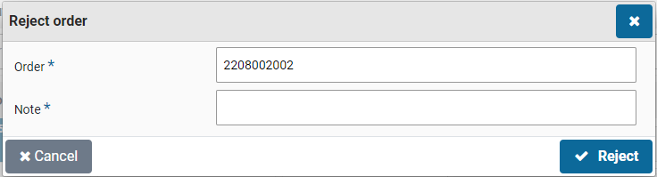

After rejecting the requisition or an individual requisition line, you need to confirm this and be asked to provide a reason for it. This rejection reason is also visible for the rejected requisition line in a shopping cart of the employee who made the request.

### Change booking items

Employees with financial authority are allowed to change the way the (invoice for the) order is to be booked. They can use the button in the column "Change booking items" for a requisition line. After changing the booking items, the "Save" button must be used to confirm the changes.

The costing unit, costing center, project and also the "Investment" indicator can be changed. Additionally, if the requisition could not be approved -- because there was no budget for it -- you can decide to change the booking items in order to have the requisition end up in a budget with sufficient budget space.

**Note**: A booking item can only be changed if this functionality has been enabled under notifications of the \>\> [System parameters](#system-parameters) and the approval step is performed for a financial approval. During the budget approval this button is not available!

**Note**: The selection of the cost unit is restricted by the selection of cost units, setup for the organizational unit. See **organizational units** at \>\> [Organization](#organization).

### Reserve order number

In case you want to inform the supplier up-front about an order that will be placed, while the requisition for it still needs to be approved, you can make use of the "**Reserve order number**" button. This is only possible if all requisition lines of the requisition are with a single supplier. If the requisition contains requisition lines for multiple suppliers, then this button is not available!

When using this button, the order number is generated and assigned to the requisition. The order number will then be shown (data module "General") at the field "Reserved order number"

**Note**: this button is only available if all requisition lines end up at the same supplier and only if the indicator "Reserve order numbers possible" is set under \>\> [System parameters](#system-parameters).

**Note**: Using direct orders it is also possible to reserve an order number.\
See Direct order under \>\> [Requests](#request).

**Note**: The button "**Reserve order number**" can only be used once and is therefore hidden after it has been used. A requisition with a reserved order number can no longer be merged with other requisitions for the same supplier at the process step "Place order".

# Ordering in Shopper

## Place order

Depending on the configuration for your organization and the method of ordering at the supplier, an order may or may not be sent automatically. Orders that have not been sent automatically can be found in the process step "Order". This process step is available for employees who are authorized for the role of "Administrator", i.e., employees who are allowed to perform procurement management or for employees who are allowed to submit their own orders.

### Place order ToDo

Selecting the process step "Place order" -- from the process flow ToDo -- presents the following screen:

On the left of the screen is the list of requisitions that can be ordered (ToDo's). Choose the order you want to process from the list and view the data in the various data modules and decide on how and when the order should be sent.

You can still edit or supplement the order details (for example if the email address is missing or if a different order method is to be used for this order). By pressing the order button, the order is sent to the supplier. If there are any details regarding the order that you would like to share internally, you can enter this in the field "**Notes for internal use**". This will also be visible in the confirmation of receipt. Any comments for the supplier can be entered in the "**Notes**" field. Internal comments regarding the prior authorization are also stated in the field "Notes for internal use".

Note: the field "Order template" is only available based on the settings for the administration. When it is available a different order template can be used for sending the order. Als see **Administrations** under \>\> [[Accounting](#accounting)](#accounting).

When an "Expected receive date" is known it can be entered or you can mark the checkbox "A.s.a.p." before you sent the order, and then confirm this by using the "Save" button. If a "Desired delivery date" was specified for the requisition, it will be in the field "Expected receipt date".

The delivery costs are derived from the delivery costs specified for the supplier in Shopper. You can mark the checkbox "Deviating costs" to specify them.

**Note**: delivery cost handling is only available in the Shopper Enterprise edition.

At the bottom of the "General" data module, an overview is shown of the requisition lines that are part of this order. (See also **spreadsheet screen** under \>\> [Use of the other screens](#use-of-the-other-screens)).

*Buttons on the requisition line:*

> Reject: place item(s) back in the requester's shopping cart.
>
> Disconnect: Create a separate order for this requisition line to order or reject them separately.
>
> **Note**: The order line itself will be removed from the original order, however, the separate order with this order line will only become visible once you reload the list of orders.

The "General" data module for the order and the "Detail" data module for the requisition lines display several fields that contain an arrow-button. If you have the authority, you can use this button to access the underlaying data.

This allows you -- for example -- to access the requisition for the requisition line of the order, including the other items that are part of this requisition, if applicable.

The "Purchaser" data module contains the data of the requester(s), the receiver, and the recipient address, with the option to modify them.

The "**Order documents**" and the "**Communications**" data module can be used to add information regarding the coordination with the supplier and optionally the related papers. Additionally, the "**Reviews**" data module can be used to add a review of the supplier.

Depending on the order method at the supplier, a specific button is shown for sending the order. For example, "**Place** **Order**" or "**Print and order**". If the order cannot be sent for technical reasons - for example because the e-mail address is missing in the case of the order method e-mail - then no order button will be displayed. In this case, you must first enter the email address to activate the button. If you have changed the order method or order details, you must first save the order before the correct order button becomes available.

If you want to delay sending the order but want to review the order form for this order (validating its contents), you can view the order form using the "**Order form**" button. You can repeat viewing the order as often as needed (to validate the order form regarding the changes you made in the order or the order form). The order form can also be viewed after the order has been sent to the supplier. You will have to select the order from the "Procurement" menu and use "Order form" butting in the "Order" data module (for example if you need to resend the form using mail of fax).

If the order was sent by e-mail, but was never received or got lost, the order e-mail can be resent using the "**Resend email**" button, located in the "Place order" data module of an order. You can repeat this action as often as needed in order to successfully send the order to the supplier. (This can also be used if the e-mail of the supplier was changed).

**Note**: If the e-mail cannot be sent to the supplier, an "Other ToDo" is created under the name "Order (not sent)". An employee with the role "P2P_Bewaker", will be assigned to this ToDo as part of the echelon "P2P_inkoop". If the e-mail address is updated as part of this ToDo, Shopper will automatically try to send the order to this updated e-mail address. If this was successful, the ToDo will no longer be shown at the "Other ToDos".

When the order has been sent to the supplier and an obligation has therefore been entered into with this supplier, this obligation can also be made known to Exact Globe or Exact Online.\
More about the costing category for general journal entries / memorial bookings and how to make this obligation known to Exact, see **financial administration** under \>\> [[Accounting](#accounting)](#organization).

### Merge requisitions

If you manually handle the sending of the orders, then newly created orders for the same supplier can be merged with the existing order, if the delivery address/location is identical. This way requisitions for different employees and organizational units are combined into a single order, for which procurement (the department handling the purchases) decides when to place the order. This allows for larger volume orders that are eligible for discounts of reduced shipping costs.

**Note**: normally Shopper merges only requisitions of the same employee and for the same organizational unit. Merging requisitions over multiple organizational units is only available if you purchased the license module "SHOPMOD-CO Shopper module Contract offtake, contract invoices, contract utilization and order advice optimalization", of when the Shopper Enterprise edition is used.

If an order is comprised of multiple requisitions, the listed requesters in the data module "Purchaser" for the process step "Place Order" are separated by commas. The field "Receiver" lists the name of the (first) requester, or the "Receiver" as specified for the organizational unit. The field "E-mail address recipient" lists the e-mail address of the first requester, or -- if specified at the organization unit -- the value of the field "E-mail recipient". These fields specified for the "Delivery address" at the organization unit are leading.

If requesters -- when confirming the shopping cart -- marked the checkbox "E-mail received after receipt", their email address will be included in the cc of the email, together with the e-mail addresses that are specified for the administration account or otherwise in the email item setup of the supervisor management menu. The list of e-mail addresses for the cc are also listed in the field "Cc" at the "General" data module for the process step "Place order". When using the tag #medewerker# (employee) in the body of the order e-mail all requesters are listed, regardless of their occurrence in the cc.

**Note**: Merging requisitions to a single order will only be applied if the "Group order based on receiving location" indicator is set at "Indicators" data module under \>\> [System parameters](#system-parameters).

**Note**: The order buttons are not available if an order advice is not applicable for this order. It's required to first process the order advice before the order can be sent. See next section on "Order advices".

### Order advices

The "Order advices\" data module of the order presents you with a list of order advices that apply for this order. They need to be satisfied or overruled before an order can bet sent to the supplier.

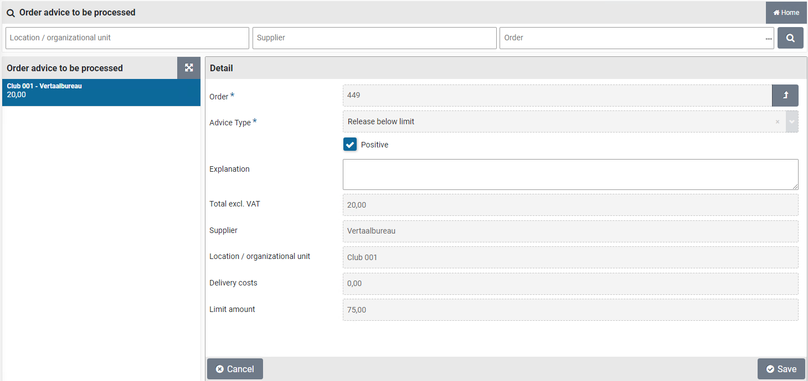

**Note**: pending order advices can also be found under "Other ToDos" listed as "Order advice to be processed", where they can be processed.

The field advice type lists the kind of advice needed. By default, only the advice type "Release below limit" is available. By marking the checkbox "Positive" and confirming this by using the "Save" button, you are giving a positive advice and as such overrule the threshold amount validation, allowing the order to be sent to the supplier. You have the option to provide a note on why you made this decision. As long as the order has not been sent to the supplier, it is possible to reconsider and unmark the "Positive" checkmark.

Order advices are often used combined with the "Group order based on receiving location" indicator to merge orders. See "Indicators" data module under \>\> [System parameters](#system-parameters).

An advice type is the result from setting up threshold amounts (lower and upper limits) for suppliers. See the "Delivery cost" data module for the supplier at \>\> [Catalog management](#catalog-management).

**Note**: the order advice functionality is only available if you purchased the license module "SHOPMOD-CO Shopper module Contract offtake, contract invoices, contract utilization and order advice optimalization", of when the Shopper Enterprise edition is used.

# Receiving in Shopper

## To be received

When the ordered goods or services have been delivered, the receipt thereof can be registered. This can be performed by an employee who is authorized for the role "P2P-Ontvanger" (Receiver) and who has authority for the organizational unit for which the order was placed, as part of the echelon P2P-medewerker. So you can also register the receipt for items/requisitions requested by your co-worker if you both work for the same organizational unit.

Reporting correctly and on time what has and has not been received (and whether what has changed) is important in order to be able to (automatically) process the checking/matching of the invoice. Processing the invoice is based on the receipt you have registered.

This prevents incorrect invoices being paid or unnecessarily long delays in payment. If the invoice does not match what you report in the system, an employee of the financial administration needs to investigate what is going on. By handling the notification of receipt with care, you can avoid unnecessary sorting work.

### Receipt ToDo (Registering reception)

Selecting the process step "Received" -- from the process flow ToDo -- presents the following screen:

In the receipt screen, the list of orders still "To be received" is shown on the left. By default, all orders that are outstanding within the organizational units that are assigned to you are shown. Choose the ToDo for the order for which you want to register the receipt and indicate what has been received or if there is a problem with it.

If there are a lot of orders, you can narrow the list by means of a search on the details of the order (see also the explanation about the search under **search bar** in \>\> [Use of the other screens](#use-of-the-other-screens))

In the search you can also limit the list to the outstanding orders that you have requested yourself. If you want make this your default, you can set this in the user settings. (See also \>\> [Login, user settings and absence](#login-user-settings-and-absence))

For the selected order, the data modules are shown with the related data and documents. The receiving screen opens by default with the "Receiving" data module where the details of the order are displayed with the list of order lines at the bottom. If an internal explanation has been added to a requisition-/order line, this will be shown behind the description of the item in the overview of the order lines (at the bottom).

By default, the receipt screen shows the "Receive" data module, that lists the details of the order, including the orderliness at the bottom. If "Notes for internal use" have been added to a requisition-/order line, it is also listed in the overview concatenated after the description of the item. The order lines can also be found at the "Order lines" data module.

You can register the packing slip number in the corresponding field. If you have the packing slip in digital form and want to add it as part of the registration of reception, you can do this via the "Order documents" data module and the "(+) Add" button. You will then get a dialog where you can select the attachment and enter a description under "Extra info". "Logging" indicates when the order document was created and changed.

**Note**: Order documents can only be deleted by the employee who added them (or in his absence by the delegated employee), an employee of procurement (the purchasing department) or the supervisor.

All receivals will be registered in de order mutations of the individual order lines, where the packing slip number is recorded in accordance to its value registered in the data module "Receipt".

**Note**: If an employee forgot to register the packing slip number, this can be amended using the corresponding order mutation for the reception (also see "Correction of receipt notification")

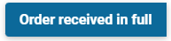

If an order has been delivered completely and correctly, you can press the button "**Order received in full**" to indicate at once that the order has been received in its entirety.

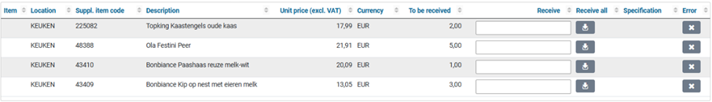

If the order has only been partially delivered, you can indicate per order line (in the overview at the bottom) what has or has not been received:

If everything for an order line has been delivered correctly, you can enter it in one go in the column "Receive all".

For each order line it is stated how many pieces (of the order unit) have been ordered. You can register/book in the number of pieces that have been received by entering the number in the corresponding column of the relevant order line. The buttons below become available during the input:

Save/enter the entered number of pieces received.

Clear the entered number of pieces received.

If not all items have been registered as received yet, the order will remain visible in the "To be received" list, pending future back order.

The moment invoices have been received for an order you have requested, you can view them in the "Invoices" data module, under the menu-item "Orders" in the menu "Shop". Additionally if you are authorized for the role "P2P-Aanvrager" (Requester) or "P2P-Ontvanger" (Receiver) you can also see the invoice at the record of receipt for an requisition made by your co-worker, as part of the echelon "P2P-Medewerker".

### Tracking delivery performance of supplier

If desired you can track the delivery times for the individual items ordered, by keeping the "Delivery time in days" field up to date. Select the order line while processing receivals and enter or update the corresponding field in accordance with the delivery time reported by the supplier upon order confirmation (or otherwise).

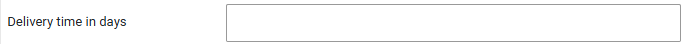

The delivery performance of the supplier can then be determined using the order and receival dates regarding the delivery times of the items.

**Note**: also read the section "Correction of receipt notification" for updating the order mutations regarding the actual receival dates.

### Correction of receipt notification

If you accidentally entered an incorrect quantity during the receipt notification, you could correct this by reversing this transaction and then entering the correct quantity.

You click on the relevant order line in the overview at the bottom of the receipt screen or you select it in the "**Order lines**" data module. You then choose the "**Order mutations**" data module and select the last/bottom mutation for "**Reception**". Checking the "**Rollback**" checkbox and saving it will reverse the receipt registration.

You can then use the "Back" button to go to the receipt screen to enter the correct number of receipts in the "Receive" data module.

**Note**: If your order is no longer visible in the ToDo step "To be received" process flow, then select "**Orders**" via the "**Shop**" menu and select the relevant order from the list. You can then go through the above steps to correct the receipt registration.

In case the date of the order mutation for the registration of receipt does not match the actual date the order was received or if the packing slip number was not provided, it can be corrected in the order mutation for the corresponding receipt.

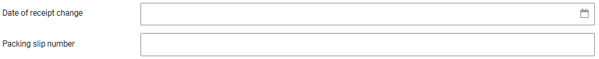

Note: when the date of receipt change has been applied it will overwrite the for the registration of receipt was performed. Hence the date on which this task was actually performed will be lost. On your request Archifact can turn the option to change de date of receipt on or off. The employee that performed the change on the order mutation will be listed in the order mutation.

### Handling incorrect delivery

If the correct item has not been delivered or the item is unusable and you have agreed with the supplier that it will be returned, you can indicate this by pressing the button with the cross on the order line in the "Error" column.

You will then see the "Incorrect order received" dialog where you can indicate in the field "Incorrect delivery info" what the problem is and what action you have agreed with the supplier. Optionally you can attach a photo/image to clarify the situation.

A "change" is now added about the incorrect delivery, but nothing is booked in or out! If this item is returned and no replacement is provided, you must also indicate this by canceling the delivery. If the correct item is still delivered later, you can book it in at that time by registering its reception.

### Canceling delivery

If the supplier reports that an item is no longer available or if an item is returned, you need to write this off for the order line, by reporting it as canceled.

In the "Order lines" data module, you can select the relevant order line or click on the order line in the overview at the bottom of the receipt screen.

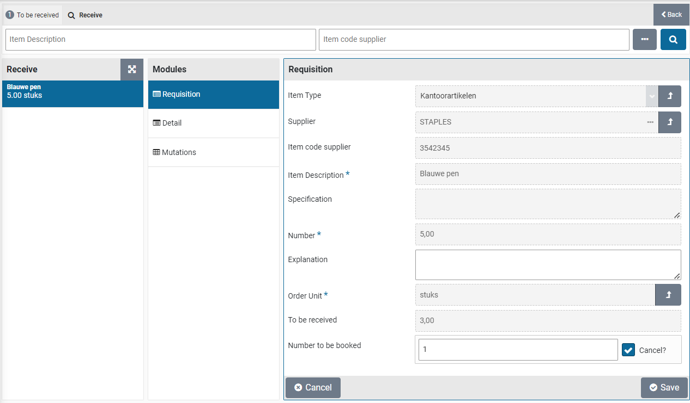

You then select the "**Requisition**" data module and enter the number that will no longer be delivered in the "**Number to be booked**" field. You then check "**Cancel**?" checkbox and save the change.

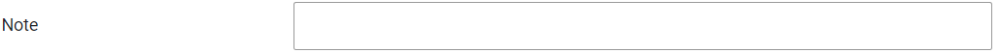

**Note**: Entering a note is mandatory when cancelling a receipt.

You can now go "Back" to the "Receive" data module where the quantities to be booked in the relevant order line have been adjusted. The matching of the invoice now assumes that this item will not be charged or that it will be credited.

### Report problems with the delivery or supplier internally 

If you encounter problems or other details during the delivery or during the coordination/dealing with the supplier - which are important to make known within your own organization - you can report this by means of a supplier Review.

Reviews are kept at a supplier and are transparent to procurement (the purchasing department) when they discuss contracts, performance or agreements with the supplier.

With the button "**Review supplier**" you open the screen dialog in which you have to confirm that you want to create an Review. Press the "Yes" button to confirm. You will then see a dialog where you can enter the supplier's Review, using stars. Click on a star to change the rating. You can rate several aspects based on the review category groups -- that have been defined for your organization.

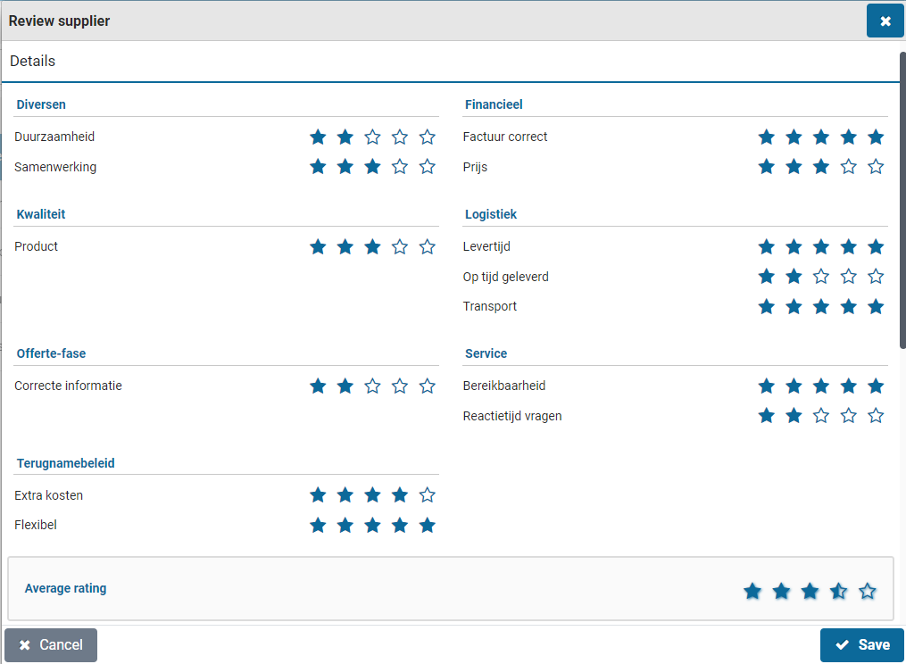

When you scroll further down you will find the section "Details" containing additional fields:

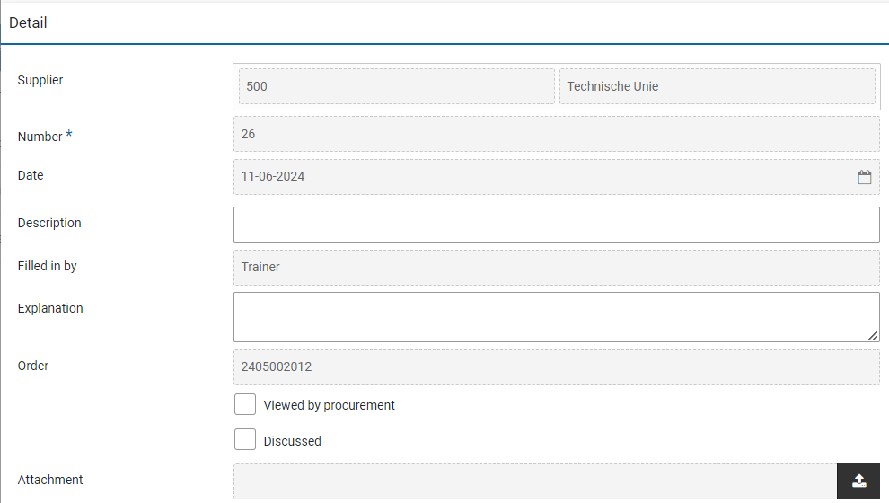

You can enter your experience in the "Description" and "Explanation" fields. Optionally, you can attach a file or image to clarify the situation, such as a photo of the damaged package or item.

You can view previous reviews in the "Review supplier" data module.

### Contacting the supplier

If you want to contact the contact person/account manager at the supplier, you can find the contact details and request the contact details via the menu "Shop" under the menu item "Contact info suppliers".

# Installments Shopper

## Installment payments (to be released)

If it is specified with the requisition that delivery/payment is to be made using installments, the order for this requisition will not be displayed at the process flow ToDo step "Received". Instead, in the "Other ToDos" section, the ToDo "Installment payment (to be released)" will become available in the "Request" section.

\

If you select this ToDo you will get an overview of all outstanding installment payments (to be released):

Select the part delivery for which you want to release an installment. If you have specified a fixed number of installments, a partial delivery is available for each installment in the list. Optionally you can modify the "% of total price" field if the installments are deviating from what was originally requested. The percentage for the last installment will be calculated each time you adjust the percentage. Once you reach the last installment the percentage can no longer be adjusted.

By checking "**Release**" you indicate that this partial delivery has taken place and that -- for the amount that is released -- the related invoice may be made payable. If this invoice has already been paid, you will see this with the checkbox "**Paid**". If this partial delivery or installment payment is canceled, check "**Canceled**" checkbox.

If you did not specify a "Fixed number of installments" with the requisition, you need to indicate for each partial delivery the amount for which you want to release this now. In that case, you enter this amount in "Release amount now".

If price estimation is allowed, you can enter a higher amount than specified by the "Amount still outstanding" field, as long as the maximum price deviation for estimation is not exceeded. See section "Place order" indicator "Estimated allowed", "Items" under [Catalog management](#catalog-management) and the section P2P under \>\> [System parameters](#system-parameters).

Press the "Save" button to confirm the processing of the partial delivery. Partial deliveries that have been released will disappear from the list. For partial deliveries with a variable installment amount, a subsequent partial delivery is always created until 100% of the total amount has been released.

# Status of requisitions in Shopper

## From request to receipt 

On the Dashboard P2P (homepage) you can view the status of your requisitions and optionally the requisitions of your co-workers (**Status of requisitions**), and/or - if available - those of the employees in your team (**Process flow management**). The functionality of these process flow diagrams is described under \>\> [P2P dashboard](#dashboard-home).

Select a process step status block to view the list of requisitions/orders that have the corresponding status of the status block you have selected.

The composition of the screen can vary depending on the status, but the structure is conforming to the standard as described under \>\> [Use of other screens](#use-of-the-other-screens).

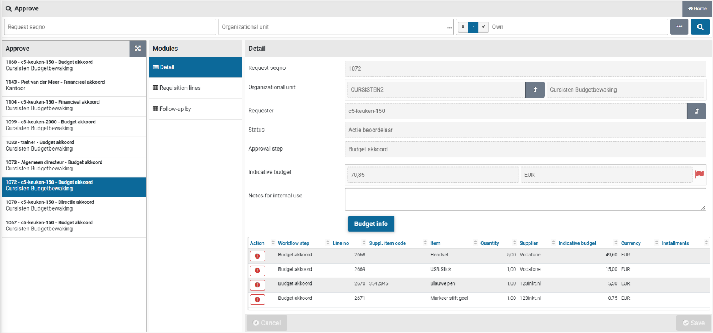

After choosing a status block in the status of requisitions, you will receive a list of the requisitions/ order lines in the status associated with the process step you have chosen. Choose the requisition you want to view. By default, the "Details" data module will be opened listing the details of the requisition / order. You have the option to expand the list (button top right) and select the column you want to sort on and then select the requisition / order.

The fields "Status" and "Approve step" reflect the required follow-up action. If the follow-up action cannot be assigned and an administrator needs to adjust the configuration to allow the process to continue, an additional field reflects what needs to be done:

The Follow-up action then ends up with the employee that can resolve the problem, in general an employee with the role "P2P-Regisseur" (orchestrator), as part of the echelon "P2P-Inrichting".

The data module "Follow-up by" will list the employees that can perform the follow-up. This module is listed for each requisition/ order.

The "Documents" data module of a requisition/ requisition line lists the documents that were attached to the requisition line. Same for order/ order line.

An overview with the status of all your requisitions can be obtained via the menu "Shop" with the menu item "My Requisitions".

This overview lists all your requisition-/order lines that you have made over time, and you can search for the line whose status you want to know.

You can locate orders in relation to the requisitions using the "Orders" menu-item. You can view the order lines and open the related requisitions. Additionally, you can view the related invoices once they have been received.

**Note**: These menu-items are only available if you have the required authorization

### Order mutations

The data module "**Order mutations**" of an order line lists all mutations that were applied after the order was placed. For each mutation the employee that performed the mutation is listed including their authorization.

Select a mutation to view the details of who was involved in the mutation, including the date and time of the mutation. Mutations reflect the actions performed as part of the process steps, such as changing the number of ordered items, the price (for estimations), cancellation, or status changes that result from processing the invoice.

All performed process-/workflow steps are listed in the "Audit trail" data module. See \>\> [Audittrail](#audittrail-p2p).

### Follow-up by

If you want to know who can take the follow-up action to continue with your requisition/order, in the data module "Follow-up by" you can see a list of the employees who can follow up the pending action for your requisition/order. 

The employee's contact details for telephone and email are listed -- if available -- so that you can contact us if necessary.

**Note**: If the list under "Follow-up by" is empty, contact the administrator/internal helpdesk so that they can look at the setup and ensure that an employee is available with the required role and authorization to follow up this ToDo.

### Status of my requisition

In the "General" data module of a requisition/order, the status of the requisition is displayed in the "Status" field.

The following statuses exist: 

1.  **Request (Aanvraag)**\
    The requisition is still in your shopping cart and must therefore still be completed and confirmed by you (Also applicable for rejected requisitions)

2.  **Action Supplementer (Actie aanvuller)\**
    A procurement employee still needs to supplement your requisition

3.  **Ready to be approved (Gereed om te beoordelen)\**
    The requisition line is fully supplemented, however the supplementation of other requisition lines in the same requisition still needs to be completed.

4.  **Action approver (Actie beoordelaar)**\
    An authorized signatory, budget holder or board member has yet to review and approve your requisition

5.  **Ready to order (Gereed om te bestellen)**\
    Requisition is fully approved and can be ordered

6.  **Ordered (Besteld)**\
    The order has been sent to the supplier and as soon as a delivery has taken place, you (or your co-worker) can register it. 

7.  **Received (Ontvangen)\**
    The order for the requisition has been received in full

8.  **Invoice booked (Factuur geboekt)**\
    An invoice has been booked on this requisition-/order line. i.e., this requistion-/order line (or a part of it) has been made payable. **Note**: (when using installments multiple invoices can be applicable)

9.  **Financially completed (Financieel afgerond)**\
    The full amount for the requisition-/order line has been paid to the supplier

10. **Cancelled (Gecanceld)**\
    The requisition has been canceled (applicable only for rejected requisitions)

**Note**: The status of requisition-/order line can also be found via the "**My requisitions lines**" menu-item under the menu "**Shop**", using the data module "**Status and approval**" of a selected requisition-/order line. For the status **Action supplementer** and **Action approver** the field "**Current workflow step**" is also shown, to indicate what the action is about.

# Status of my order in Shopper

## Invoices and payment

On the P2P dashboard (homepage) you will see the process steps for "Invoices to be received" and "To be paid" next to the process steps listed under \>\> "[From request to reception](#from-request-to-receipt)" under the "Status requisitions". If Shopper is used in combination with ImageCapture from ScanSys, the related tasks are not handled in Shopper, but in ImageCapture. The progress however can be tracked using the status blocks for the process steps "Invoices to be received" and "To be paid".

The color coding in these process steps is related to the number of days that invoice processing is pending: **Green** -- 0 to 1 days, **Yellow** - 2 to 6 days and **red** - longer than 6 days.

**Note**: Only an employee with the role "P2P-Uitvoerder" (executer) will see the process step "To be paid". Only an employee with the role "P2P-controleur" (controller) will see the process step "Invoices to be received". In combination with ImageCapture, these process steps are then limited to viewing, correct receipt bookings (cancelling) and being able to remove an incorrect invoice (this last one is only possible if it is allowed based on the corresponding indicator under the system parameters and then only by a supervisor).

Committed order lines (i.e., that have been sent to the supplier) are also visible in ImageCapture, where the related invoice processing can be performed once receipt registration has been performed.

**Note:** Reporting to ImageCapture requires a creditor link with the supplier. If the creditor link has not yet been established for a new supplier, the obligations will only be made known to ImageCapture after the creditor link has been added.

The action to link a creditor is mentioned in Other ToDos for employees who are authorized for the role "Administrator".

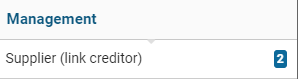

ImageCapture processes the received invoices and will -- as far as possible -- automatically match them with the registered receipts in Shopper. When making these invoices payable, the entry data for these order lines that have been derived in Shopper in relation to the relevant device is assumed. See the chapters on administrative tasks for this.

The bookings for invoices that have been made payable are reported to Shopper by ImageCapture. Invoices that deviate from or for which no order line exists are manually assessed and processed in ImageCapture by an employee.

**Note**: It is possible that multiple bookings for an order line can be reported by ImageCapture in the same invoice. This can occur if the booking data for items is subsequently changed in ImageCacture and is divided over, for example, multiple locations (cost centers), whereby a booking is then reported back to Shopper for each location.

When the invoice matching and making the invoice payable are performed in Shopper (thus without the use of Image Capture), the process steps "Invoices to be received" and "To be paid" are also used and conform to the standard color coding.

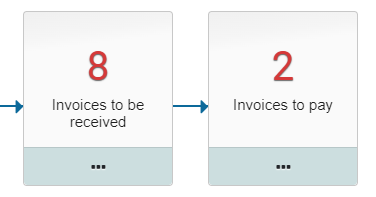

The process step "**Invoices to be received**" applies when for a received (in regard to the matching criteria) order line no matching invoice line has been found (i.e. the automatic matching cannot be performed). This process step can be followed-up by an employee of the financial department with the role "P2P controlleur".

The process step "**Invoice to pay**" can be used to make adjustments in regard to the invoice line and the related order line, deciding what will and will not be made payable. This process step can be followed-up by an employee of the financial department with the role "P2P uitvoerder".

The matching applied by Shopper will determine if the invoice booking line will be set to approved, where -- depending on the system configuration -- the number or the total amount are set to be leading. Also see the indicator "Write off booking allowed?" in the section "Financial" for the indicators under \>\> [System parameters](#system-parameters).

The incoming invoices are in this case processed as invoice interface lines, provided via a connected invoicing system (of the financial department), that scanned and digitized the received invoice and consequently passes this data to Shopper, where the matching and follow-up can be performed (using the "Invoices to pay" step).

\

If there are invoice interface lines that cannot be processed in Shopper (e.g., if they cannot by matched tot financial data in Shopper) an "Other ToDo" is created in the section "Orders". Follow-up this Todo requires the data fields of the invoice interface line to be adjusted or the financial data in Shopper to be amended, allowing the match with the order line to made.

If invoices are made payable in Shopper, the related invoice bookings will be reported back to the invoicing system (of the financial department). In case of Exact Globe, Shopper can provide a CSV-that can be used to import this data in Exact Globe.

### Invoices to be received

When following up the ToDo "Invoices to be received" in the screen link, the list of invoices to be received is shown for the orders received and, on the right - when the data module "Receive" is displayed - the details of the related order and the order lines.

If the order has not yet been received in full for the invoice, the remaining part can be debited if the remaining part is no longer delivered and will therefore not be invoiced. For more details, see the section **Deviating invoices and general journal entries**.

### To be paid

When following up the ToDo "Invoices to be paid" the list of invoices to be paid is shown in the link screen and on the right - when the "Detail" data module is displayed - the invoice and the related invoice entries.

With the button "View invoice" the scanned invoice can be viewed and if this turns out to be the wrong invoice, then this invoice can be removed with the button "Remove invoice". After removing the invoice, the order returns to the process step "Invoices to be received", until the correct invoice is linked.

**Note**: The button "Remove invoice" can only be performed by a supervisor in combination with the role "P2P-controleur" (Controller), as part of the echelon "P2P-Financiele administratie" and is only visible if the corresponding indicator is set under the system parameters.

### Action incoming invoice

Following up on the ToDo "Action incoming invoice" present a screen with a list of received invoices on the left side and to the right the "Details" data module with the data related tor the order, followed below with the bookings for the order lines in relation to the received invoice. If the order is related to a proforma-order of a contract, the "Contract" field will show the designated contract.

If an invoice does not refer to an existing order number in Shopper, the data for the order will be left blank. In that case the "Order" and if applicable the "Contract" field can be entered manually. The "**Link orders**" data module lists the connected orders and if needed can be used to connect another order. If the order was not placed using Shopper, the button of checkbox "**Outside the procurement system**" can be used to indicate that no order in Shopper applies. The invoice will then be made payable (if you do not want this invoice to be paid mark the checkbox "**Reject**").

The section "**Approved**" includes several checkboxes regarding the assessment of the invoice. Use the checkbox "**Content**" if from a procurement perspective the invoice is approved (even if the invoice deviates from the order). Use the check box "**Rejected**" to reject the invoice as a whole. If the invoice is rejected, use **the** checkbox "**Rejection reported**" to indicate that the supplier/creditor has been informed of the rejection. De marked checkboxes are processed after using the "Save" button.

The checkboxes "Financial administration" and "Deviations" are derived and cannot be changed. The checkbox "**Deviations**" is set if there is a Content approval has been provided while deviating amount or rejected booking are present. The checkbox "**Financial administration**" is set if the costing type of the booking corresponds to the costing type of the order line, or if the system parameters indicate to skip the financial approval. Also see the section Financial of the "Parameters" under \>\> [System parameters](#system-parameters).

If an invoice line is invalid, it can be rejected using the checkbox for the designated booking for the order line (at the bottom of the "Order" data module. If all (remaining) invoice lines need to be rejected, then use the button "**Reject all bookings**". All bookings that were not yet approved will then be rejected in a single action.

#### Correcting invoice bookings

The bookings listed for the order lines (at the bottom of the "Orders" data module) contains a column with the original amount of the order line, to the right of the column "Total amount (excl. VAT)". If the amounts are different, the amount to be paid can be adjusted and then saved. Also, you can select the booking to view the full details. These bookings are also listed in the "Bookings" data module, with full details and options for adjustments (see further down for a description of this data module).

The field "**Difference**" shows the difference between the invoice and the order. This field is updated after correcting (the amounts) the individual bookings. If a remaining discrepancy exists that is acceptable, you can use the checkbox **"Write off**" (to the right of the "Discrepancy" field). The invoice can then be fully matched, and the difference is written off.

The "Detail" data module shows the details of the invoice that can be modified if needed. The scanned invoice can be viewed using the "**View invoice**" button.

The "Status" field can be used to provide a explanation on the progress/status of the approval.

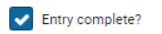

The checkbox "**Entry complete**" is set by default, allowing automatic matching for the invoice, and making it payable, to occur once the bookings have been adjusted or the differences have been written off. However, if you want to prevent an automatic match from occurring -- before you are finished with all the bookings -- you can unmark this checkbox and then mark it again once you are finished. The ToDo for the "Action incoming invoice" with then remain present until the automatic matching has been performed or the invoice has been rejected.

The "**Correction on**" field can be used to specify that this invoice contains a correction (crediting) on another invoice, by selecting the other invoice form the presented list. Multiple invoices can correct another invoice. For the corrected invoice these credit invoices can be found under the "**Corrections**" data module.

If an enquiry is needed for the invoice this can be done using Shopper by adding a memo for the purchaser, using the "**Approval**" data module. The purchaser will then get an Other ToDo "Incoming invoice to approve" in order to follow up on the enquiry memo. All memo's that have been created and followed up for an invoice are listed in the "Approval" data module. Alternatively, the action incoming invoice can be followed up by the purchaser using the other ToDo "Incoming invoice (purchaser)".

#### Bookings for the order lines

The "**Bookings**" data module lists the order lines for the order connected to this invoice in correspondence with the matching invoice line. The amount of number of units (that are derived from the amount) of the invoice line can deviate from the order line. The booking then needs to be adjusted or small differences need to be written off (using the "Orders" data module).

If the amounts deviate, then the checkbox "**Divergent**" is set. The "Number fixed" checkbox is set if it concerns a partial delivery or an installment. This is done to prevent the number to be automatically derived from the amount from the invoice, hence making it possible to enter (or change) this number manually. The total amount (excl. VAT) and the VAT type (VAT field) can be modified to let a match arise between the invoice line and the order line.

An approval on the invoice containing bookings with deviating amounts is only accepted if the fall within the range that is specified by the supervisor, using the amount or percentage write off fields of the section financial of the system parameters, under \>\> [System parameters](#system-parameters).

The booking details (Cost unit, Cost type and Costing center) can in this stage be changed towards how this needs to be booked in the financial administration (if this integration applies).

**Note**: These are not the bookings that are part of the Excel export of the weekly bookings. These bookings are a listing of the orderliness that have been delivered using the pick list groups for the warehouse.

### Status order

In Shopper, the progress of processing in ImageCapture can be followed for the requestor under the "Status requisitions" using the process steps "Invoices to be received" and "To be paid".

**Note**: The data module "Follow-up by" is not available for requisition-/order lines for which the invoice handling is performed in ImageCapture.

The status of the order can also be found in the data module "Status and approvals" (accessible via the menu-item orders under the menu "Shop"). See status of the requisition under \>\> [From request to receipt](#from-request-to-receipt).

The following statuses are distinguished for invoice processing: 

11. **Invoices to be received (Facturen te ontvangen)**\
    This concerns order lines for which receipt has been registered.

12. **To be paid (Te betalen)\**
    This concerns order lines for which an invoice has been received and for which the receipt has been registered. When the invoice has been made payable and the payment has been made, the order line will no longer be displayed in the "Status of requisitions".

13. **Invoice (Factuur)\**
    An invoice booking has been made on the order. I.e., an invoice has been connected to a requisition-/order line for this order and there exists a match of the invoice line with the requisition-/order line.

14. **Completed (Afgehandeld)\**
    The financial processing of all the requisition-/order lines of the order have been completed. The related invoices have been paid or the remaining amounts have been written off. The requisition-/order line will no longer be listed at the "Status requisitions" on the P2P dashboard.

### Deviating invoices and general journal entries

If the amount on the invoice deviates and this deviation has been accepted in ImageCapture and does not conflict with the indicators for Financial at the \>\> [System parameters](#system-parameters) , then this will be visible in Shopper at the "Other ToDos" by means of a ToDo for "Order-line invoice mismatch".

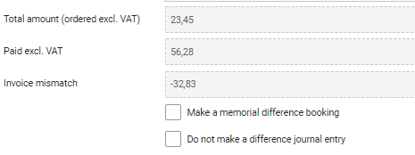

When following up this ToDo, you can explicitly indicate per order line whether or not you want to create a journal entry / memorial booking for the difference. In other words, to make a reversal to administratively correct the previously recorded liability (on the interim account).

**Note**: This only applies when using general journal entries / memorial bookings.

If the financial processing has not yet taken place and will never take place, then it can be written off financially in the Process Flow ToDo "Invoices to be received". Select the concerning order-line and open the "Requisition" data module.

In that case, Fill in the number of items that you want to write off at "**No. write off**" and check the adjacent "**Write off**" checkbox. Next you are required to provide a note on why the write off has been performed. This is mandatory and you cannot save the write-off until it is done.

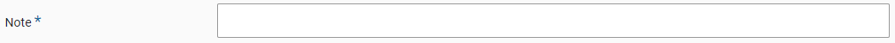

**Note:** this field is only available if the order line was received. Otherwise use the option to cancel the receipt as the receipt process step. See canceling delivery under \>\> [Receipt](#receiving-in-shopper).

After saving, a general journal entry / memorial booking with a counter-entry will also be created for the canceled quantity if you work with general journal entries.

**Note**: Journal entries (Memorial bookings) is a separate license module of Shopper for reporting obligations arising from the purchasing process in Shopper to Exact. For more details see **financial administration** under \>\> [[Accounting](#accounting)](#organization).

### Overview of orders and outstanding invoice amounts

Via the "**Shop"** menu item "Shop \> Orders" you can view all orders that have been requested by you or your co-workers (within the organizational units assigned to you). For an order, you can view the details of the relevant order line via the "Order lines" data module. In the data module "Invoices" you can find the related invoice or invoices (from the moment that the invoice matching has taken place).

**Note**: If this menu-item is not available, you are not authorized to use it

Using the search bar you can find orders, using the search fields for the order as well as for the order lines (accessible via the three dots "...").

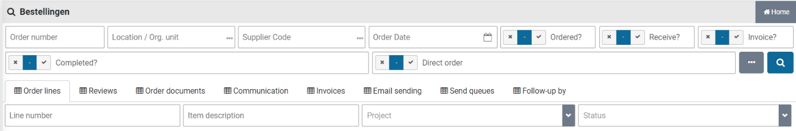

An employee with the role "P2P Controleur" of "P2P uitvoerder" can access the menu-item "Reports" under the menu "Finances" and select the reports for "Overview contract to be paid" and "Overview contract invoices payable" regarding orders or contract offtake with outstanding payments. These reports are grouped by order, creditor, costing unit, costing center and cost type. In case you need to do a write off on the outstanding payments, see the section on "Deviating invoices and general journal entries".

### Approving direct orders

When a request for requisition has been processed as a direct order, invoice processing -- in relation to the executed order for this order -- is only possible if, in addition to the receipt registration, the necessary approval has also been issued. This processing is like the regular process, but for a direct order this is done via the "Other ToDos".

\

In the ToDo process flow for a direct order, the process of the requisition, ordering and receipt is completed, unimpeded by any process steps for "Action by authorized signatory" and "Orders to approve". These two ToDos are handled separately from the ToDo process flow via the other ToDos for the "Direct order".

The ToDo "Direct order (action authorized signatory)" or "Direct order (to be approved)" are displayed in the list of the \"Other ToDos\" in the "Direct order" section. If you choose this, you will see a list of relevant pending approval actions for direct orders:

When handling these ToDos, you can only choose "Approve". After all, it makes no sense to reject this requisition, as this requisition was ordered directly, and the item may already have been received and processed in production. If it is established that the employee who submitted the direct order request has acted incorrectly here, you need deal with this internally by addressing this employee or - if it is decided to do so - to remove the authorization for direct orders from this employee.

The layout and operation of these screens also correspond to the operation of the screens in the process flow ToDo steps for \>\> [Approve](#approve).

**Note**: Sometimes you can still intervene manually if the order has not yet been fully processed. You may still be able to cancel the order (if the order has not yet been sent to the supplier) or return the received goods, reverse the related receipt and then cancel the order line[. In that case, do not approve the direct order with the other ToDo]{.underline}. If you can still intervene, the ToDo will disappear from the other ToDos automatically as soon as the order or the order line is canceled.

# Audittrail P2P

## Audit trail requisitions and orders

An audit trail is kept on all requisitions and orders in Shopper. The audit trail can be accessed via the "Audit trail" data module, that is present for requisition, requisition lines, orders, and order lines.

All performed process flow and related workflow steps are recorded in the audit trail and listed under the registration of when, who and with what authority the were performed. In case of a rejection the related note is also included.

**Note**: Only steps that were applicable to the workflow of the requestion are present in the audit trail, where this depends on the setup of the workflow and the workflow steps.

**Note**: An employee with the role "P2P-Controleur" of "P2P-Uitvoerder" can access the report "P2P audit trail overview" using the menu-item "Reports" under the menu "Finance".

The following pages will provide some examples of the audit trial for different objects:

### Audittrail requisition

### Audittrail order

The button "**Print audit trail**" is available in the "Audit trail" data module for employees of the finance department with role "P2P_Controleur" and for the employees of the procurement / purchasing department with role "P2P beheerder".

**Note**: The report that results from printing the audit trail for an order, is also provided in PDF format to the ImageCapture application, allowing this application to forward it as part of an integral audit trail to Exact.

### Button "Print Audit trail" for an order

### Audittrail requisition-/order line

This audit trail can be access via de "Audit trail" data module for the requisition-/order lines of a requisition or order. The audit trail for the requisition lines of the same requisition can be different in regard to the supplement actions that were performed per requisition line.

The buttons "View audit trail" and "Print audit trail" are available in the "Audit trail data module" for employees of the finance department with the role "P2P_Controleur" and employees from procurement (the purchasing department) with the role \" P2P beheerder".

### Button "Print Audittrail" for a requisition line

### Button "View Audittrail" for a requisition line

If Shopper is used in combination with ScanSys ImageCapture, the workflow and related data from ImageCapture will also be shown in its entirety in this overview, when applicable.

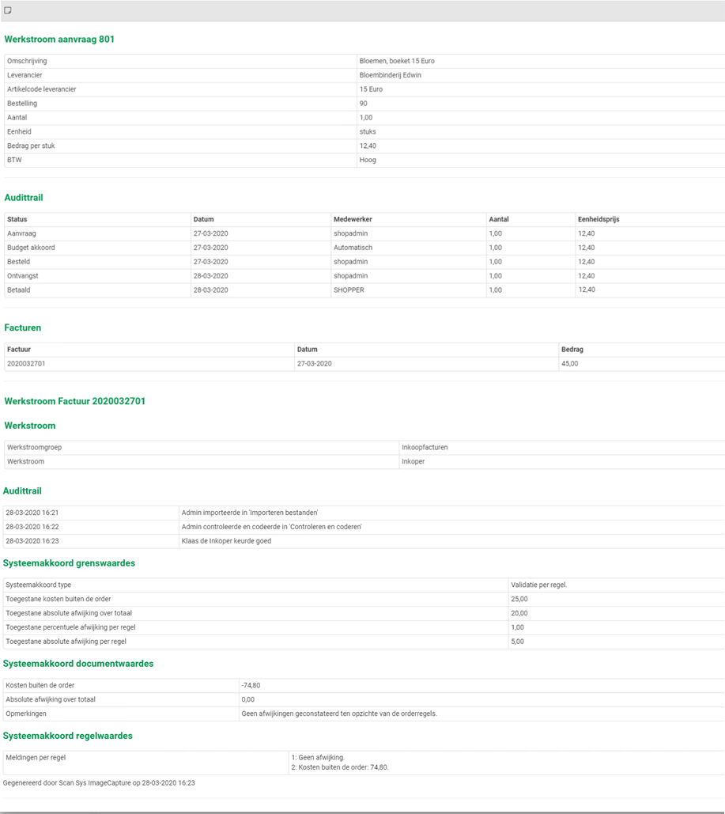

# Tenders

## Quotations dashboard

The quotations dashboard shows the "Workflow Quotations" and the "Workflow Quotation monitor". The tendering process is composed of a number of fixed steps that need to be carried out to complete a quotation process". The steps that are visible depend on your authorizations within the quotation echelons.

**Note**: The quotations dashboard and the quotation menu are only available to employees that have the "Quotations" checkbox marked in their profile. This mark is set if the employee has been assigned to one or more quotation-echelons.

**Note:** The dashboard and menu for quotations are only available if you have purchased the "Quotations" license module.

### Workflow Quotation

The Quotations workflow shows the steps within the quotation process with an indication of the outstanding ToDos within the quotation process.

For a general explanation of the operation of the workflow quotations, see the comparable operation of the process flow ToDo under \>\> [Home dashboard](#dashboard-home)

The quotations workflow is conducted as follows: After starting a new quotation process, an invitation to participate in this process needs to be created and then sent to the selected suppliers. Subsequently, the quotations are received and the related communication moments per supplier are recorded and then assessed. When a quotation is accepted, the processing of the quotation can be initiated, which can then be followed up with contracts or orders.

**Note**: The workflow will only show the quotations for organizational units that have been assigned to the employee, and then only for those steps that can be performed by the employee based on the role assignments of the assigned quotation echelon.

### Workflow Quotations monitor

As a team leader or manager, you can also follow the process of quotation processes started by other employees (who work within the same organizational units). In this way you can monitor the progress of the processes in which these employees participate.

The quotations monitor workflow shows only quotations for organizational units for which the employee is authorized.

## Tenders

Shopper can guide you in processing tenders with the quotations for, and record communication with the suppliers involved. When processing a quotation for a tender, you can register a contract with this supplier in Shopper or create a requisition with this supplier.

The creation and management of tenders is accessible via the menu "Quotation" with the menu item "Tender" and the tender screen with a layout in accordance with the standard as described for the "**General screen layout**" \>\> [Use of the other screens](#use-of-the-other-screens).

Below the list of tenders (on the left), you can create a new quotation trajectory with the "(+) Add" button or remove the selected quotation trajectory with the "(x) Delete" button.

**Note**: A tender can only be deleted if quotations are not/no longer linked to it.

The Tender process is processed by entering data and performing the actions for the data modules "**Detail**", "**Planning**", "**Invitation**", "**Documents**" and "**Quotations**".

### List of quotations (Detail data module)

In the "Detail" data module, the quotations of suppliers are listed at the bottom, along with the quotation status. If this screen is opened via the process diagram of the dashboard quotations, the action column will have a red boxed exclamation mark to indicate which quotation requires an action.

After selecting a quotation from this list, the overview of quotations is displayed with this quotation selected. This is the same list that is shown when you have selected a quote via the "Quotations" data module during a quotation process.

### Adding tender

If you have selected the process step "New tender" in the quotations dashboard or if you have pressed the (+) Add" button at the bottom of the list of tenders, a new tender will be created for which you can enter the data in the "Detail" data module. The required fields are marked with an \*. The "Short description" field is used to display the tender in the list of tenders.

**Note**: Only employees with the role quotation-requestor can create and maintain new tenders.

Under "point of contact" you need to select an employee who will be the point of contact for the invited suppliers for handling within the quotation process. The employee at "Specialist point of contact" can be another employee who can be approached by the supplier for specialist questions.

**Note**: All employees can be assigned as a point of contact, regardless of their access to the quotation module (i.e. that have been assigned to a quotation echelon) of if they have access to the related administration. Upon selecting the employee the column "Quotation" indicates if the employee actually has access to the quotation module.

The fields Organizational unit, Project, Item type, Contract type are optional and can also be filled in later in the quotation process (when they are needed). When the mandatory fields are filled in, you can save the quotation process.

**Note**: Only organizational units, projects and item types that have been assigned to the employee via the quotation echelon, can be selected.

### Tender planning

After adding and saving a tender, you can indicate in the "**Planning**" data module how many suppliers you want to invite to participate, and which timelines (data) will be followed. This data is generated and entered by default. You can then change these if you wish to follow other timelines.

The "Selected" field shows the number of suppliers that you have added via the "Quotations" data module. If you have enough suppliers in view -- even before the number of planned suppliers has been reached -- to be able to make your choice, you can indicate this with the corresponding checkbox.

### Adding suppliers / quotations

You can add the suppliers you want to invite to the "Quotations" data module with the "(+) Add" button. A quotation is added to the quotation process for each supplier.

In the "**Detail**" data module of the quotation, you can enter the details of this supplier, including the supplier's contact person who is applicable for this quotation process. If the Supplier is already known in Shopper, you can choose it from a list of suppliers. If the supplier does not yet exist, you can check "New supplier" checkbox and enter the "Supplier name".

**Note:** You then need to create the creditor and supplier definitions (or have these created) before the quotation can be processed for a new supplier.

**Note**: Only employees with the role quotation-requestor can add, modify, delete, send, receive and coordinate tenders (but not review and process/handle them).

### Send the invitation for a quotation process to suppliers 

In preparation for sending the invitations to the suppliers, you can specify the subject and content (body text) of the request e-mail in the "**Invitation"** data module of the quotation process. This concerns the texts for the email that is sent to all invited suppliers.

If you also want to send an attachment to this standard e-mail, you can add it via the "Documents" data module. Via the button "(+) Add" you can add an attachment as a document to this data module, where you then mark the "Attachment request e-mail" checkbox.

The request e-mail can then be created per supplier (possibly customized) in the data module "Quotations" for those suppliers that have been added and whose contact details have been entered. There you can create the e-mail per supplier with the button "**Create invitation Email**". The created e-mail is then available in the "**Communication**" data module of the quotation, where you can view it, but not edit it.

When all data and attachment(s) have been entered, you can send the e-mail in the "Communication" data module and then by clicking the "Outgoing mail" on the "Send Email" in the "**Detail**" data module. After sending, "Finished" checkbox is checked and the shipment date is displayed in the "On" field. If you have sent the e-mail yourself (outside of Shopper), you can check "Finished" yourself and optionally enter the date in the "On" field.

If you add a supplier afterwards, you can create and send the request e-mail for this supplier in the same way, so that request e-mails have already been sent before.

**Note:** If the e-mail has not been received by the supplier or if the e-mail needs to be re-sent for other reasons, you can uncheck the "Finished" box. After saving, the "Send Email" button will become active again, so that you can resend the mail.

### Receipt of and coordination of quotation with supplier

When the supplier has responded to the invitation/request e-mail, you can enter the received data in Shopper. To do this, select the relevant supplier from the list of quotations in the "**Detail**" data module of the quotation process (at the bottom of the details of a quotation process) and fill out the "Reception" section of this quotation. After saving, you can also enter a "Resume" and a "Quotation amount".

For the Quotation amount it can be indicated if it is with or without VAT.

You can add the received email with the quotation from the supplier to the data module "**Communication**" as a communication type "E-mail", where you can add quotation document as an attachment via the "**New document"** data module.

You can also add other communication moments with the supplier -- regarding the tender -- to the "Communication" data module, including telephone coordination or otherwise (other).

You can also send an e-mail to the supplier there by adding an "Outgoing e-mail" to the "**Communication**" data module. You can also send an attachment via the "**New document**" data module and after you have entered it via the "Process new document" button, add it as an attachment.

You can send the email by pressing the "Send Email button in the "**Detail**" data module. After sending, "Finished" checkbox is checked and the shipment date is displayed in the "On" field.

### Reviewing supplier quotation

Next the received quotation will need to be reviewed. To do this select the supplier from the list of quotations (at the bottom of the data module "Detail" of a tender) and for this quotation under data module "Detail" in the section "Processing" you indicate the choice for "Accepted" or "Rejected".

When saving, the date of the relevant Review is also recorded.

**Note**: Only employees with the role quotation-approver can review quotations.

### Digitally sign quotation document

When applicable the quotation (and or related PDF-documents) can be digitally signed via Shopper.

**Note**: This requires the integration with a digitally signing system to be installed.

In that case, the data module "Signings" is available for the quotation. Using this data module you can setup and execute the handling for the digital signing. To this extend please read \>\> [Sign documents digitally](#sign-documents-digitally).

**Note**: If no PDF-documents were added to a quotation, the data module "Signings" will not be available for this quotation.

### Processing supplier quotation

If a quotation has been rejected, you will have to inform the supplier. You register the related correspondence, with or without a document, using the data module "Communication". Once you informed the supplier you can mark the checkbox "Rejection communicated".

Replies from the supplier on the rejection can also be recorded for the quotation. Once everything has been recorded you can mark the checkbox "Completed". Consequently the sections for order-line and contract are no longer visible.

**Note**: Only employees with the role quotation-purchaser can process quotations.

When you have accepted the quotation, the sections "Contract" and "Order line" also become available. After saving, the known data will already be filled in, insofar as you have already entered this in the "Details" data module of the tender. Such as "Contract type", "Organizational unit", "Project" and "Item type".

You determine the choice about how the quotation should be handled by checking the relevant box: "Create contract" checkbox or "Create order line" checkbox. To create a contract, it is required that the data in the "Contract" section is filled in. To create an order line, the "Order line" section must be filled in.

In case of an **order line**, you can specify or change the organization unit and optionally the project, as well as the item-time. If these were specified in the data module "Detail" of the Tender, they will be prefilled, however they can still be changed. Additionally, an item description of the order line, the VAT-type and a requester need to be provided.

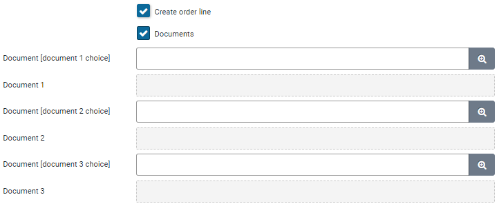

You can also include documents for this order line, based on the documents of the quotation. To add documents mark the checkbox "Documents" and save it. Next you can connect up to 3 documents.

After saving a quote for which the checkbox "**Create order line**" checkbox is selected, an order line is added in Shopper for the employee who is entered under "Requester". This employee will find this request line in the shopping cart that becomes visible in the "ToDo process flow". After "Apply definitive" for this shopping cart, you need first go through the required approval (if applicable) before finally placing the order. See \>\> [Requests and shopping cart](#request), for further explanation.

**Note**: Don't mark the checkbox "Create order line" until everything has been filled in and the documents have been specified.

In case of a **contract**, you can specify or change the contract-type. If these was specified in the data module "Detail" of the Tender, it will be prefilled, however it can still be changed. Additionally a description and general info for the contract need to be provided.

After saving a quote with the "**Create contract**" checkbox selected, a contract is registered in Shopper. You can then find this contract via the Contract menu and the menu item "Contracts". See also \>\> [Registering contract](#contract-requests).

Once you have fully completed the processing of the order-line or contract, mark the checkbox "Processed". Afterwards the sections "Order-line" and "Contract" can no longer be changed.

**Note:** You can choose "Accepted" for multiple suppliers/quotes and have the processing run differently for each supplier.

**Note**: Once a quotation has been completed and the requisition or a contract has been created for it, the entry fields of the quotation in relation to this requisition or contract can no longer be changed. The corresponding checkbox for "creating a requisition or a contract are then also disabled. Also the fields for a requisition or a contract will not be shown once the checkbox "Completed" had been marked manually (i.e. no requisition of contract was created for it).

# Contract process

## Dashboard Contracts

The dashboard contracts can display the "Process flow Contracts", "Process flow my contracts" and the "Process flow contracts monitor", depending on your authorizations within the contract echelons. The contract process is made up of the process steps that apply within your organization for the life cycle of a contract. Several process steps are conditionally completed depending on the contract type, to which these steps may or may not apply.

**Note**: The contracts dashboard and the Contract menu are only available to employees that have the "Contract management" checkbox marked in their profile. This mark is set if the employee has been assigned to one or more contract-echelons. For more details see the section "Contract authorization and access rights" in \>\> [Contract setup](#contract-setup).

### Process flow Contracts 

The ToDo contracts process flow shows the sequence of the process steps within the contract process with an indication of the outstanding ToDos within the term of a contract. In the Assess process step, a line runs under the process step to indicate that this step can be left conditionally.

For a general explanation of the operation of the ToDo process flow, see \>\> [Home dashboard](#dashboard-home)

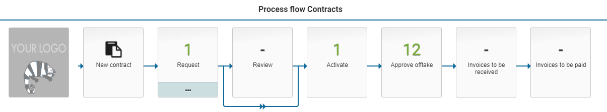

The ToDo Contracts process flow is completed as follows: A new contract is to be requested after registration and then approved. Once approved, the contract can be activated and - if applicable - the periodic offtake can be approved for these current contracts, followed by invoice processing. For more details on the process and status transitions of a contract see **Life cycle** under \>\> [Contract setup](#contract-setup).

When setting up the workflow per contract type, it is determined which process steps are or are not applicable in the process diagrams. See **Contract types** under \>\> [[Contract setup](#contract-setup)](#_Contract_workflow_en).

**Note:** The process steps "Approve offtake", "Invoices to be received" and "Invoices to be paid" are only available if you have purchased the license module "SHOPMOD-CO Shopper module Contract offtake, contract invoices, contract utilization and order advice optimalization".

After choosing a process step with a ToDo, the corresponding screen is displayed to be able to perform the required actions. In the event that the ToDo relates to a contract period, the relevant contract will have a colored exclamation mark next to the relevant period. The color coding of the exclamation mark corresponds to the color coding of the numbers in the process steps.

The color coding of the numbers is explained in the Contract process steps:

### Contract process steps

\>\> [Requests](#contract-requests)

\>\> [Approve](#contract-approval)

\>\> [Activate](#activating-contract)

\>\> [[Approve offtake](#approving-contract-offtake)](#_Afname_accorderen_Contract)

\>\> [Invoices handling](#contract-invoice-processing)

### Status my contracts

You can follow the progress of the requested contracts in the process diagram that is displayed under "Status my contracts". Here too you can open the corresponding screen by pressing the process step, but these screens only provide insight, and you cannot change or add anything. Except for "Running" which behaves similarly to the "Contracts" menu item in the contract menu, with the difference that in the list of contracts only the contracts in progress are shown. For more details on the contract screens, see: \>\> [Contract recording](#contract-recording)

The numbers in this process flow diagram represent the number of (contract) periods in this state. A contract can consist of one or more contract periods, with a new contract period being added for each renewal. The color coding of the numbers is the same as described in the ToDo process flow.

**Note**: Depending on the purchased license of Shopper, fewer process steps may be visible, such as "Approve offtake", "Invoices to be received" and "Invoices to be paid", which you will not find in the status of your contracts.

### Contract monitor 

As a team leader or manager, you can also follow the process of contracts requested by other employees (who work within the same organizational units).

In this way you can monitor the progress of the requests made by these employees. Even if they are on vacation, sick or otherwise absent.

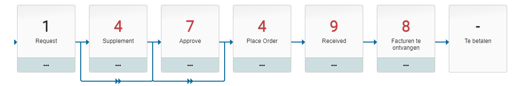

The Contracts monitor process flow is only visible to employees who are contract owners of the contract echelon and who therefore have the role of Executive for these contracts. For more details about the roles in the contract organization see **Contract organization** under \>\> [[Contract setup](#contract-setup)](#_Contract_workflow_en).

# Contract requests

## Contract recording

The registration of contracts is started via the process step "New contract" or via the menu "Contract" and the menu item "Contracts" and then under the list of contracts you can register a new contract with the "(+) Add" button.

When all required data has been registered with the contract and the contract period, the button "Offer for Approval" becomes available in the button bar from the contract period. This will start the contract request with the related Approve workflow. For details on offering a contract period for Approval see contract-Workflow (approve), under \>\> [Workflow](#workflow).

The contract screen is formatted according to the standard as described for the "**General screen layout"** under \>\> [Use of the other screens](#use-of-the-other-screens).

The "sequence number / status", "Description" and "Contract Party" fields are used to display the contract in the list, along with the status of the contract below. For details on the status of a contract see **Contract workflow and life cycle** under \>\> [Contract setup](#contract-setup).

Below the list, you can create a new contract with the "(+) Add" button or remove the selected contract with the "(x) Delete" button.

**Note:** A contract can be removed as long as the contract has not yet been submitted for approval.

The "(x) Delete" button is only available if you have the required authorization/authorization for that contract. For more information see **Contract authorization and access rights** under \>\> [Contract setup](#contract-setup).

When all mandatory contract data has been entered, a report can be created with an overview of all entered contract data by clicking the "**Print**" button in the button bar. For example, to confirm it before you submit the contract for Approval, or for the employee who will carry out the Approval.

If all required data has been entered, the contract/period can be submitted for Approval via the button in the button bar "**Submit for Approval**". This button only becomes active when all the required data for the contract and the contract period have been entered. At the bottom of the "Detail" data module of the contract period, any missing data is displayed under the status.

### Adding a new contract

After you have started the registration of a new contract, a new contract will be created for which you can enter the details -- as visible in the "General / Periods" data module. The required fields are marked with an \*.

You can choose the **contract type** from the list of contract types that are defined for your organization and for which you are authorized. The workflow for assessing the contract can differ according to contract type. Optionally, a **contract subtype** can also be used if these apply to your organization, such as for single or multiple private tenders.

**Note**: The contract type directs the Approval workflow, so be careful to choose the correct contract type when adding a new contract.

You can enter a short text in the **Description** field. This text is also used by Shopper to list the contract in the list of contracts (on the left side). A more elaborate description can be provided in the "**General info**" field and the text entered for the "**Report info**" is used by Shopper in the contract-reporting based on Excel exports.

You must also fill in the "**Contract party**" field, here you can only choose a contracting party that is known as suppliers within Shopper. So if applicable, the supplier (and if necessary the creditor) needs to be added first.

Items can be registered with the contract arrangements for registering [periodic]{.underline} offtake within a contract period. Items purchased within the P2P process according to this contract do not need to be registered with the contract itself. You can register these items in the catalog for the supplier, registered as the contract party for this contract. See \>\> [Catalog management](#catalog-management).

If items are (also) to be registered with this contract, you need to mark the "**Register items with this contract**" checkbox. After saving the contract, the data module "Items" is now added to the list of data modules for this contract. For the use of the data module, see "Items" \>\> [Recording items](#recording-items).

**Note**: This checkbox is only activated if the contract is in draft status.

If you have purchased the "SHOPMOD-CO Shopper module Contract offtake, contract invoices, contract utilization and order advice optimalization" license module, you can also apply invoice matching for the transactions in periodic offtake. This requires that you also register items with this contract and the agreements for this with the contract period. You can indicate by checking "**Invoice matching**".

If the contract is part of a framework agreement, you can attach the contract to the framework agreement after you have created the framework agreement by selecting it in the "**Framework** **agreement**" field.

If items were registered at the framework agreement -- selected for this contract - then after saving the contract, the "**Framework contract items**" data module is added to the list of data modules for this contract. For the use of the data module, see "Framework contract items" \>\> [[Recording items](#recording-items)](#_Registreren_artikelen).

**Note**: the contract type determines whether or not a contract itself is a framework agreement. The framework agreement fields are not available for these contracts. You cannot therefore attach a framework agreement under another framework agreement.

When the mandatory fields are filled in, you can save the contract.

The registration of the contract data is partly included in the contract period. See for this part \>\> [Recording contract period](#recording-contract-period)

**Note**: Registering documents and communication/contact moments are described under \>\> [Contract filing](#contract-filing)

### Recording of financial particulars 

In the "Financial" data module, you enter particulars regarding the payment terms, costs and other conditions that apply to the contract, as shown in the screen below.

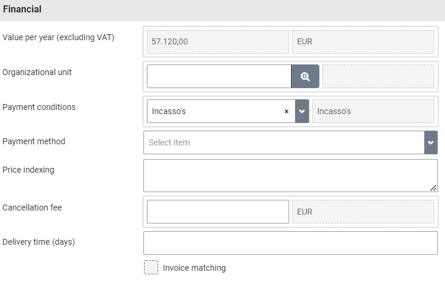

It can be indicated for which "**Organizational unit**" this contract applies in relation to the relevant cost center and costing unit. If the contract applies to multiple organizational units, you can leave this field empty. You can then create agreements for periodic offtake at related organizational units during the contract period.

**Note:** The organizational unit is also used in relation to the authority of employees to access a contract. In this as specified in the financial data module or derived from the agreements in the contract period.

If the license data module for general journal entries / memorial bookings has been purchased, you can also indicate the item type for the general journal entry here in order to register the obligation arising from this contract in the financial administration. Only item types can be specified for which the employee is authorized, and then only those item types for which the supplier has indicated that they can be used in contracts. See also supplier under \>\> [Catalog management](#catalog-management).

At the top is the "**Value per year (excl. VAT)**" for this contract. This approximates the contract value that is derived from the value per year as stated at the current period, or if it is not there at the next period in draft, or if the contract is terminated at the last period.

### Recording term of contract 

In the "Term" data module, you register the data relating to the commencement and termination of the contract, including the warranty and cancellation period.

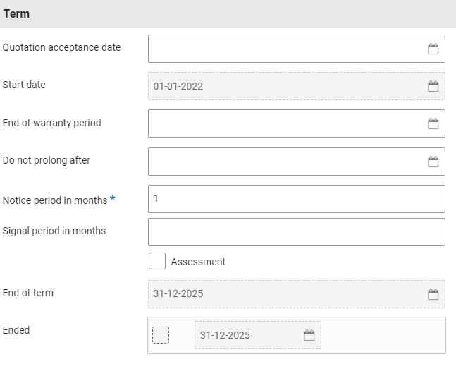

The "**Start date**" field indicates when the contract will take effect. This date can also be in the past, if you register an existing contract. If a contract has a definite end date, you can enter this in the "Do not prolong after" field.

For you indicate an expiring contract period under "**Notice period in months**": the number of months in advance of the notice period at which a contract manager from the role of contract monitor is informed via an "Other ToDos" to indicate the follow-up action, i.e., extend or discontinue. See also **Contract signaling** under\>\> [Other ToDos](#other-todos).

In the field "**Quotation acceptance date**" you can indicate -- if applicable -- when the related quotation has been accepted. If you use the "SHOPMOD-OF Shopper module Tenders request and manage quotations, incl. communications" license module, this date is automatically taken over from the quotation and cannot be changed in the contract.

At the bottom it says, "**End of term**" and "**Ended**". These fields are not filled in manually but are derived from the status of the contract and the current contract period. When a contract has been terminated, the corresponding checkbox is selected, indicating the date on which the contract was terminated. See also **Cancelling contracts** or **Cancellation of contract within trail period,** under [Renewal, amendment and termination](#renewal-amendment-and-termination) and **Contract signaling** under \>\> [[Other ToDos](#other-todos)](#_Contract_signalering).

### Recording contact particulars 

In the "Contact details" data module, you register the internal contact for your organization regarding the communication (talks, negotiations, etc.) on this contract. Select an **Employee** using the dropdown list. This list is populated with all employees with a role that allows them to access this contract. Additionally, the contract-role can be specified. The list of selectable employees will then be limited to employees with this role. If the **Role** is specified and the employee selected as the internal contact for this contract becomes inactive, or in any other way no longer has access to this contract, another employee with the same role is automatically assigned as the internal contact for this contract by Shopper. The internal contact is listed on the print-out of the contract, generated using the "Print" button.

[]{#_Registreren_artikelen .anchor}

You also enter the contact particulars regarding the contracting party. This information is taken over from the supplier specified as the contracting party in the "General / Periods" data module. You can adjust or supplement this regarding the contacts for contracts, whereby you can state the contract number under which the contract is known at the supplier in the "Reference contracting party" field.

## Recording items 

These items concern the products and services that are (periodically) purchased via contract offtake. Items can be inherited from a framework agreement (data module "Framework contract items") or registered specifically for this contract (data module "Items"). These items are not related to the items set up in the internal catalog (Procurement menu -- Setup -- Items) for the supplier.

**Note**: Entering or adjusting items and indexing is only possible if the contract and thus the contract period has the status draft. Adding, removing, or editing items to a current contract requires that you first amend the contract within the trial period.\
See \>\> [Renewal, amendment and termination](#renewal-amendment-and-termination).

### Recording items with this contract

In the "Items" data module you can "(+) add" or "(-) remove" items to this contract. For the item, specify the description, the "**Unit price (excl. VAT)**" and the "**VAT type**" and indicate the item type that applies. The item type determines the cost type to which the contract offtake will be booked. In this case too, only item types can be specified for which the employee is authorized and that these are permitted by the supplier for use in contracts.

**Note**: This data module is only available if "Register items with this contract" is checked in the contract

If applicable, you can indicate how the price of this item should be included in the indexation by checking "Indexation". You can also indicate whether you want to round the indexation to 2 decimal places when displaying the index.

The "**Amount for periodic offtake**" is stated at the bottom, which is derived on the basis of the agreements about the periodic offtake of this item for the current contract period. The agreements can be found with the relevant contract period.

### Recording framework contract items under this contract

In the data module "Framework contract items" you can check which items you want to inherit from the framework contract.

**Note**: This data module is only available if this contract is subject to a framework agreement.

The selected items of the framework agreement mentioned above are then available to pre-register agreements with the contract period. The price and indexation specified in the framework agreement apply to this.

**Note**: the indexation you specify in this contract therefore has no influence on the items that come from the framework agreement.

### Recording indexation

In the "Indexation" data module, the indexing is specified for the item prices for this contract. The indexing is applied to the items where "Indexing" is checked. The indexation does not apply to the framework agreement items. That indexation must be specified in the framework contract.

**Note**: This data module is only available if "Register items with this contract" is checked in the contract

The indexing is specified by a percentage or an amount, linked to a start date. In the contract agreements, the prices of the items in question - which are subject to indexation - are adjusted accordingly on the stated start date. The indexation is calculated with a precession of 6 decimal places to prevent rounding errors as much as possible.

This indexation is also applied to the current contracts, i.e., the indexed prices are also applied to the contract agreements of the active contract period. The indexation also applies to contract agreements with a different price. For an approved price change in the future, the indexation will be applied based on the last price change performed.

If the price of an item in the contract is changed during the renewal or interim adjustment, the next indexation will be applied based on this adjusted price. If the price in the contract has not been adjusted upon renewal or interim adjustment, then the indexation of the price will continue unchanged at the time of the contract, taking into account the indexation that has already taken place up to that point.

You can register multiple indexing periods. If it concerns an annual indexation that applies every year (with the same percentage or amount) for the entire duration of the contract, you can check "**Generate annual indexes**" to have these generated automatically.

In the data module "Item indexing" you will get an overview of the indexing per item. You can view these and adjust them if necessary. For example, if a certain rounding has been agreed upon during indexation. Then check the "**Different amount**" checkbox and enter the correct amount for the unit price.

Any documents about indexing or validating the indexed amounts can be included in the "**Documents**" data module and, if applicable, removed. Documents that are added here, are then also visible and insightful in the "Documents" data module of the contract, where they can also be removed.

### Recording overview within the term of the contract

The impact of the indexation can be seen in the "Overview" data module of the contract. Here you will find all periods within the term of the contract, including any future extension if these have already been created.

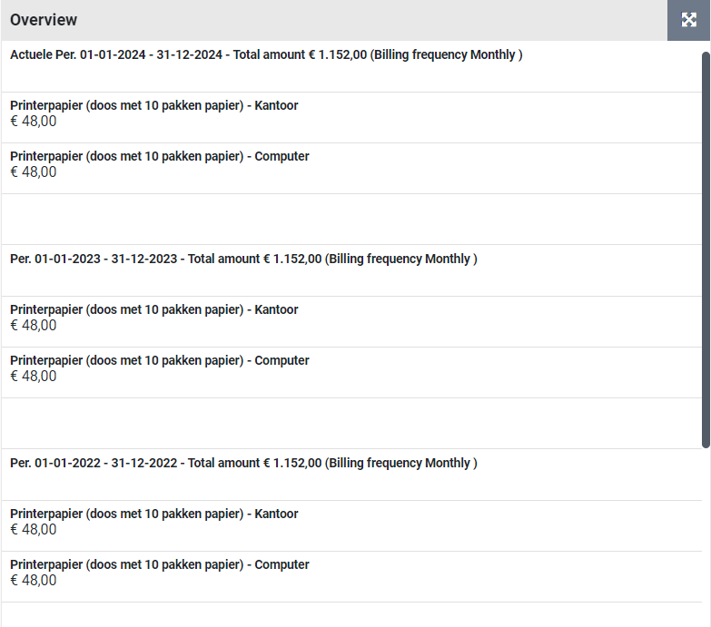

The value of the period is displayed per period. If indexation is applicable, this is included in the value for that period into the future.

## Recording contract period 

At the bottom of the data module "General / Periods" of the contract is an overview of the periods of this contract. By default, this overview is sorted from Newest to Oldest and if applicable, scroll to see older contract periods.

The term of contract and status of this period is displayed per period. The status of the period is displayed as status with optionally a (sub-status). The sub-status applies to the status "Draft" (in relation to the outstanding ToDo) and to the status "Activated" (in relation to the maturity status).

[Period status (sub-status):]{.underline}

  ------------------------------------------------------------------------------------------------------------------------------------------------------------------------------------------------------
  Draft (enter contract)                                  New period is registered but has not yet been submitted for approval.
  ------------------------------------------------------- ----------------------------------------------------------------------------------------------------------------------------------------------
  Draft (contract renewal)                                Period has been created for an extension but has not yet been submitted for approval.

  Draft (Rejected contract request)                       Period has been rejected during the Approval and can be resubmitted for Approval

  Draft (renewal declined)                                Period for renewal has been rejected during the Approval and can be resubmitted for Approval

  Draft (amendment to contract within the trial period)   Contract/period can be adjusted and then submitted for approval

  Draft (interim amendment to renewal)                    Contract/period for a planned renewal can be adjusted and then submitted for approval

  To be approved                                          Contract/contract period to be approved (approve workflow applicable)

  To be activated                                         Contract period has yet to be activated, (only active period can be running)

  Activated (future)                                      A period for a scheduled renewal that has already been activated (this period will then be current on the effective date of the period)

  Activated (current)                                     This is the current period for the contract

  Activated (ended)                                       This is an already terminated period, it often exists in combination with an ongoing period, unless the contract itself has been terminated.
  ------------------------------------------------------------------------------------------------------------------------------------------------------------------------------------------------------

When a new contract is registered, a contract period is automatically created in the status "Draft (register contract)".

For more details on the status and status transitions of a contract period, see **Contract workflow and life cycle** under\>\> [Contract setup](#contract-setup).

After choosing the period from the list, the details and data modules of these periods are shown.

With the period, the data regarding the duration of the period is specified in the data module "Detail" and the status is also transparent.

For registering a new contract, the "**Starting date**" of the first period is copied from the start date specified for the term of the contract. If the starting date of this period is adjusted - and this subsequently deviates from the commencement date of the contract - then the start date of the contract term will be adjusted accordingly. When renewing a contract, the start date is entered in connection with the previous period and cannot be changed.

The T**erm** of contract is specified in months and is set to 12 months by default. For contracts where - from the contract type - early termination is allowed, it is possible to specify the deadline until when this is possible under "Interim termination until". See **Cancellation (within trial period)** under \>\> [Renewal, amend and end](#renewal-amendment-and-termination).

The **value per period (Excl. VAT)** and the related **Installment amount** is -- if applicable -- derived from the periodic offtake within the contract period. When registering a contract (period) without items and agreements, the installment amount can be entered. In the event of an extension or interim change, the installment amount can be changed during the contract period.

For contracts with items and agreements, the installment amount is determined based on the item prices and the number of items in the arrangements. The value per year is determined by contract period as installment amount \* invoice frequency of the contract period.

### Recording invoicing setup

In the "Invoicing setup" data module, the data regarding invoicing can be entered. This can be done by specifying the **Invoice frequency** (monthly, weekly, etc.) or by choosing the invoice frequency "irregular" from the dropdown selection and then specifying in the field "Number of invoices" how many invoices will be sent within this period. When saving the invoice data - if an invoice frequency is specified - the number of invoices is derived and displayed.

When renewing, the invoice frequency can be adjusted and deviate from the previous period. The invoice frequency can also be specified in the contract agreement for the period, whereby it can deviate from the invoice frequency specified when setting up invoicing.

For contracts for which "Match invoice" is checked, the "**Date of initial order**" can also be specified, whereby the order dates of the offtake purchases are then relative to the date of the initial order instead of the start date of the contract period, allowing offtake approval and the related invoice handling to be performed starting from the date of the first order. If so desired, the initial order date can by default start earlier than the start date of the contract period. This can be setup in the Parameters data module, under \>\> [System parameters](#system-parameters).

The checkboxes at the bottom indicate how the approval of offtake needs to be performed. If no checkboxes are marked, approval is not applicable and the process step for offtake approval for this contract is skipped and this constitutes an "Automatic approval".

The checkbox "**Numbers adjustment possible upon purchase**?" enforces a manual validation of the contract offtake, allowing the number of items for the offtake purchase to be altered. The checkbox "**Approve prices on purchase**?" indicates that if the number of items was altered, someone from procurement (the purchasing department) should validate and approve the price. The checkbox "Final approval by budget holder upon purchase?" indicates that a budget holder should approve the alterations -- in regard to the committed contract value -- before invoice handling can be performed. See also \>\> [[Approve offtake](#approving-contract-offtake)](#approving-offtake).

#### Irregular invoice frequency

If the invoice frequency for the invoicing setup is set to "Irregular" order dates will have to be manually created. After activation of the contract period the "Order dates" data module contains an "Add" button (at the bottom). This button is only available for employees with the role Administrator or Operator as part of the assigned contract echelon. The Add button is used to add an order date for the offtake purchase using a proforma order. You can then specify the order date and confirm it using the "Save" button. Once the "Proforma order created" checkbox has been set the offtake approval and invoice handling can be performed. If an order date for an irregular invoice is cancelled, the created order date can be removed by selecting the order date from the list in the "Order date" data module and then use the delete button (at the bottom of the list).

**Note**: an order date can only be removed if it was manually added for an irregular invoice date, as long as no offtake or invoices have been registered for it.

**Note**: The described handling also applies for contract arrangement with a deviating invoice frequency set to irregular.

### Recording options for renewal

In the "Prolongation" data module, the options for renewal are specified. By default, the checkbox "**Prolongation possible**" is selected, but if it is a question of the only or last contract period, this checkbox can be unchecked, so that the contract is automatically terminated at the end of the period.

When adding new contracts or when creating a new period (as a result of a renewal), you can already specify with how many months the next extension must be carried out if this has already been agreed with the contracting party. See also **Contract signaling** under\>\> [[Other ToDos](#other-todos)](#_Overige_ToDo’s).

If applicable, you can check "**Automatic prolonging**". Then -- after the cancellation period has expired -- a new contract period is automatically created, based on the number of months entered in the field "**Prolongation in months**". This field is therefore mandatory if the \"**Automatic prolonging**\" box is checked. After the automatic prolonging has taken place, the extended contract period still needs to be activated. See also **Contract renewal** under\>\> [Renewal, amendment and termination](#renewal-amendment-and-termination).

The fields "**Deadline renewal decision**" and "**Signaling from**" are filled in when the field "Prolongation in months" is specified, based on the "Start date" of the contract period, the "Notice period in months" and the "Signal period in months" of the contract.

### Recording contract arrangements and (planned) price changes

The contract agreements for the periodic offtake of the items in this contract are registered in the "Arrangements" data module. A contract arrangement itself also has several data modules, whereby the data module \"Detail\", "Prices" and "Documents" apply when registering contract arrangements. The other data modules are described under \>\> [Activate contract period](#activating-contract-period), \>\> [[[[Approve offtake](#approving-contract-offtake)](#approving-contract-offtake)](#approving-contract-offtake)](#approving-offtake) and \>\> [Contract audit trail](#contract-audit-trail).

In the arrangement, the quantities and booking data for the installments of the contract period are recorded. Agreements can be created for items of this contract and -- if applicable - also for items from the framework agreement.

The agreements are recorded for an **organizational unit**. You can enter one or more agreements for the same item and thus specify the periodic offtake purchases for several organizational units.

In the contract arrangement, you enter the "**Number of periodic offtakes**" that will be purchased per installment (as defined by the invoice frequency in the "Financial" data module). You can then save the arrangement. When saving, the other data is automatically generated. If the actual data deviates, you can adjust the arrangement, such as for a different financial administration than the one the contract was created or a deviating installment period (start and end date). A project can also be selected if this arrangement applies within this project.

If a different unit price applies within this arrangement, this can be entered in the "**Unit price (excl. VAT)**" field when creating the agreement. After saving the agreement (or if a planned price change applies), this field can no longer be changed, and the deviating price can only be entered or adjusted in the "**Prices**" data module.

If a **deviating installment period** applies - compared to the term of the contract period - you can adjust the relevant **start date** or **end date** to this in the contract agreement. For example, if the periodic maintenance only starts after the warranty period has expired, or if the total amount has been paid, the repayments stop while the maintenance or subscription continues.

If there are items within a contract that are not purchased periodically, but on demand with or without installments, these items can be entered in the internal catalog of this supplier. The purchase of these items then takes place via the P2P process. These purchases via the P2P process can be traced for this contract via in the data module "Occasional offtake". See also **Recording occasional offtake.**

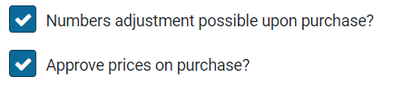

For contracts with invoice matching the arrangement can be assigned different offtake approval handling then is set for the contract period in the "Invoicing setup" data module.

Likewise, a deviating invoice frequency can be specified with the agreement when deviating from the invoice frequency when setting up invoicing of a contract period.

In the "**Reference**" field, an entry can be made regarding this agreement, for example a subscription number or an employee to whom this agreement applies. If documents are applicable to an agreement (or when changing it), these can be recorded with the agreement via the "Documents" data module.

[Deviating prices and planned price changes]{.underline}

In the "**Prices**" data module of an agreement, prices are kept in historical perspective, whereby price changes and deviations are to be approved via the Approve process step. With a contract period, only those price statements that apply within the term of the contract period are shown.

After saving a new agreement, one or more price entries are created, derived from the price for the item (or the deviating unit price if this is specified when recording the agreement) and the specified indexation.

The start date of the first price entry corresponds to the date of the first order specified in the contract period (Detail data module). If a price indexation applies within this contract period, then these planned price changes have also been added. If a deviating unit price was specified at the time of the agreement, the "Divergent" checkbox next to the price will be selected.

With the button (+) Add" a (planned) price change can be entered when creating or changing a previously approved agreement (via interim adjustment).

If the checkbox "**Divergent**" is selected, the price in the field "**Unit price (excl. VAT)**" can be adjusted. After saving the arrangement, the price can be adjusted using the "Prices" data module, selecting the price, and checking the Divergent box. For example, for example if lower prices apply when purchasing larger quantities or where other agreements were made that affect the price in some other way.

The "**Approved**" checkbox is set by Shopper if the price (change) has already been approved in the Approve workflow before. If an interim change is made to a contract, this checkbox will remain approved, unless a change is made to this price listing. Then it needs to be approved again via the Approve workflow.

The price of the item can also be adjusted at the level of the contract while the contract recording is being performed (i.e., before the contract is presented for Approval). If the price of an item is changed there, then -- unless a different price is specified in the agreement -- this price will be adjusted with the relevant agreements of the contract period in the "draft" status. The value of the contract period and the contract is then also adjusted accordingly. This does not apply to active or terminated periods, so they will not be adjusted by it.

If the indexation is adjusted or added with an interim adjustment of the contract, then the indexations are adjusted or added for all periods in the future, whereby these are again approved via the Approve workflow.

For an activated contract period, the price that applies from the start date of the contract period is used. Entered price changes - approved when the contract request is being reviewed for approval - will automatically take effect on the effective date specified in the price listing.

**Note:** If the price of an item in the contract is still adjusted after request, it will only be accepted when the contract period is extended or amended with trial period. Price changes in the future, including indexing, can only be changed when extending or adjusting in the meantime.

### Recording occasional offtake

In the "Occasional offtake" data module of a contract period, it can be specified to track the occasional offtake in the P2P process, related to this contract or the obligations agreed for it. I.e., list the purchases that result from requisitions via the internal/external catalog of using the free request, for items of the supplier that is named as the contract party for this contract. See \>\> [Requests and shopping cart](#request) for P2P requisitions and for the setup of catalogs under \>\> [Catalog management](#catalog-management).

Recording of occasional offtake can only be done for a contract period in the status "Concept". The field "**Explanation**" can be used to describe the nature of the occasional offtake and the reason for tracing it. The other fields describe wat will be tracked.

It can be specified which financial administration and/or organizational unit should be tracked. If these fields are left empty, it applies to all administrations / all organizational units, depending on the field that has been left empty.

For occasional offtake you can specify for what financial administration and or organizational unit it applies. If you leave these fields empty, all purchases for all administration and organization units are tracked, or in respect to the field that was left empty.

Optionally an item type or even a specific item can be specified that needs to be tracked. Again, only item types can be selected for which the employee (that is recording the information) is authorized and that this item type is approved for use in P2P purchases.

**Note**: You can specify an item type or an item, but not both.

**Note**: The occasional offtake record first needs to be saved before an item can be selected.

If an offtake obligation has been agreed, you can enter the agreed amount or the agreed number for this period in the field "**Amount agreed**" or "**Number of items agreed**".

If a different term applies (in relation to the contract period) a deviating start/end date can be specified.

If the contract period is activated, from that moment on, the total purchases within this contract (or deviating) period will be tracked and displayed in the fields "Amount purchased" or "Number of items purchased". The progress is shown in a pie chart.

Below the pie chart, a list of all order lines from the P2P process is displayed for purchases made with the contracting party (supplier) in this contract (or deviating) period. These order lines are also the basis for determining the progress of the obligation.

# Contract Approval

## Workflow for Approve

The "Approve" workflow starts after a registered contract has been requested using the "Submit for approval" button for the relevant contract period. This button is only available to employees who have the role requestor through the contract echelon.

From the moment the contract is submitted for Approval, many details of the contract and the relevant contract period can no longer be modified. If something is still forgotten during registration, the requestor can cancel the Approval via the button "Abort approval".

For the contract period - which has been submitted for Approval - the data module "Follow-up by" is now available, where it can be determined which employee can carry out the follow-up action (in this case Approve). This depends on their authorization for the Approver role and the associated expertise type (assigned via the contract echelon) and the access rights (assigned to the employee within this contract echelon) for the contract type, item type and organizational units that are specified in the agreements and occasional offtakes.

In the "Employees" data module of the contract, in the "Approver" column, it is also possible to determine which employees can fulfill this role for this contract. See **Contract authorization and access rights (contract echelon)** under \>\> [[Contract setup](#contract-setup)](#_Contract_workflow_en).

Depending on the workflow set up for the contract type of this contract (in relation to whether or not invoices are matched), one or more Approve steps may or may not apply. See **Contract Workflow** under \>\> [Contract setup](#contract-setup).

### Approve contract period

For contracts that need to be approved, it will be listed in the "Approve" process step of the contract process flow ToDo. The ToDo for this process step can be followed up by an employee who has the role of "Approver" via the contract echelon.

If the contract/contract period has been submitted for Approval, the progress of the Approval can be found in the "Detail" data module for the contract period. If Approval steps apply, the status will show "To approve", without Approval, the status will display "Activated".

The field "Step to approve" indicates which approval is required. If more than one approval applies, then after giving an approval, the next required approval will be stated in this field, with the employee(s) who have approved the previous Approved in the field "Already authorized by".

In order to carry out the Approval, the different data modules in the contract and the period can be viewed or - by means of the "Print" button on the contract - can be viewed as a report.

After Approving the contract period, you can select "Approve" or "Reject" via the available buttons. If rejection is chosen, a rejection note (reason) must be provided.

The contract and the period then go back to the draft status. The approver can also add a document to the contract with an explanation or report of the Approval. Preferably do this before using the approve or reject button, as otherwise the contract is no longer listen for the approval ToDo or may even be empty (with the message "First choose a contract from the list"). A document can be added afterwards by the approver, but then the contract must first be selected again via the contract-contracts menu.

For the requestor, the color of the displayed number is red at the process step "Request" and after choosing the process step a red exclamation mark is displayed for the relevant contract period with the status "Draft (Rejected contract request)".

After the opening of this contract period, the approver's reason for rejection will be stated in the "Rejection note" field. After resolving the rejection reason, the checkbox "Rejection comment seen" must also be checked before the button "Submit for approval" becomes active again.

The course of the Approval - including the reason for rejection - is recorded and can be found in the "Audit trail" data module, as described under \>\> [[Contract audit trail](#contract-audit-trail)](#_Audit-trail_Contracten).

After approval of a contract period, the next step in the Approve workflow is determined. If applicable, start the next Approve step for a different expertise type. As soon as the workflow for the Approval has been completed, the contract arrives at the status "To be activated" and the process step "Activate" is to be performed next.\

# Activating contract

## Activating contract period

The activation process step follows, after the Approval workflow of a contract and is performed via the "Activate" button for the relevant contract period. Before the contract is activated, it is possible to digitally sign the (approved) contract documents. See section "Digitally sign contract documents" for more details.

The activate button is only available to employees who have the role "Requester" through the contract echelon.

If something still needs to be amended at this stage, the requester can reset the contract period to draft status via the "Amending" button. After the adjustment, the Approval workflow needs to be completed again in order to return to the activating process step. See also **Interim amendment to contract** under \>\> [Renewal, amendment and termination](#renewal-amendment-and-termination).

In the "Employees" data module of the contract, in the "Requester" column, it is also possible to determine which employees can fulfill this role for this contract. See **Contract authorization and access rights (contract echelon)** under \>\> [[Contract setup](#contract-setup)](#_Contract_workflow_en).

The Activate step is required to change the status of a contract to "Running". For an ongoing contract, the contract period in which the current date falls, must have the status "Activated (Running)". Each contract period needs to be activated separately, and a contract period cannot be extended until it has been activated. Invoice matching for periodic offtake can also only be performed once the contract period has been activated. See also \>\> [Approve offtake](#approving-contract-offtake)

When activating a contract period retrospectively, the proforma orders and location offtake are created retroactively.

### Digitally sign contract document

When applicable the contract (and or related PDF-documents) can be digitally signed via Shopper.

**Note**: This requires the integration with a digitally signing system to be installed.

In that case, the data module "Signings" is available for the contract. Using this data module you can setup and execute the handling for the digital signing. To this extend please read \>\> [Sign documents digitally](#sign-documents-digitally).

**Note**: If no PDF-documents were added to a contract, the data module "Signings" will not be available for this contract.

### Create order dates and proforma order

For contracts for which "Invoice matching" is checked, when the contract period is activated, the order dates for periodic offtake is created in the "Order dates" data module of a contract period, based on the arrangements for invoicing arrangements for the contract period.

The list of planned offtakes is displayed in the "Order dates" data module of a contract period. A checkbox also indicates if a "Proforma order" has already been created for this order date. Shopper automatically creates the "Proforma order" on the order date of the offtake, so that the invoice processing can take place. If it is desirable to create the Proforma orders earlier, this can be specified, data module parameters - contract section under \>\> [System parameters](#system-parameters).

In the "Detail" data module for a decrease in the list of order dates, "Proforma order created" can also be manually checked to create it earlier. This may also apply when registering existing contracts where the order date has already passed, but invoice processing has yet to be performed.

**Note**: This also applies for the recording of an already running contract, where the order date is in the past, however invoice handling must still be performed.

**Note**: You can delete proforma orders (by unchecking the relevant box), but only as long as no offtake has been approved or canceled.

**Note**: If the contract uses an irregular invoice frequency, the order date could be missing in the list at the "Order dates" data module. In this case the "Add" button should be available at the bottom of the list, allowing you to add the required order date.

Once the proforma order has been created, it can be viewed per location in the "Location offtakes" data module in the "Order dates" data module. Location orders are made with the current price. In other words, the price of the contract agreement with the (most recent) effective date that applies on or before the order date of that contract offtake /term.

The budget expenditure that follows from the proforma orders of the contract is totaled in the annual budgets per cost type and can be found in the budget periods as contract obligations. See also **Budget periods** under \>\> [[Budget control](#budget-control-1)](#budget-control-1).

### Creating journal entries

If the license for journal entries (memorial bookings) has been purchased, the journal entries are created when the contract is activated, based on the specified "Item type journal entries" in the "Financial" data module of the contract. See also **Entry of financial particulars** under \>\> [Contract recording](#contract-recording).

The general journal entry is created according to the "Item type journal entries" specified in the contract type, per term or per entire period. In other words, a journal entry is created per order date for the installment amount (when the proforma order is created) or a journal entry is created for the value of the entire period (when the period is activated). See also **Contract types** under \>\> [[Contract setup](#contract-setup)](#_Contract_workflow_en).

When activating a contract period after performing an interim amendment, the new contract value is set off against the old contract value, whereby the differences are then corrected with a general journal entry. Depending on the "Journal entry type" (of the contract type), this is done for the entire contract term or by interim date. For performance of an interim contract amendment see **Interim amendment to contract** under \>\> [Renewal, amendment and termination](#renewal-amendment-and-termination).

[]{#_Afname_accorderen_Contract .anchor}

# Approving contract offtake

## Approving offtake

The process step "Approve offtake" follows, after activating a contract and is carried out by approving the relevant offtake location with the order date. This is only available for employees who have the recipient role via the contract echelon and then only for contracts where "Match invoice" is checked.

If for the invoice setup of contract arrangement none of the checkboxes "Numbers adjustment possible upon purchase?", "Approve prices on purchase?" and "Final approval of budget holder upon purchase?" are set, approving offtake is not applicable. For more details see the **Register invoicing setup** and for **Recording contract agreements and (planned) price changes** under \>\> [Recording contract period](#recording-contract-period).

After selecting this process step, a list is shown on the left of the screen with the offtake is still to be approved, originating from the various contracts with outstanding location offtake, the employee is authorized for (i.e., authorized organizational units and projects). The organizational unit and, if applicable, the project is specified per contract offtake in the list "Approve offtake" on the left.

In the "Detail" data module, lists for the location-offtake the contract, the administration and the location (organizational unit) and order date. When approval has been carried out for the offtake items listed at the bottom, the checkbox "Completed" is marked.

**Note**: If the checkbox "Completed" is marked, the related invoice line can (automatically) be made payable if the numbers and amounts match.

At the bottom of the "Details" data module you will find the related offtakes for the different items of this location. For each offtake you can set the presented checkboxes in the columns for "**Action number is correct**", "**Action price is correct**", "**Approve**" and "**Cancel purchase**", to indicate approval for this offtake. The check marks "**Number is correct**" and "**Price is right**" indicate if an approval was already given.

**Note**: Depending on the invoicing setup of the contract period, the contract arrangements and the expertise type assigned to you for the contract role "Receiver", certain checkboxes will or will not be available. Also see the section on **Workflow approve contract offtake**.

For the location offtake it is possible -- if you have the required authorization -- to adjust the numbers purchased or the price. This can -- for example - be useful for contract arrangements that were recorded using a provisional sum for the installments per order date. Adjusting the number and price when they are known allows for an automatic match in the invoice handling.

**Note**: If these numbers are not known until the invoice is received, this is best done using ImageCapture. The deviating numbers and prices are then recognized and adopted by Shopper. For these cases, make sure all the checkboxes "Numbers adjustment possible upon purchase?", "Approve prices on purchase?" and "Final approval of budget holder upon purchase?" are [not]{.underline} set for the invoicing setup of the contract period of for the contract arrangement. De offtake will then automatically be approved and becomes visible in ImageCapture for the invoice handling.

If the numbers or the price needs to be adjusted, select the offtake from the list at the bottom and a dialog is opened with all the booking details will be opened.

Adjust the numbers or price accordingly and save the changes. Confirm the changes using the "Number is correct" or "Price is right" button.

**Note**: You need to first set the checkbox "Deviating unit price" or "Deviating number purchased" before you can enter a different price, or the number of items purchased.

**Note**: After adjusting the number or price you will first have to save the offtake, before you can use the "Number is correct" or "Price is right" button to approve the offtake.

The button "**Cancel purchase**" is also available to cancel all the selected offtake.

**Note**: If only 1 of the 2 offtakes can get approval and thus 1 offtake needs to be cancelled, select the offtake and adjust for the offtake the number from 2 to 1, save the change and confirm using the "Number is correct" button.

**Note**: If you determine that the number or price are not correctly specified, you can interrupt the offtake approval workflow and restart it using the "**Reopen**" button. This can be performed by an employee with the contract role "Administrator", "Receiver" or an employee of the financial department. To do so, you must first select the offtake for the order date of the contract period. See details in the section **Order dates and purchases**.

### Approve contract offtake workflow

Several employees can be involved in the approval of contract offtake. An employee that approves the quality of the offtake, an employee of procurement (the purchasing department) that approves the price and a budget holder that provides a final approval. The "Follow-up by" data module reflects the employee(s) that can approve the next step in the offtake approval workflow.

**Approving the quality of the offtake** requires an employee with the contract role "Receiver" and the expertise type "Kwalitatief" (Quality), as is part of the echelon "Contracten-Gebruiker" (Contract user).

**Note**: If the numbers of the offtake are changed as part of approving the quality of the offtake, then it can be required for an employee of procurement (the purchasing department) to validate and if needed adjust the price. This can then also require the budget holder to provide a final approval for the change of the number or the price, as this has an impact on the value of the committed contract period, that was approved before.

**Approving the price of the offtake** requires an employee of procurement (the purchasing department) to also go through the "Approve offtake" workflow step. This employee requires the contract role "Receiver" and expertise type "Inkoop" (procurement), as is part of the echelon "Contracten-Beheerder" (contract administrator). The employee selects the location offtake from the list, validates the price and can use the button "Price is right" to approve the price.

**The final approval of the offtake** requires a budget holder to also go through the "Approve offtake" workflow step. This employee requires the contract-role "Receiver" and the expertise type "Budgethouder" (Budget holder), as is part of the echelon "Contracten-Eigenaar" (Contract owner). The employee selects the location offtake from the list, validates the impact of the quantity in relation to the price and can use the button "Price is right" to approve the price.

### Order dates and purchases

For the order dates of a contract period, per order date - for which a proforma order has been created - the "Location offtakes" data module is available. This data module provides a list of all location offtakes, in other words the offtake per location (organizational unit). After selecting a location offtake, the "Details" data module for this offtake is shown, including the list location offtake items at the bottom.

Of the approval of all location offtake items has been completed, the "Completed?" checkbox will be marked. For the offtake items the checkmarks in the corresponding column reflect the progress of the approval workflow.

**Note**: All changes made during the offtake approval, including approval and cancellation, are recorded in the "Offtake mutations" data module of the corresponding agreement within the applicable contract period. See also **offtake Mutations** under \>\> [[Contract audit trail](#contract-audit-trail)](#_Audit-trail_Contracten).

When selecting an offtake line, the "Details" data module is shown for it. For details on the elements on this screen please read the previous sections on **Approving offtake** and the handling for adjusting numbers and prices. If invoices have been booked on this location offtake, the "Bookings" data module will list the related invoice booking(s).

# Contract invoice processing

## Contract invoice handling

The process steps "Invoices to be received" and "Invoices to be paid" follow, after the approval of the offtake for a contract with invoice matching enabled.

If Shopper is used in combination with ImageCapture from ScanSys, these ToDos are not handled in Shopper, but in ImageCapture. In that case, the follow-up of these process steps in Shopper is limited to read-only access, in accordance with how these process steps are available to the requestor in the status of my contracts.

Contract offtake for which a proforma order has been created becomes visible in ImageCapture, where the invoice processing can be performed as soon as the offtake has been fully approved by the offtake workflow in Shopper.

For more details about the invoice processing screens, see \>\> [Invoices and payment](#invoices-and-payment).

### Invoices to be received

The process step "Invoices to be received" is only available for employees who have the role of controller via the contract echelon. When opening this process step, all invoices are displayed for which a proforma order has been created, but which have not yet been received.

If no invoice is to be expected for (part of) the contract offtake, the button in the column "Financial write-off" can be used to write-off a number of items (scroll to the right if needed to locate the button).

You can enter de number of items to write-off in the popup screen that follows, including the reason for the write-off (which is mandatory).

### Invoices to be paid

The process step "Invoices to be paid" is only available for employees who have the role of controller via the contract echelon. When opening this process step, all invoices for proforma orders, that have been made payable, are displayed.

As for P2P invoices, the button "**View invoice**" can be used in this step to view the invoice document and using the button "**Remove invoice**" the invoice is removed in Shopper and another can be assigned using ImageCapture.

If all entries for the related transactions of the invoice have been reported as paid by the financial system, the invoice disappears from the list.

### Cancel payment

If, when booking invoices for periodic offtake with a contract, differences arise at the end of a term, even if all offtake has been approved or canceled. These differences then continue to reappear as potential bookings during invoice processing.

It is possible to write off these differences in Shopper by choosing the relevant installment from the "Order dates" data module and then canceling the outstanding payments using the button "Cancel payment". This button is only available to employees with the contract role "Receiver" (as assigned via the contract echelon) and then for contract that have the "Invoice matching" checkbox marked.

Above the button "Cancel payment" the field "Still to be paid" shows for which amount payments are still outstanding.

**Note**: It is possible to cancel all outstanding payments for all proforma orders in single action, using the "Cancel payments" button in the "Details" data module of an "[Ended]{.underline}" contract period.

Above the "Cancel payments" button the "Still to be paid" amount is shown for the total of all outstanding payments.

# Contract management

## Renewal, amendment and termination

The renewal and termination of contracts can be affected in different ways in Shopper.

Manual prolongation Creating the next contract period manually (via the "Create" button). This period then still needs to be submitted for Approval and activated. May also apply to auto-renewal, but then no rating is required (activation is still required). Manual renewal can be undone, if the extended period is still in draft and there is no follow-up period (renewal) for this period.

Automatic prolonging When the cancellation period in relation to the end date of the active contract period is reached, the Shopper automatically creates and approves a next contract period based on the data in the active contract period. This contract period then still needs to be activated. For a contract with automatic renewal on, the contract can also be extended manually, as long as this is performed within the notice period. (See manual renewal).

Regular termination When the end date of the active contract period is reached - for a contract that does not automatically renew or for contracts that do not renew after specified - Shopper automatically puts the contract into the status ended.

Non-regular termination Terminating the contract by means of an interim adjustment to specify a different end date on which the contract is automatically put in the status ended by the Shopper.

Cancellation Indicate within the agreed notice period that the contract must be cancelled. The contract will be put in the status ended by the Shopper at the end of the current period.

Cancellation (within trial period) Cancel the contract within the agreed trial period, so that the contract is immediately put in the status ended by Shopper.

When following up on the other ToDo for Contract signaling, it can be indicated in the subsequent decision of the active contract period whether the next step is to extend or to terminate, whereby a reason for non-renewal can be given if discontinuation is chosen.

If the notice period for a contract has expired, then for contracts without the "Automatic prolonging" checkbox - based on the follow-up decision - the chosen settlement is automatically processed (i.e., "prolongation" 🡺 automatic prolonging / "Discontinue" 🡺 terminate).

An extended contract period still needs to be activated (within the notice period) before it takes effect. If this does not happen, the contract is, as it were, paused and no proforma orders are created for the periodic offtake.

See also the related ToDos for signaling extension and termination of contracts under \>\> [[Other ToDos](#other-todos)](#other-todos).

### Contract renewal

When a contract is extended, a new contract period (the follow-up period) is created. For this new contract period, the process flow ToDo contracts needs to be completed again.

- If a contract with "Automatic prolonging" is renewed, the Approval steps will not be completed, because the contract will continue unaltered. The renewal will take effect after the Activate process step for this period has been completed.

- If a contract with "Automatic prolonging" is [off]{.underline}, manually or following the follow-up decision, this renewal request must first be approved before they can be activated.

The manual renewal of a contract can be performed by an employee who has the role requestor via the contract echelon, by means of a. the button "Manually period extension", assuming that the next period is not later than the date specified in "Do not extend after" (for data module duration of a contract).

**Note:** This button will only become available if the period to be extended has been activated and extension has been chosen in the subsequent decision.

For the extension to be performed, the "Prolongation in months" field must be specified. The follow-up period is created with the duration that is set in \"Prolongation in months\".

If this follow-up period is still in draft status and has not previously been submitted for Approval, the manual extension can be undone for the previous period by means of the button "Remove follow-up period".

**Note:** This button will disappear once the follow-up period has been submitted for Approval.

Future renewals can already be performed manually (multiple times) in Shopper if you want to clarify the impact of this or if specific deviating agreements have been made for the follow-up period(s). These future renewals (whether or not with different agreements and terms) need to be requested, approved and activated per subsequent period before the subsequent manual renewal can be performed.

After the renewal request, the agreements for items with an extended period can still be adjusted before it is submitted for Approval. It is therefore also possible to indicate whether or not items are included in the renewal (or whether new items will be added). During the renewal, the indexation set in the "Indexation" data module for a contract and the planned price changes in the agreements in the period are always taken into account.

If the follow-up period has not been activated before the previous period has expired, then the contract in Shopper is effectively paused, no proforma orders are created for the location offtake and invoice processing until the follow-up period is activated.

**Note**: The default workflow for automatic prolonging is set to "Geen akkoord" (No approval), however you can change this using the \>\> [System Parameters](#system-parameters).

### Canceling contracts

Not regularly terminating the contract by breaking off the current contract period requires an interim adjustment of the current contract period. See also the section "Interim amendment to contract".

During the interim adjustment, the "Cancel" checkbox can be selected in the Detail data module. If this is checked, the end date can be aborted, after which a "Reason aborted" must be entered. The aborted end date must be before the original end date of the contract period.

This adjusted contract period then needs to be submitted for Approval. Only when this contract period is activated does the new end date of the contract become valid. The contract will then be terminated on this date and will be given the status terminated. (Depending on the contract terms, this may have financial or legal consequences). The end date aborted can also be in the past, whereby the contract is terminated immediately after activation.

**Note**: This is independent of the option to terminate the contract prematurely.

### Cancellation of contract within trial period

Early termination of the contract may terminate the contract as long as the deadline for early termination (trial period) has not expired. It is also possible to terminate the contract after this date, but in that case, it is seen as breaking off the contract. Early cancellation is only possible for contracts with a contract type that supports early termination. See **Contract types** under \>\> [[Contract setup](#contract-setup)](#_Contract_workflow_en).

For contracts that can be canceled early and for which the deadline for "Interim cancellation until" has not yet been reached, it is possible to check the "Abort" box in the Detail data module and to specify an end date and reason, without interim adjustment is required.

After the expiry of the deadline, the contract can only be canceled by canceling the contract, see section "Canceling the contract".

See also the related ToDo for early cancellation under \>\> [[Other ToDos](#other-todos)](#_Overige_ToDo’s_1).

### Interim amendment to contract

Interim amendment of a contract applies to contracts whose contract period has been approved or has been activated. It is initiated using the button "Amending". After starting the Approval (before it has been completed), the adjustment can still be made by using the button "Abort Approval".

The contract period that is being adjusted is then paused and in the case of a contract with invoice matching, no new proforma orders are created and no location offtake for approval is processed until the period is approved and activated again.

**Note**: You cannot cancel an interim adjustment. If the requested interim amendment is rejected, you need to correct the amendment (or undo the changes) so that it can be approved and activated.

When starting an interim adjustment, the order dates are deleted, unless a proforma order exists for certain order dates. In that case, these order dates will remain, and the invoice frequency can no longer be adjusted for the period or the related agreement.

**Note**: You can delete proforma orders prior to the interim adjustment (by unchecking the relevant box) as long as no orders have been approved or canceled yet.

**Note**: The workflow for amending a contract is specified per contract-type, or alternatively (if not provided for the contract-type) using the \>\> [System Parameters](#system-parameters)

When amending a contract, certain fields may not be editable for the contract or the contract period, if they are used for data related to this contract or period. The contract-type can be modified, however this can have an impact on the workflow and the (financial) handling.

**Note**: Certain properties of the contract (related to the contract-type) could get lost if the new contract-type does not support them.

**Note**: "Subtype" of the contract and "Interim cancellation until" of the contract period can get lost when switching to a contract-type that does not support this property. Also, it is not possible for a framework agreement to switch to a contract-type that does not have this checkbox marked, once procurement contract have been assigned to it.

## Other ToDos

Contract alerts apply for different stages in the life cycle of a contract, such as for the contract signaling in relation to extension, cancellation, or termination of the contract. Also signaling alerts apply when a contract has been automatically extended or terminated.

In addition, there are alerts for archiving a contract, renewing contract documents, planning and completing evaluation interviews.

These alerts are handled via Other ToDo's. Just like with the "Other ToDos" that follow from the P2P process, these ToDos can be followed up by choosing them from this list and performing the follow-up in the screen that then appears. For contracts, the contracts screen is usually shown with a list of contracts to which this ToDo applies (like the follow-up from the ToDo process flow).

After choosing a contract from the list, it can be determined -- if applicable -- to which period the ToDo applies. If follow-up is required for a period of a contract from another ToDo, then a blue exclamation mark is shown for this period of the contract.

For other ToDos that are separate from a contract period, no blue exclamation mark is shown.

Other ToDos are awarded to employees who have the necessary role assignment via the contract echelon to be able to follow up this ToDo.

### Contract signaling

Contract signaling alerts are created and handled via the "Other ToDos". The alerts apply to contracts that are prolonged manually or automatically and also to the premature termination of a contract. These ToDos are shown to an employee who has the role of regulator via the contract echelon. (See also the introduction above for the follow-up.)

[Contract signaling (renewal decision)]{.underline}

When following up the Other ToDo "Contract signaling (renewal decisions)" the follow-up decision can be entered in the "Prolongation" data module for the contract period up to the deadline of the notice period and then saved.

After specifying the follow-up decision to renew, the follow-up period is automatically created (immediately or the day after). In anticipation of this, the extension can also be performed manually. The latter also applies to contracts that are automatically extended and for which no contract signaling alert (follow-up decision) applies. See also **Prolongation** under \>\> [Prolongation, amendment and termination](#renewal-amendment-and-termination).

When following up the ToDo for the contract signaling alert, an employee who has the role of guardian through the contract echelon, can specify the follow-up decision for the contract signaling alert and an employee with the role requestor is needed to execute a request for a manual renewal (i.e. pressing the manual renewal button. Both roles are part of the best-practice contract echelon for Contracten-directie (Board), so it effectively ends up with the same employees, for more details see **Contract authorization and access rights** under \>\> [[Contract setup](#contract-setup)](#_Contract_workflow_en).

After providing the follow-up decision, this contract will no longer be displayed in the ToDo for Contract signaling (renewal decision).

[Contract (signaling autom. ended)]{.underline}

For contracts with "Automatic prolonging", a notification is made via the other ToDos when the automatic prolonging and automatic termination (in relation to the "Do not renew after date") is processed. This prevents this from happening unnoticed. These ToDos are shown to an employee who has the role of regulator via the contract echelon.

The employee who has the role of guard via the contract echelon also receives the other ToDo for the alert of the automatic renewal or termination.

When following up this ToDo, the button "Auto terminated seen" or "Auto extended seen" is available in the button bar during the contract period. After confirmation via this button, this contract will no longer be displayed in the ToDo for Contract signaling (auto renewed/terminated).

[Contract signaling (Cancellation)]{.underline}

For contracts that can still be terminated prematurely and for which the deadline "Interim termination until" has not yet been reached, follow-up of this notification is required.

When following up the other ToDos for the "Contract signaling (Cancellation)", the current / active contract period can be interrupted. See **Contract cancellation** under \>\> \>\> [Renewal, amendment and termination](#renewal-amendment-and-termination).

If it is decided not to cancel the contract before the deadline has been reached, the "Do not cancel prematurely" checkbox can be checked, so that this contract is no longer shown in the other ToDo for Contract signaling (Cancellation).

After the deadline, this contract will no longer be displayed in the Contract alert (Cancellation).

### Contract documents incomplete

The ToDo "Contract documents incomplete" is shown to an employee who has the role of administrator via the contract echelon. After choosing this ToDo, a list of contracts that still need to be archived follows. For further follow-up of this ToDo, see **Registering documents and archival** under \>\> [Contract filing](#contract-filing).

If the documents required by your organization have been added, the "Archived" checkbox can be selected for the contract in the "General / Periods" data module. Subsequently, this contract is no longer shown at the Other ToDo "Contract document incomplete".

### Renew contract document

If, when registering documents for a contract, an expiration date ("Date valid until") is specified, the contract will be listed in the Other ToDos "Renew contract document" when a document needs to be renewed. The ToDo is shown to an employee who has the role of administrator or owner via the contract echelon. After choosing this ToDo, a list of contracts with documents that still need to be renewed follows.

A few days before the document expires, this is stated under the Other ToDos. The number of days is adjustable at the "**Parameters**" data module from the \>\> [System parameters](#system-parameters).

When following up this ToDo, you can go to the "Documents" data module in this contract and expand the list of documents there to determine which documents need to be renewed.\
The button to expand the list puts "Documents" in the title bar on the right.

After choosing the document for which a "Yes" is indicated in the "Expired" column, the document can then be replaced with this document and, if necessary, a new "Date valid until" can be entered. After replacing/renewing the document, the checkbox "Renewed" can be checked to set the indication of expiration back to "No".

If a "No" is again stated for all documents in the "Expired" column, the contract will no longer be displayed in the Other ToDos "Renew contract document".

In case a document is replaced by another document, the existing document can be marked as "**Archived**".

## Contract filing

Documents relating to the contract can be filed for the contract in Shopper, allowing a complete contract archive to be established in Shopper. A document can be added as an attachment/file or by means of a reference to a network location. This can be performed by an employee who has the contract role of administrator, advisor, or owner via the contract echelon.

### Registering documents and Contract archival 

Documents are added to the data module "Documents" with the button "(+) Add" or removed with the button "(x) Remove".

When adding a document, specify the "Name" and the document "Type". You choose the document type from the list. The document can be added as an attachment via the upload button. The supported formats are PDF, MSG, MS Office documents from Word & Excel.

Added documents can be viewed by opening them via the download button. You can then also print them out or save a copy on your own PC.

**Note**: The download button will only become available after the "Save" button has been used. It should also be noted that MSG files are opened in the default mail application, as configured in Windows.

There is also the possibility to include attachments by means of manual references to files on a network location (i.e. without uploading them to Shopper). For example, you can add a reference to a file in an existing / external archive.

**Note**: The option to enter manual file references is only available if the "Attachment with path reference possible" checkbox is checked in the system parameters for your organization.\
For more information see data modules **"Back office folders"** and **"Drive paths"** under \>\> [System parameters](#system-parameters).

You specify the manual file reference by entering the UNC path to the folder and the file name in the field "Attachment (enter folder and name manually)", for example "\\\\SHARE\\folder\\file.ext". After you have entered this UNC path and it has been saved (button "Save"), the download button will become available (behind the path entered). This button allows you to open the file from Shopper, assuming you have specified the UNC path correctly.

If the contract setup for your organization has been configured to use signaling for document renewal, additional fields are available for filing documents. See "**Parameters"** data module under \>\> [System parameters](#system-parameters).

By filling in the validity date, another ToDo will be created in the future in order to be able to renew this document in time. If the document has been renewed, you can check "Renewed" checkbox.

At the bottom of the "Details" data module of the document, it is stated who created the document (i.e. added it to Shopper) and who made the last change regarding this document (such as, for example, updating this document).

When all documents have been registered completely and correctly, you can indicate this at the bottom of the contract in the "General / Periods" data module with the "Documents completed" checkbox.

When a document is **Archived** the corresponding checkbox can be set accordingly.

### Supplier evaluation, Review and contact moments 

If you want to evaluate the contract with the supplier in the interim, you can mark the "Assessment" checkbox in the "Term" data module at the bottom and then specify the number of months between assessments.

The resulting evaluation moments are flagged by Shopper and reported to the contract manager by means of: an "Other ToDos" so that these can be scheduled.

During the evaluation, use can be made of all registered documents, contact moments and Reviews that have been recorded by your organization with the contract in Shopper. Reports and declarations of performance (created with Shopper) can also be added to the contract as PDF. This way you have everything easily accessible in one place.

Should you agree with the supplier, following the evaluation or otherwise, that the contract will be terminated/terminated prematurely, please follow the instructions for contract termination under \>\> [Renewal, amendment and termination](#renewal-amendment-and-termination).

All correspondence with the supplier regarding the contract can be kept in Shopper with the contract. In the "Communication" data module, the "(+) Add" button can be used to record a communication type/correspondence.

In the data module "Detail" you can specify the related data of the communication moment. It also records what has been communicated and with whom. Under "Communication type" it is indicated how the communication took place and - if the coordination has been fully completed / followed up with this communication moment - "Completed" checkbox can be checked. With the communication Type "Outgoing e-mail" this indicator is turned on by default.

Any attachments can be added via the "New document" data module of the communication moment. The linked documents are then listed at the bottom of the "Detail" data module, where you can unlink them - if applicable - with the "Linked" checkbox. Attachments that are added here are then visible and insightful in the "Documents" data module of the contract, where they can also be removed if necessary.

In the "Reviews supplier" data module you can find the supplier's reviews or add your own review. By default, only the supplier reviews regarding this contract are listed.

If the checkbox "Showing order reviews and other contracts" is marked, the supplier reviews provided in the P2P process and for other contracts are also listed. Select the review in order to see the full details.

The button "Add supplier review" can be used to add a supplier review for this contract. For details on the screen for adding a supplier review, please read "Report problems with the delivery or supplier internally", under \>\> [To be received](#to-be-received).

Select a review to display the details or when applicable modify them. See **Reviews** at \>\> [Catalog management](#catalog-management) for more details.

**Note**: You can only modify the reviews performed by yourself

**Note**: The categories for an review are adjustable. See the section "Review categories" under \>\> [Catalog management](#catalog-management).

[]{#_Contract_workflow_en .anchor}

## Contract setup

When setting up contracts in Shopper, you can determine which working method is used and which access rights apply. Within the standard product there are several contract echelons, contract workflows for this, based on our best-practice experiences.

With contract echelons, different levels/ranks can be set up within your organization, whereby a free form of organization is supported in relation to the "roles / hats", expertise and access rights that apply.

The steps in the process from requesting to activating contracts can be set up in contract workflow, whereby one or more Approve steps can be applied.

**Note**: However, you cannot add a contract echelon or contract workflow yourself or change any role assignments or workflow configuration. This can be provided in customized form by an Archifact employee. Inquire about the available options through your contact person.

**Note**: The best-practice configuration for contracts is described under "Contract organization" in the chapter \>\> [Organization](#organization).

### Contract life cycle

The life cycle of a contract is linked to the contract process flow. The moment a contract is created (saved for the first time), the contract has the status "Draft" and the first contract period(s) is created in the draft status (Register). If items are subsequently registered with the contract (or taken over from the framework agreement), the contract agreements are registered for the contract period. Occasional offtake can also be registered in relation to item (type)s of the P2P orders.

The moment all contract data has been registered and the contract is requested by means of the button "**Submit for Approval"**, then an authorized employee needs to assess the contract via the ToDo process flow.

For the Approval, one or more Approval steps can be followed from the workflow for different areas of expertise. The approver can choose to "**Approve**" or "**Reject**". If the contract request is rejected, the contract period will be in the status concept draft (rejected). The requestor can "**Abort Approval"** if the contract still needs to be adjusted.

If all Approvals have been approved, an authorized employee needs to activate the contract period via the ToDo process flow, by means of the "**Activate**" button. When activating and - for contracts with invoice matching - the order dates are created for the period for periodic offtake. After activation, the status of the contract is set to "Ongoing" and the contract period to activated (ongoing).

While the contract is being registered, approved and even if it is already running, the archiving of the contract can be carried out. This therefore has no dependency in the life cycle of the contract. When archiving is ready, this is indicated by the checkbox "Archived" (at the bottom of the General data module).

From the moment that the contract is running, Shopper will -- for contracts with invoice matching -- create proforma orders for periodic offtake per term and approve them, whether or not automatically. Invoice matching can be performed for approved offtake.

Each created proforma order is included in the related budget commitments (if budget control is active). Each approval of a offtake is stated with the mutations of a contract agreement, including changes in numbers and price when manually approving.

An ongoing contract can be adjusted in the meantime by means of the button "Interim amendment". At that time, the order dates are cleared for those proforma orders for which no purchases have yet been booked. If there have been no contract purchases at all during this period, all the order dates will be cleared. Only in that case can the invoice frequency be adjusted during the contract period or the contract agreements. The contract is set back to the "Draft" status and the period to draft status (Interim amendment).

After the amendment, the contract needs to be requested again, approved and activated, in order to bring the contract back to the current status. Upon activation, the (previously deleted) order dates are recreated, based on the adjusted contract data.

Automatically or manually approved contract offtake then proceeds to the process step for invoices to be received and paid. If the offtake has not been fully utilized for a period or if a partial amount remains outstanding, then this remainder can be debited by clicking the "**Cancel payment**" button.

For an ongoing contract / active contract period (if the subsequent decision is to extend) the next contract period can already be created with the "**Renewal**" button. For the renewal, a new period is added next to the active period and this new period gets the status "Draft (renewal). The registered indexation and price changes are included in the prices of the agreements of the extended period. For example, by creating multiple extensions in advance, you can already provide insight into the financial impact in the future (see data module overview under contract).

Timely renewal is also monitored via contract signaling alerts. With the follow-up decision, in addition to extending, you can also choose to stop. Automatic renewal and termination is also signaled and the signal alert is handled with the "**Seen**" button.

A contract receives the status "Terminated" the moment that the end-term has expired or if the contract is terminated early (with the "discontinued" checkbox next to the contract period by means of an interim adjustment, or before the deadline of a contract with a notice period).

An audit trail is applicable at the level of contracts, contract periods, contract agreements and occasional offtake.

### Contract workflow

For the Approval process step, a different workflow can be set up per contract type. A default workflow is set up on the level of the financial administration and the system parameters, that will apply if a different workflow is not specified for a contract type.

The process step Approval is based on this workflow setup, where the setup can be based on the best-practice workflows options that are supplied with Shopper, as listed below:

> Workflow 1 -- Implicit approval: The requested contract can be activated without Approval
>
> Workflow 2 -- With content-based approval: An employee's approval with the role approver and the content expertise type is required
>
> Workflow 3 -- With legal approval: An employee's approval with the role approver and the legal expertise type is required
>
> Workflow 4 -- With board approval: An employee's approval with the role approver and the board expertise type is required
>
> Workflow 5 -- With financial approval: An employee's approval with the role approver and the expertise type contract-financial is required, in combination with a limit type and the number of approvals required.
>
> 
>
> Workflow 6 -- With board approval: Multiple approval steps are concatenated requiring the approval of several employees with the role approver and the expertise types for Business, Legal and Financial.

**Note**: The best-practice setup for contracts is described under "Contract workflow (approve)" in the chapter \>\> [Workflow](#workflow).

### Contract authorization and access rights 

Access to the contract functionality is obtained by assigning (checking) "Contract management" in an employee's profile. The role authorization then determines which contract functionality is accessible to them via the contract echelon. For checking contract management see **Employee roles and user licenses** under \>\> [Employees and authorized persons](#employees).

The role authorization follows from the roles assigned to a contract echelon. One or more roles can be assigned to each contract echelon. Each role translates into an authorization to perform certain tasks and actions (ToDos) within the contract process. For more details, see the section **Contract organization**.

**Note**: Assigning roles to contract echelons is not available by default. Contact Archifact if your contract organization -- in addition to the best-practice options -- requires additional contract echelons or other role assignments.

Within the contract echelons, the (content-based) powers are set up in relation to organizational units, item types and contract types. The choice for organizational units and contract types in the employee assignment is limited to what has been set up for this in the contract echelon. In addition, only those organizational units of which the employee belongs can be selected in the employee assignment. For the latter see **Employee roles and user licenses** under \>\> [Employees and authorized persons](#employees).

**Note**: For setting up contract echelons, see the section **Contract echelons**, under **\>\>** [Organization](#organization) Contract organization**.**

The setup at the contract echelons translates into contract roles per authorized employee is made transparent for a contract in the **"Employees"** data module.

In other words, if in this manual reference is made to a required role for a described process step or task/ToDo, then in this overview it can be determined which employee has this role, whereby only those employees are shown who have the required authorization for the organizational units, item types and the contract type of this contract.

### Contract type

Contract types are managed via the Contract menu and the menu item "Management -- Contract types". See the **Contract organization** section for an explanation of contract types.

The contract type screen is formatted according to the standard as described for "**General screen layout**" under \>\> [Use of the other screens](#use-of-the-other-screens).

With the buttons "(+) Add" and "(x) Remove", contract types can be added or removed. In the data module "Detail" you can optionally enter a description and a code.

The other fields are optional and only need to be filled in if it is necessary to deviate from what is set in the "Parameters" data module for contracts under \>\> [System parameters](#system-parameters).

Such as for specifying a different "Default signaling in months" or for the choice of the workflow that applies to this contract type. A distinction can be made for the workflow that must be followed for contracts with or without invoice matching (i.e., with the checkbox "Match invoice").

There are several options that can be checked that apply to this contract type. (See also the "?" help texts in the screen for more explanation of the different options.)

**Note**: The checkbox "**Framework agreement**" can no longer be deselected if contracts of this type have been created, whereby contracts with suppliers have been attached to this framework contract.

**Note**: The checkbox "**Create memorial bookings**" and the field "**Journal entry type**" are only available if the license for journal entries (memorial bookings) has been purchased. For more details see **Create journal entries** under \>\> [Activate contract](#activating-contract).

In the data module "**Per administration**" you link the administrations to which this contract type applies.

With the data module "**Subtype**" you can create different contract subtypes for your own administration.

When installing Shopper, several contract types are available in Shopper by default for setting up contracts, based on best practices. You can adapt or extend this contract type in line with your own contract organization. (You do not normally need the support of an Archifact employee.)

**Note**: If you want to work with different role authorizations within a contract type (i.e., assign groups of employees different role authorizations), you can only do this by creating multiple contract types for this and by differentiating per contract type.

## Contract reporting

### Contract reports

In the "Contract" menu you can request various reports, such as for current contracts, expiring contracts and current contracts per supplier. For several reports you can specify a selection, such as a filter by organizational unit in the report "Ongoing contracts", in which the report also includes a grouping by organizational unit.

These reports can also be exported here as an Excel export, with the related data -- including contract subtype -- available.

**Note**: Using the Excel export more data/columns are included, then are shown in the contract report overviews in Shopper. Such as contract value, obligations, etc.

### Current overview

For a running contract using invoice matching, the "Current overview" data module is available for the utilization of the contract period. This data module shows the initial value of the contract period (that was approved as part of the contract period approval) as also the current value.

The current value is calculated by taking into account the mutations in quantity and prices of approved offtake, as well as deviating amounts that follow from the booked invoices. The outstanding liabilities are calculated using the current value of the contract diminished by the booked invoices.

**Note**: a deviation of the current value towards the initial value can be caused by offtake with deviating numbers or prices, that -- depending on the setup of the offtake approval workflow -- can only be effective after the approval of the budget holder (checkbox "Final approval budget holder" set in the "Invoicing setup" of a contract period). Also see **Recording contract period**, under \>\> [Contract requests](#contract-requests).

At the bottom of the overview the active arrangements are listed, with specifications of the periodic offtake and prices (that were approved as part of the contract approval). Hence these are the most current arrangements, even if, for example, they were changed using contract amendments.

## Contract audit trail

Various actions are recorded in the audit trail for the contract and contract period, with the date/time and the employee who performed it and the remark specified (in case of rejection or cancellation):

- Create contract

- Offer contract period for Approval

- Cancel contract period Approval

- Accept contract period

- Reject contract period

- Activate contract period

- Interim amendment of contract period

- Renew contract period

- Add & remove occasional offtake

- Terminate contract

- Follow-up of interim termination of contract (cancel, continue or deadline has passed)

- Issue renewal decision

- Cancel payment

- Archival complete

- Document revised/updated

- Auto-renewal viewed

- Automatic termination viewed

The auto-renewal performed by Shopper is also listed in the audit trail with the statement that it was performed by the SHOPPER employee.

The addition, adjustment or removal of agreements and prices for a contract period is separately tracked in an audit trail for the relevant agreement. With the agreement, the "Transactions" data module is also available with all operations related to the adjustment of quantities, prices, offtake, and invoicing.

For adding, adjusting, or removing occasional offtake, an audit trail is kept.

**Note**: An employee with the contract role "Controller" or "Operator" can use the "Finance/Reporting" menu to access the report "Contract overview audit trail".

Below are some examples of the audit trail for the various components

### Contract audit trail

### Contract period audit trail

### Arrangement audit trail

### Offtake obligation audit trail

### Offtake mutations

### Offtake mutations

The "Offtake mutations" data module of a contract arrangement lists all handling and mutations that were applied during the offtake approval workflow. This provides an insight into the quantity and amounts that were used in contrast to what was originally recorded for the contract arrangement.

[]{#_Contract_signalering .anchor}Als see \>\> [Approving contract offtake](#approving-contract-offtake) for details on changing numbers and pricing, including the involved approval steps.

# Budget control

## Annual budgets

Budget control supports you in proactively preventing budget overruns by validating the budget expenditure before the order is sent to the supplier (i.e., before the commitment is made). Shopper takes into account the current budget expenditure and what is in Shopper's pipeline. The current budget expenditure can be supplied by the source system for the budgets, but the shopper can also derive this from the booked invoices for the orders and the approved contract offtake.

Budget control can be turned on and off via the **Details** of a **administrative year** of a financial administration under \>\> [[Accounting](#accounting)](#finances-1). If budget control is on, then in Shopper all expenditures that follow from the orders for (P2P) and the proforma orders (for contracts), are tracked in relation to the corresponding annual budgets.

Annual budgets are recorded per administration year and cost center and/or cost unit, depending on the setup of the designated financial administration as configured using the "Financial" data module section "Budgets". The annual budget is comprised of budgets per costing type (thus corresponding with the general ledger accounts in the financial administration). These budgets are divided into budget periods based on the budget period setup. You can, per administration indicate whether budgets are mandatory or whether they should be created automatically before an order can be placed with a supplier in relation to this budget. For more details see section "Budgets" in the **financial data module** of the **financial administration** under \>\> [[Accounting](#accounting)](#finances-1).

With the annual budget, for the underlying budgets per cost center and also per budget period, the detail of the budget, allocation and commitments are available, where the underlying orders and pro forma orders can be found per budget period.

The pending commitments on budgets are derived by Shopper. The budget allocation is reported by the budget source system (that is used to manage the budgets) or derived in Shopper based on the booked invoices on the orders and proforma orders in Shopper. For more details see indicator "Derive budget expenditure" in the "Indicators" data module of the \>\> [System parameters](#system-parameters) and in the section "Budgets" of the **financial data module** for the **financial administration** under \>\> [[Accounting](#accounting)](#finances-1).

Setting up annual budgets is usually carried out in an external (financial) system, whereby these budgets (budget scenario) are transferred to Shopper. These budgets can be viewed via the Budget menu with the menu item "Annual Budget" or -- if the budgets are managed and maintained within Shopper -- budgets can be created and changed here.

**Note**: Currently Shopper supports only one budget scenario that is administered in the financial administration, regarding the budget structure and budget allocation. For more details see **administrative year** for financial administration under \>\> [[Accounting](#accounting)](#finances-1).

If the budgets are managed in Shopper, any budget changes can be made, whereby part of a budget can be transferred to another budget. Budget tasks also apply (Other ToDos) in relation to the automatic or non-automatic creation of missing budgets (if allowed), where the data for this new budget needs to be supplemented, or to add the budget manually.

**Note**: It is necessary to create a new administration year for each year -- at the administration -- before budgets for that year can be transferred or created. See **financial administration** under \>\> [[Accounting](#accounting)](#finances-1).

### Budget responsibilities

Budget responsibilities are assigned to employees using echelons. Employees are via the echelon authorized for a budget type that provides access to all budgets of this type, for budget control or administrative tasks. A budget is by default assigned with the budget type "Algemeen" (General). This budget type works with two expertise types "Budget-jaar" (Budget year) and "Budget-periode" (Budget period), that can be assigned different workflows for budget control.

The example below contains a setup of three different budget types: Kitchen, Computer and Office. Where the P2P-echelons "P2P Budget owner" and "Budget delegate" provide the employees with this echelon the right to approve budget overruns for the assigned budget type.

Employees assigned with a budget type (via de echelon) get access to the "Budget" menu. They can only view the budgets for the assigned budget types. Employees with the contract role "Approver" can follow up the tasks for budget overruns, based on the assigned budget types and the related expertise type (for budget year and budget period) via the echelons "P2P-Budget eigenaar" (Budget owner) and "P2P-Budget gedelegeerde" (Budget delegate).

**Note**: It is only possible to assign budget types to an employee if the checkbox "Budget control" is marked for the corresponding echelon.

Employees with the contract role "Regisseur" (Orchestrator) can set up budget types and assign them to (annual) budgets. An employee with financial responsibility (contract role controller or operator, as part of echelon "P2P-Financiele administratie") can administer budgets or import them from another source system.

Also see **Budget control** for **echelons** under \>\> [Organization](#organization).

### Budget import

Instead of entering budgets manually or synchronizing/transferring them via a link with an external system, you can also read in a .csv file to import or update the budgets. The budget import can be performed by an employee with financial responsibility (contract role controller or operator, as part of echelon "P2P-Financiele administratie") using the "Management" item of the "Budget" menu.

With the button "**Reading**" the .csv file is read in and displayed in the table view below. If any data in the file is not correct (such as a reference that cannot be found) then there will be a "Yes" in the Alert column. You can then edit the .csv file accordingly and read it again.

If there are no lines with an "Alert" or if you want to disregard the lines with an "Alert", you can use the button "**Process**" to enter the budget data in Shopper. In that case, only the lines with Alert "No" are read in.

If you do not want to process the file or start over, you can cancel the import with the "**Delete**" button and delete the previously imported data in the table view.

The columns in the import File ((where Columns 1 to 5 are required):

1.  Administration code

2.  Year

3.  Cost center (code)

4.  Cost type (code)

5.  Cost unit (code)

6.  Amount for current budget (initial)

7.  Amount for budget expenditure (committed)

8.  Budget holder (echelon)

**Note**: Before importing, do not forget that an administration year must first be created for the related administration.

**Note**: Depending on the Windows language and country settings, the separator (comma or semicolon) may differ for the format of the .csv file for import from your PC. This also applies to the amount notation (points or commas). Check your Windows settings to see what applies to your PC.

### Annual budgets

Budgets are managed via the "Budget" menu option "Annual budgets". After choosing a budget from the list, the "Detail" data module displays the totals and the expenditure (commitment and reservations), including reservations for requisitions that are still in the pipeline (i.e., that still need to be approved).

The expenditure is visualized in the form of numbers as well as in a chart.

**Note**: The buttons "(+) Add" and "(x) Remove" are only available for employees with the role "P2P-Regiseur" (Orchestrator), as for the echelon "P2P-inrichting".

The annual budgets are made up of the different budgets per cost type (with the corresponding ledger accounts in the financial administration).

A budget type can be assigned to the annual budget by an employee with the role "P2P-Regiseur" (Orchestrator), as for the echelon "P2P-inrichting", or it can be assigned per cost type budget.

The "Budgets" data module displays these in a list, whereby -- after a budget has been selected -- the "Details" data module is displayed. The budget totals and expenditures (commitments and reservations) are also displayed here.

An employee with the role "P2P-Regiseur" (Orchestrator), as for the echelon "P2P-inrichting", budget types can be assigned to the budget per cost type if they are deviate from the annual budget.

**Note**: The default budget owner and budget delegate can be set up per annual budget and per administration.

For an explanation about approving or rejecting requisitions that exceed a budget, see process step \>\> [Approve](#approve).

### Budget periods

In the "Budget periods" data module, the periods of a budget are displayed, with the distribution of the amount *pro rata* part of the period. The budget allocation is initially determined based on the "Period default budget allocation" that is specified with the relevant administration. See **Financial** data module of the f**inancial administration** under \>\> [[Accounting](#accounting)](#finances-1).

If the period budgets are managed in Shopper, after choosing a period you can -- if necessary -- adjust the percentage of the distribution and "Save" it. In combination with the other periods, this is calculated into the percentage for the last period, which is adjusted to arrive at 100%.

In the "Detail" data module, the budget totals, obligations, and reservations are displayed *pro rata* part of the period. In the field "Paid other" you can optionally specify additional budget obligations for expenditures that occurred outside of Shopper on this budget. The other obligations are made clear in the data modules "Order lines" and "Contract obligation".

In the "Order lines" data module, the order lines can be found in relation to the obligations arising from the orders in the P2P process. In the Contract obligations" data module, the contract offtake purchases can be found in relation to the obligations arising from the proforma orders in the contracting process.

If the budget expenditure is derived in Shopper, the invoice entries in relation to the budget expenditure can be found in the "Booking cumulations" data module. See also the indicator "Derive budget spending" in the "Indicators" data module of the \>\> [System parameters](#system-parameters) and the **Financial** data module of the f**inancial administration** under \>\> [[Accounting](#accounting)](#finances-1).

### Budget transactions

In the "Budget transactions" data module for a budget per costing category, you have the option of transferring budget allocation from one budget to another. You enter the amount of the transaction and the budget for the counter-entry, in other words the amount for which the transaction is settled. For the selected budget of the counter-entry, the fields below are filled in to further identify this budget.

**Note**: This only applies if the budgets are managed in Shopper and the budget administration in Shopper is leading (compared to other systems). In other cases, the budget will be changed in other systems and then synchronized with Shopper.

### Budget tasks (Other ToDos)

In addition to the management of the budgets, additional (follow-up) actions may also be required, in addition to approving budget overruns, in relation to the requisitions in the P2P process. Such (follow-up) actions are visible for the relevant employees (with the required budget authorizations) under "Other ToDos". These ToDos mainly relate to supplementing or expanding budgets per cost type. This depends on the setup of the **Budget** section in the **Financial** data module of the **financial administration** under \>\> [[Accounting](#accounting)](#finances-1).

If it has been set that requisitions are not possible without a budget, then -- if a requisition is made for an item for which there is still not a budget for the linked cost type -- this budget must first be created within the defined annual budget. Only when it has been created is it possible to run through the P2P process flow for approving or not approving the budget. The notification alerts and follow-up take place via the other ToDo "Order line (no budget available)".

The other ToDo's for budget tasks can be followed up by an employee with financial responsibility (contract role controller or operator, as part of echelon "P2P-Financiele administratie") and only applies to the budgets that are managed within Shopper.

#### Order line (no budget available)

When following up this other ToDo, you choose the relevant (follow-up) action for the budget task from the list shown and after assessing the data in the various data module, you can create the relevant budget in the "General" data module with the button "**Create budget**".

In the dialog you can enter the Initial budget. The budget type is inherited from the default set for the financial administration. If another budget type is to be used, an employee with the role "P2P-regisseur" (Orchestrator) first needs to specify a different budget type at the level of the budget. If a financial employee also has the role of "P2P_Regisseur", the budget type can also be specified as part of following up this budget task in the Other ToDo's.

**Note**: If the employee assigned for this budget task is not authorized for the role "P2P-Regisseur" while the budget type still needs to be set, no budget task will be assigned for this. Following up this task needs to be organized differently (manually).

If all is well the budget can be added using the "**Create budget**" button. If it is decided to not add the budget, then the concerning requisition needs to be rejected. U can then use the "**Reject**" button and specify the reason for rejecting.

#### Fill out initial budget

As an alternative, budget indicators can be set up in which this budget is created automatically. In that case, the budget for the cost type is automatically added with the default values. However, the initial budget is set to 0 and another ToDo is created to supplement this initial budget.

**Note**: The field "Budget type" can only be changed if the financial employee also has the role "P2P-Regisseur", as is part of the echelon P2P-Inrichting.

When following up this ToDo "Budget (Fill out initial budget)", the relevant annual budget is opened, where you can set the value for the initial budget for the relevant cost type.

## Budget types

Budget types can be created in Shopper by an employee with the role "P2P-Regisseur" (Orchestrator) using "Management" under the menu "Budget". This employee can also use the "Budget" menu to view all budgets and assign budget types to budgets.

The screen is structured according to the standard as described for the "**General screen layout**" under \>\> [Use of the other screens](#use-of-the-other-screens).

On the left the budget types are listed and to the right the "Details" data module is shown for the selected budget type. Budget types can be assigned with expertise types for the handling budget overruns of a budget period and budget year.

The data module "Echelon-assignment" lists the employees that are connected to the budget type, based on their echelon assignment.

## Budget Dashboard/Reporting

Employees with financial responsibility (contract role controller or operator, as part of echelon "P2P-Financiele administratie") and employees with budget authority (for approving budget overruns) also see the menu item "Dashboard budget" within the "Dashboard" menu. On this dashboard you quickly gain insight into spending, space and possibly exceeding the budget.

You can zoom in on costing unit, cost center and costing type by selecting them in the search bar at the top of the dashboard.[]{#_Inkoop .anchor}

[Overview of budgets\]{.underline}
Employees with financial responsibility (contract role controller or operator, as part of echelon "P2P-Financiele administratie") have the "Reports" item under the menu "Budget", that provides access to the report "Overview of budgets". This report provides the means to create an overview of the budgets for a selected financial year. For the budget expenditure that same color coding is used for the amount as for the budget flags shown for approving budget overruns.

# Procurement

## Catalog management

The management of suppliers and the (price) agreements for the items (which can be purchased via the P2P process) can be set up in different ways in Shopper. You can choose to manage an internal catalog yourself with items per supplier. You then have full control, but you are then responsible for implementing (price) changes in the catalog in a timely manner.

The alternative is that you make the supplier responsible for keeping the catalog up to date. For example, the supplier can provide you with a file with the current catalog that you can import into Shopper or if the supplier supports OCI, you can order via the supplier's website, whereby the supplier implicitly manages the catalog via their website. However, with OCI you have less control over the linked item type that determines how the posting is made.

If you want to leave the product range free, you only create the supplier, and the items are purchased via the free request. For more details see **Free request** under \>\> [Request](#request).

### Supplier

In order to be able to place an order or conclude a contract with a supplier, the supplier needs to be known in Shopper. Employees from procurement (the purchasing department) with the "Administrator" role in their profile can manage the suppliers via the "Procurement" menu item "Management - Supplier".

The screen is structured according to the standard as described for the "**General screen layout**" under \>\> [Use of the other screens](#use-of-the-other-screens).

In the "**Detail**" data module you can manage the general data and indicate how you want to order. In other words, order method via E-mail, Post, Telephone and other options.

**Note**: If you choose the E-mail "order method", you need to also enter the e-mail address to which the orders must be sent under "Email address Procurement".

The XML order method is only possible if the supplier also supports cXML in addition to OCI. The supervisor can set this under \>\> [OCI link](#oci-link) in the data module "Detail" for suppliers that support cXML and this OCI link is supported by Shopper.

**Note**: A supplier may ask you to use cXML, but it does not matter to you whether E-mail or XML is used (unless the supplier then offers better price agreements). Both order methods can be used to send the order automatically.

To send fully authorized orders directly to the supplier, you can check "Send orders automatically". The order does not end up at the process step "Order" but goes straight to the process step "To be received", if automatic sending is possible.

If the logo of this supplier also wants to be displayed (at the top) in the internal catalog, you can check "Show in internal catalog".

This logo of the supplier can be set at "Internal catalog logo". Employees who work at an organizational unit that is linked to this supplier will then see the logo of this supplier in the internal catalog.

**Note:** if an employee has no items available for a supplier -- within the assigned item types for an organizational unit -- then the logo of this supplier will not be shown in the internal catalog of this employee.

**Note**: Items are also not available in a supplier's internal catalog if the linked creditor (via supplier) and the cost type (via item type) are not linked to the active company that the employee has selected. To set this up, use the data modules "Per administration" and "Per administration (management)" at the supplier and the item type.

If a supplier is not shown in the internal catalog, the supplier can still be available to choose at the "Free request" in the shop catalog section, whereby only those item types can be selected that have been assigned to this supplier via the "Item types" data module if these are also assigned to the relevant organizational unit for the free request.

It is also possible to create a virtual supplier for which supplementing of the requisition is required, to force another supplier to be selected. To this extend use the checkbox "**Supplier requires to be complemented**".

You can also set the agreed "**Delivery time in days**" for the supplier and optionally indicate with "**Signaling late in days**" when a ToDo must be stated under "Other ToDos". The value of "Signaling late in days" can therefore deviate from the "Delivery time in days". If nothing is entered at "Signaling late in days\", then the ToDo for "Too late" will not be created/reported under "Other ToDos". The other ToDo for "Too late" is shown for all employees who are allowed to perform the receipt registration for the relevant organizational unit.

Optionally you can set an "**Alert**". The text you enter here will be shown to the employee when an item from this supplier is placed in the shopping cart. This can be used, for example, to point out the necessary additional information that the supplier needs for handling and delivery, or in relation to other agreements with the supplier that need to be considered.

**Note**: for the items of a supplier, you can also set up your own web alert for each item. A notification for existing and new items can also be entered under item type.

If you have made agreements with the supplier about an extra discount on all items purchased through this supplier, you can enter the discount percentage in the "**Extra discount**" field. This discount is applied to all items and is therefore on top of any discount of the item itself. For more information about item discount, see the "Item" section of the Costing data module. If this extra discount also applies to the requisitions via the OCI, the supervisor can set this under \>\> [OCI link](#oci-link) in the "Detail" data module.

In the data module "**Address**" and "**Account manager**" you can include the relevant contact details of the supplier. In the "Address" data module, you can also select a different "Order template", which you can create via the "Procurement" menu item "Management - order template". For more information about the use of an order template, see administrations See f**inancial administration** under \>\> [[Accounting](#accounting)](#finances-1).

**Note**: The supplier's address is required if you use the "Post" order method.

The contact information of the account manager at the supplier is also available to employees via the "**Shop**" menu item "**Contact info suppliers**". If employees are not allowed to contact the account manager themselves, you can hide the contact information of this supplier in this menu item with the checkbox "Contact info not public".

Optionally, you can adjust the supplier's delivery days in the "**Delivery days**" data module. When validating the delivery time, the days on which delivery is or is not taken into account.

The data modules "**Items**", "**Item types**", "**Contract item types**" and "**Reviews**" show the relevant items that are linked to the supplier. The "Item types" in this section refer to the items that can be purchased via the P2P process and the "Contract item types" refer to the item types for periodic offtake (and the journal entries / memorial bookings for this) in contracts. You can also go directly to the relevant item to manage it via the "Items" and "Reviews" data module.

The "**OCI item group**" and "**OCI item**" data modules can apply to suppliers with an OCI-link, enabling shopper to derive the corresponding item type for the OCI items or OCI item groups. See **Derive item type** under \>\> [OCI link](#oci-link).

**Note**: The "OCI Item" data module is only available if the checkbox "Manage Oci items" is marked. This checkbox can be found at the bottom of the "Details" data module of the supplier.

### Delivery costs

The "Delivery costs" module is used to register the delivery costs used by this supplier, where a limit amount together with delivery cost for the above and below this limit can be specified. If the limit is specified, orders with a total amount below the limit amount will have an order advice applied.

**Note**: This data module is only available if the license module "SHOPMOD-CO Shopper module Contract offtake, contract invoices, contract utilization and order advice optimalization" has been purchased or if Shopper Enterprise edition is used.

### Creditor

For the administrative processing it is required that a creditor is linked to a supplier. You can assign this creditor differently per administration if they are not the same across all administrations. See the data modules "Per administration" and "Per administration (management)". For an explanation of the use of these data modules see section **Management by administration** of the f**inancial administration** under \>\> [[Accounting](#accounting)](#finances-1).

If no creditor has yet been created for a supplier, but you already want to send orders to this supplier, you can postpone the linking with a creditor when setting up per administration (by not completing this for an administration yet).

**Note**: you do have to link the administration with the supplier to be able to place an order, but you can leave the "Creditor" field empty.

An "Other ToDo" is then created for "Supplier (link creditor)" to flag this and follow up later. The supplier can then already be used for that administration for requisitions up to and including the registration of the receipt. However, settlement of the invoice is only possible after the creditor has been set up with the supplier for the relevant administration. The order lines are therefore not picked up for invoice processing until the creditor has been linked (and in that case is therefore not captured in screenshots).

### Item type

Items within Shopper are identified with an item type. You can manage these item types via the "Procurement" menu item "Management -- Item type". Item types can also be used to determine how order lines should be posted in your financial administration. This is done in Shopper via the VAT type and cost type that are linked to a VAT code and a general ledger account within your financial administration.

The screen is structured according to the standard as described for the "**General screen layout**" under \>\> [Use of the other screens](#use-of-the-other-screens).

With the item type you also define the number of decimal places for the quantity that can be ordered. This is usually 0, since only whole order units (for example per piece) can be delivered. However, if, for example, deliveries are made per measured weight or otherwise in fractions, you need to specify the number of decimals that apply here.

**Note**: for orders that need delivery using installments, it is required that the item type supports at least 2 decimals.

Using the field CPV-Code the corresponding CPV-Code can be provided (regarding European tenders).

Optionally, you can set notifications when ordering an existing item (from the internal catalog) or a new item (with the free request) of this item type. Using the field "Supplement workflow" you can specify a different workflow that will be applied to requisition lines with this item type. Also see P2P-Workflow Supplement, under \>\> [Workflow](#workflow).

**Note**: The changes made for the supplement workflow will only be applied for new requisitions. that are already in a supplement workflow will continue to follow that workflow.

With the checkbox "Direct order" you can indicate whether or not direct orders are allowed for this item type. With the checkbox "Project Required" you can indicate that the item type may only be used for requisitions for a project (i.e., requisitions for which a project is specified).

You can set up the cost type and the VAT type for the item type per administration. See sections **Cost structure** and **VAT administration** under \>\> [[Accounting](#accounting)](#finances-1) for more information.

In the data module "Per administration (management)" you indicate which cost type and VAT type applies to this item type, which may differ per administration. When specifying the costing type, you can additionally also specify a costing type for investment requisitions with this item type. Exceptions to this can be recorded with an item.

**Note**: if you work with different costing categories per administration, you need to set a different costing category for an item type per administration. In other words, if different general ledger accounts apply per administration.

For an explanation of the use of the data modules "Per administration" and "Per administration (management)" see section **Management by administration** of the f**inancial administration** under \>\> [Accounting](#finances-1).

### Item

The items shown in the internal catalog are created per supplier via the data module "Item" at the supplier. You can also view, create and manage all items via the "Procurement" menu item "Management - item".

The screen is structured according to the standard as described for the "**General screen layout**" under \>\> [Use of the other screens](#use-of-the-other-screens).

In the data module "**General**" you can enter the data of an item, such as a description and the image ("Web image filename") that will be shown in the internal catalog and with order lines. In addition, you can add information ("Info") that is displayed with an item when you hover over the item in the shopping cart.

In addition, it is required to fill in the mandatory fields "**Order unit** "**Fee per order unit**" and the "**Minimum amount**" for an item, which are usually supplied by the supplier. The minimum amount refers to the minimum number of order units that need to be purchased with an order. At the bottom of the data module "General" you can enter the "Item code" under which the item is known to the supplier.

If an item is (temporarily) out of stock or if you no longer wish to purchase the item, you can set the item to **inactive** with the corresponding checkbox. The item will then no longer be displayed in the internal catalog.

If this item may only be requested by an employee from procurement (the purchasing department) and not by other employees, then the "**Preferred item**" checkbox can used. If the checkbox is unmarked, the item will only be displayed in the internal catalog of procurrement employees. See also f**inancial administration** under \>\> [[Accounting](#accounting)](#finances-1).

Using the field CPV-Code the corresponding CPV-Code can be provided (regarding the European tenders). The CPV-Code of the item will overrule the CPV-Code of the item type.

You can also optionally set a "**Web alert**". The text you enter here will be shown to the employee when an item from this supplier is placed in the shopping cart. This can be used, for example, to point out to the employee that they can/should set further specifications about the item, such as color, size or design.

In the "**Costs**" data module, you enter the price "Exclusive of VAT" of the item, optionally with a "Discount percentage" or "Discount amount" as agreed with the supplier.

If the **discount percentage** has been entered, the discount amount is calculated when saving. The discount amount can then no longer be entered yourself (unless you remove the discount percentage again and save the item). The percentage of extra discount that has been specified with the supplier is also stated, with the costs excluding VAT after all discounts have been processed.

At least one item type needs to be assigned to an item. For a requisition line the "**VAT type**" is taken over from the item type of this item, whereby the "VAT amount" and the "Amount incl. VAT" are calculated and displayed. If a different VAT type applies, you can change this under "VAT type". If the deviating VAT type or cost type for this item differs per administration compared to the item type, you can enter these deviations in the "Per administration" data module or the "Per administration (management)" data module.

For an explanation of the use of the data modules "Per administration" and "Per administration (management)" see section **Management by administration** of the f**inancial administration** under \>\> [Accounting](#accounting).

If the price of an item is not fixed, but can change based on a target price, you can check "**Estimate**" checkbox. The price on the invoice may then differ. In that case, employees can adjust the price when registering the receipt, so that the invoice processing can still take place automatically.

**Note**: This is only available if the "Estimated allowed" indicator is checked in the "Indicators" data module of \>\> [System parameters](#system-parameters). The checkbox is also available if for the item in the catalog the checkbox "Requester may adjust price" is checked.

With the checkbox "**Requester may adjust price**" it can be set that an employee may adjust the price when applying or receiving. This is an exceptional situation, in which it is not a price estimate, but the price can still deviate and need to be determined at the time of requisition. For example, with a unit price per weight, where the weight can differ per requisition/order.

If the item can also be delivered in parts, you can indicate this with the checkbox "**Installments**". It is then required that the item type allows this (see item type number of decimals). Part deliveries are requested by the employee by checking the "Instalment payments" box next to an item in the shopping cart or via the "Free request". See also \>\> [Requests and shopping cart](#request) section "Free request".

You can view all order lines that have been created/processed via the P2P process for this item in the "Order lines" data module.

If different accounting data applies to this item in relation to the item type, you can indicate in the "Per administration" data module which costing type and VAT type apply for this item, which then may differ according to the respective administration. When specifying the costing type, an additional cost type can also be specified here for investment requisitions with this item type.

**Note**: If the supplement process step applies, the item type can also be set during this step, to allow for deviating bookings. at this process step the price can also be supplemented and when applicable this new price can be applied to the item in the internal catalog.

Additionally, it is possible to assign multiple item types to an item, where the restrictions on item types at the level of the organizational unit and/or project (used for the requisition) direct what item type to use, depending on the item-types assigned to the organizational unit or project.\
If organizational unit is part of an organization layer, the restrictions on item types of the organization layer will be leading to deriving the item type.

### CPV-Codes

Shopper is provided with the standard CPV-Codes that can be assigned to items or item-types for European Tenders.

Where needed this can be modified. Also, CPV-Codes can be removed and added when needed.

### Import items

Instead of entering items manually, you can also read in a file to import or update the items from a supplier. You can choose the following file types: "Standard CSV", "Fixed CSV" of "XML".

With the button "**Import supplier items**" you can read in the .csv file and display it in the table view below. If any data in the file is not correct (such as a reference that cannot be found) then there will be a "Nee" / "No" in the column "OK?". You can then edit the .csv file accordingly and read it again.

Should all lines say "OK?" set to "Yes" or if you want to disregard the lines marked "No", then you can read the item data into Shopper with the button "**Update items**". In that case, only the lines with "OK?" on "Yes" are read in.

If you do not want to process the file or start over, you can cancel the import with the "X" button after the file name and delete the previously imported data in the table view.

The columns in the import file:

1.  Supplier code (if this is known in Shopper)

2.  Supplier item code

3.  Supplier item description

4.  Order unit

5.  Number of items per order unit

6.  Minimum number per order

7.  Amount per order unit (excl. VAT)

8.  VAT type (H, L or N)

9.  Percentage discount

10. Discount amount

11. Costing type (code)

12. Image file name

13. Extra column (dummy)

Where columns 1, 2, 3, 7, 8 and 11 are mandatory and where the supplier, and the VAT type exists.

For example, CSV:

103122;12873;Pickwick Earl Grey;Pack (100 units);1;1; 6,14 ;L;;;7004;;

103122;22845;Pickwick Pro Green Tea Pure;Pack (75 sachets);1;1; 7,61 ;L;;;7004;;

The column "Image file name" refers to image file without path and with file name extension (jpg, gif, png). These image files must be manually copied to the configured back-office location in Shopper ("Photos of items"). For more information see data module "Back-office folders" under \>\> [System parameters](#system-parameters). This may also be done after the import of items has been carried out.

**Note**: The item type needs to be entered for the relevant costing type in Shopper in order to be able to unambiguously derive the item type (since a costing type can be assigned to several item types). See section "Cost structure" under \>\> [[Accounting](#accounting)](#finances-1) for more information.

### OCI

If you want to include a supplier in the external catalog, you need to first make agreements with the supplier about the use of an OCI link. Also, the OCI definition for this vendor must be available in the Shopper implementation you purchased.

The link for the OCI of a supplier is set up by the supervisor via the menu "Supervisor" and the menu item "OCI link". See \>\> [OCI link](#oci-link) in management tasks.

The logo with which the supplier is displayed in the external catalog follows from the OCI definition in the Archifact catalog. You cannot change this yourself!

**Note**: if the data field "Default item type" is specified at the supplier with the external catalog via an OCI-Link, or if the item type is determined using the "OCI item" or "OCI item group", this item type need to also be assigned to the organizational unit where this OCI link is used, or else the item cannot be placed in the Shopper cart. Also see **Derive item type** under \>\> [OCI link](#oci-link).

### Reviews

The reviews registered for this supplier at order receivals, or contracts will be listed in the data module "**Reviews**". You can also add a review for this supplier using the "**Add**" button.

After selecting a review (or when adding a review) the following fields will be shown:

**Note**: The reviews categories are also available at the data module "Valuations".

**Note**: You can only modify reviews that were performed by yourself

Using the checkboxes "**Views by procurement**" and "**Discussed**" it is possible for an employee of procurement to track if the reviews was read and or discussed with the supplier (for example, during the contract evaluation).

### Review categories

When registering receipts and managing contracts, a supplier can be approved. It is also possible by means of a number of stars are given a value judgment within certain categories. These Review categories can be managed via the menu "Procurement" menu item "Management -- Review category groups".

Different category groups can be created, containing Review categories. By default, the groups "Financial", "Logistics" and "Quotation phase" are present here, with the categories "Invoice correct", "Invoice on time", "Delivered on time" and "Correct information".

Categories that have not yet been used within a Review can be removed from the list with "(x) Remove". If a category has already been used but is no longer applicable, you can check "Inactive" for this category, so that it will no longer be shown in the Review. []{#_Overzichten_&_Rapporten .anchor}

## Overviews & reports

In Shopper, several standard overviews and reports are available to track the results of the purchasing process or a specific order.

### Orders

If you want to view the status or progress of a specific requisition-/order line, you can select "Requisition / order lines" via the "Procurement" menu item "Orders". In this overview you will see the complete history. You can also request this for "Order", "Requisition" and "Incoming invoice".

The screen is structured according to the standard as described for the "**General screen layout**" under \>\> [Use of the other screens](#use-of-the-other-screens).

*Overview: "Requisition / order lines"*

You can view the details of the requisition line and its processing in the various data modules. In the "**General**" data module you see the requisition data, in the "**Financial**" data module you see the financial data, in the "**Installments**" data module you can view the status of the partial deliveries -- if applicable -- and in the "**Follow-up action by**" you can see which employee(s) can perform the next process step for this requisition-/order line.

[Order mutations and audit trail]{.underline}

In the "Order mutations" data module, you can see the operations performed since the order for the requisition line was created, with the specification of when and the employee that performed the operation. If you want to see all operations including those performed in other systems -- if they are integrated with Shopper -- you can request this "Audit trail" data module. See \>\> [Incoming invoices and audit trail](#incoming-invoices-and-audit-trail) section "Audit trail" for more details.

*Overview: "Order"*

You can view the details of the requisition and the processing of the order. In the data module "**General**" the order summary, in the data module "**Order**" and "**Place order**" the details regarding the settlement, in the data modules "**Status and approval**" and "**Follow-up by**", you can view the process workflow. In the data modules "**Order lines**", "**Reviews**", "**Order documents**", "**Communication**" and "**Invoices**" you can look up the corresponding data related to this order.

[Status and approval]{.underline}

In the "Status and approval" data module you can follow the progress of the order. You can see which employees have performed what and when, and which process steps still need to be completed. This data module is also available with the order line via the data module "Order lines". There you will find more details about the next process step. Workflow and order mutations.

After choosing an order line in the "Order lines" data module, you can zoom in further on details of the order line, where you can also find transactional data such as the numbers in relation to the different stages in the processing of the process.

You can view the data of the order line and the progress of the various data modules. In the modules "**General**" and "**Order**" the settlement data, in the modules "**Financial**" and "**Numbers**" the results, in the modules "**Status and approval**", "**Order mutations**" and "**Follow-up by**" you can view the process flow, and in the module "**Documents**" you can find the linked (order) documents. Optionally the module "**Installments**" is available for order requisitions that were specified with installments.

If no employee is listed in the "**Follow-up by**" data module, you can find the status and the current workflow-step using the "**Status and approval**" data module, to determine what is missing in the setup. If this situation arises, this will also be made known via the other ToDos. Also see "Order (not to be approved)" under \>\> [signing authority / Power of attorney](#signing-authority-power-of-attorney).

### Reports

In addition to requesting the status of a requisition-/order line, order, or invoice online, you can create various reports and save or print them if desired. These reports are accessible through the "Procurement" menu via the "Reports" menu item. You can then scroll down the list to find the report you want.

These reports are generated with "Crystal Reports" and the output is shown in Shopper. With some reports you can also choose to save the output in an MS-Excel file, depending on the available buttons:

 

If you choose "**Get excel overview"** then the output of the report will be exported to a \*.xls file which will be available as a download via your browser. If you choose "**Get overview**" the report will be displayed in the Shopper PDF viewer:

In the PDF viewer you can browse, search, print or save the report as a PDF. You can also adjust the view to full-screen, rotate or zoom in. You can close the viewer with the "X" button at the top.

After selecting the report, you will see a dialog in which you can enter the selection for the report. As in the example below, where you can choose the "administration", "Employee" and optionally "Supplier".

Then specify a date range with the Start date and the End date and select which status the requisition line should have to be included in the report. If you want to see everything, you have to check all the boxes. If you do not check any boxes, you will get an empty report. The report will also be empty if there is no result from the other selection.

The list of reports in the "Reports" menu item may differ depending on the Shopper implementation and the license modules you have purchased.

## Sign documents digitally

When committing to financial obligations Shopper offers the option to initiate the digital signing of purchase conditions or contracts. As this is integrated in the process flow of Shopper, it becomes part of the audittrail. Using the approval workflow, the validation of documents can be performed internally within your organization, preceding the activation of the contract, where the supplier/contracting party and authorized signatory within your own organization can be requested to perform the digital signing.

To digitally sign PDF-Documents, integrations are available with DocuSign and Entrust. Integration with other systems can be realized.

### Signings

Using the data module "Signings" (for a contract or quotation) signings can be added or removed.

The screen is structured according to the standard as described for the "**General screen layout**" under \>\> [Use of the other screens](#use-of-the-other-screens).

The data module "**Detail**" contains the data of the employee that will administer the signing process, the "**Authorized signatory Internal**" and the authorized signatory of the Supplier/Contracting Party "**Authorized signatory Supplier/Contracting Party**". At the bottom the "**Status**" of the digital signing is show, followed by the involved "**Documents**" and the "**Persons**" that have performed the digital signing.

The **Administrator** is the employee responsible for the execution of the signing process. This employee will not perform the signing itself, unless they are also listed as an Authorized Signatory. The field "**Our reference**" can be used to refer to the contract or quotation involved. The administrator can modify this, along with the "**Template**" that can - among other things -- be used to specify the language for the correspondence regarding the digital signing.

**Note**: the default template is prefilled, based on the setup of the signing templates. For example to set the default template for the language.

Based on the selected template the fields "**Salutation**", "**Email subject**" and "**Accompanying text**" are prefilled. It is possible to modify them if needed.

Note: When you select another template the fields "Salutation", "Email subject" and "Accompanying text" will be overwritten based on this new template and previous modifications will be lost.

Using the section **Authorized signatory Internal** the employee(s) with signatory powers can be specified, that need to perform the signing. By default the field "**Our Signing**" is set to "None", i.e. only the supplier/contracting party needs to sign. This can be changed to "Before" or "After" (i.e. the internal signatories sign after the supplier/contracting party needs to sign).

Mark the checkbox "**Additional signatories**" to allow for the entry of multiple employees with signatory powers. Once this checkbox is set (and saved), the data module "Persons" becomes available, that can be used to add the additional employees (on either side).

Using the section **Authorized signatory Supplier/Contracting party** the supplier/contracting party will be derived and prefilled based on the contract or quotation (optionally this can be changed by selecting it from a list of suppliers). The field "**Your reference**" is used to specify to the other party what the signing is concerning. The field "**Name of signatory**" and to the right of the field "**Salutation**" refer to the person that is to be addressed for suppling the signature, where the email address is provide using the field "**E-mail signatory**".

The section "Documents" lists the PDF-documents that are present for the contract of quotation in Shopper. To indicate which document need to be signed use the checkbox(es) in the column "Sign".

**Note**: Once the signing is being performed, these checkboxes can no longer be changed

In case required data is omitted for the signing, for example when no documents have bet selected/marked, an alert is shown underneath the status of the signing:

The data module "**Persons**" is used to specify the data for additional signatories. Using the button "(+) Add" additional persons/signatories can be added. This can be an employee of your internal organization as well as from the supplier/contracting party side.

Using the field "**Sequence**" a number can be specified that indicates the position within the ascending sequence of signatures to be provided. In the list of persons (on the left side) these numbers are listed in order to identify the sequence.

**Note**: The persons that were added using the details section for the signing are also listed at the data module Persons, however they cannot be changed from this list. Instead use the data module Details for this purpose.

In case of an additional signatory from the internal organization, the employee can be selected using a list of employees in Shopper, Where -- [after saving]{.underline} -- the data fields underneath will be derived from the selected employee.

In case a deviating accompanying text is to be used, then set this checkbox, allowing the according data fields to be modified.

At the bottom of the person details, the progress of the digital signing by this person is reflected by the checkboxes "**All documents signed**" or "**Aborted**".

### Perform signing

The section status of the "Details" data module can be used to track the overall progress of the signings. When the signing is being created/setup, the status is set to "Initial". When the required data for the signatories is specified, the checkbox "**Ready for execution**" can be marked (and saved). The status of the signing is then set to "Ready for execution".

Once the checkbox "Ready for execution" has be set, the button "**Activate signing**" will become available. Using this button the signing process is initiated using the connected signing system.

After the use of the button "Activate Signing" the status of the signing will then reflect the progress in relation to the pending signing actions, e.g. "Waiting for supplier" or "Waiting for our signature".

**Note**: The layout of the email depends on the digital signing system used. The content follows from the template and the signing details provided in Shopper.

The checkbox "**Executing**" is set during the signing process being executed. Also, the data module "Persons" will be hidden and the data contained is now reflected in the section "Persons" at the bottom of the details data module. This list contains the people that need to sign, including columns regarding progress, allowing for progress tracking.

**Note**: You need to refresh the signing data module to see the progress.

Should a signatory (using the signing system) decide to decline the document, then the status for the signing in Shopper will be set to "**Aborted**", as also indicated by the corresponding checkbox. Please, also read the section on the Other ToDo "Signing (aborted alert)".

While the signings are being executed (using the signing system) the administrator of the signing can intervene and choose to manually abort this process. For example, when no action is being taken on the e-mails being sent by the signing system or when an email address is incorrect. Using the button "**Abort**" the signing process from Shopper can be aborted. This is independent of the process in the signing system. After a manual abort the checkbox "**Aborted manually**" is marked.

After a manual abort or when the signing is aborted due to a declined signing of a document, changes can be made in Shopper to the signing, allowing it to be activated and executed again, or alternatively the signing can be cancelled (possibly followed up by another signing request in Shopper). To activate/execute the signing again, use the button "**Again**".

### Other ToDo "Signing (completed alert)"

Once all digital signatures have been obtained, the other ToDo "Signing (completed alert)" is assigned to the administrator of this signing. The administrator can follow up this signing and -- when applicable -- check the log of the signings. This alert can, for example also be used to activate the contract or proceed with the handling of the quotation.

The signed documents of the signing are available in the data module "Signed documents"

**Note**: When using DocuSign, a document under the name "Summary" becomes available in the data module "Signed documents". This document contains a summary of the performed signings.

Using the button "**Seen**" the administrator can indicate that this signing has been completed.\
After the use of the button, the ToDo "Signing (completed alert)" is no longer listed.

### Other ToDo "Signing (aborted alert)"

When the digital signing of a document is declined by a signatory, the other ToDo "Signing (aborted alert)" is assigned to the administrator of this signing. The administrator can follow up this signing and either choose to acknowledge this abortion by using the button "Seen", of follow up by making changes to the signing (or the related documents) and using the button "Again" for activate and execute the signing again.

### Other ToDo "Signing (reminder)"

When completing the signing is taking to long the other ToDo "Signing (reminder)" is assigned to the administrator of this signing. The administrator can follow up this signing and take action on the process in the signing system or contact the next signatory in line.

**Note**: the alert will be triggered based on the setting for the "Standard turnaound time (days)" as part of the data module "Parameters", section "Signing" of the \>\> [System parameters](#system-parameters).

### Signing templates

The setup of the signing templates can be setup using the menu-item "Signing template" from the menu "Procurement" - management.

Shopper is provided with 2 templates. Once for "English" and one for "Dutch". The texts for the labels of the template can be modified. Additionally, templates can be added (or removed), to accommodate for other applications that require deviating texts.

[]{#_Dashboard .anchor}The checkbox "default" can be set to indicate the default template for signing of quotations and contracts.

**Note**: Only one template can be made the default. When the default is set for another template, it is reset at the template that was the default before. Always one template needs to be the default!

## Dashboard

For employees with authorization to perform (procurement) management (role "Administrator"), charts are also available on the "Home dashboard" or the "P2P dashboard" to visualize the purchasing processes. These graphics are located under the various process flow diagrams that are also shown on this dashboard.

A dashboard is usually the homepage of this employee and can also be retrieved via the menu "Dashboards" menu item "Home dashboard". The composition of the graphs on the home dashboard can be customized by the user in user settings.\
See also \>\> [Login, user settings and absence](#login-user-settings-and-absence) in the section "Graphics dashboard".

For several graphs you can view the underlying data:

With this button you can open the corresponding overview, where you can zoom in on the data with a search bar or link to the data of linked parts.

This button gives you an overview of the details of the items displayed or aggregated in the chart.

**Note**: The availability of items on the "Home dashboard" may vary depending on which Shopper implementation and license module you have purchased.

### Spend analysis

From the Dashboard menu the dashboard "Spend analysis" can be selected. This dashboard provides an overview of quantity and amounts in relation to two dimensions, where a selection can be made for item-types, CPV-codes, organization units and suppliers.

Using the search bar on top, a selection of data can be made based on a date range and the number records in the result set. Also, the two dimensions can be specified in the search criteria (i.e. the two selections for item-types, CPV-codes, organization units or suppliers).

# Warehouses 

## Warehouse management

If items requisitions are delivered via a warehouse, you can define these warehouse(s) in Shopper and set them up in line with your stock policy. You determine for which organizational units and items the requisitions are made via the warehouse, where Shopper then supports you with stock management and issues via the warehouse.

Requisitions for items delivered through the warehouse are processed within Shopper as an internal order at the warehouse. This is then delivered from stock in the warehouse. If the stock in the warehouse is insufficient or if the limit for the minimum stock - after processing this internal order - is breached, an order is automatically created in Shopper with the supplier of this item and according to the P2P process flow in Shopper completed.

Delivery of the items in the warehouse is possible when the stock is sufficient and can then be done by means of a picklist (delivery list) will be processed, whereby any deviations in the stock can be followed up immediately. Delivery from stock directly at the counter of the warehouse is also supported in Shopper. You process the regular inventory of the stock in Shopper, whereby any transactions can be made for the differences.

In the process step "Requests" it is indicated with the item in the internal catalog if this is requested via the warehouse. In the column "Supplier / Item" the name of the warehouse is then stated between brackets. (As seen in the image below with the red outlined text) 

The order unit for items that are delivered via the warehouse (delivery unit) may differ from the order unit used by the supplier. For example, if the supplier supplies pens in sets of 10, it is possible that a multiple of 1 can still be requested/delivered via the warehouse. For items that are delivered via the warehouse, the "Order unit" column also states the warehouse's delivery unit, with the "Price excl. VAT" column converting the price in relation to the delivery unit.

For the requisitions that go through the warehouse, an order line is created in Shopper for issue of items by the warehouse. If the stock in the warehouse is insufficient, a new order line is created to replenish the stock. This order line is created with the booking data stated at warehouse and depending on the setup for the workflow of the (organizational unit of the) warehouse and the supplier, the order is automatically sent to the supplier.

After registration of reception by the warehouse, the items are added to the stock of the warehouse. If sufficient stock has been created for outstanding orders at this warehouse, the delivery procedure will be initiated (via the picklist handling).

The employee that issued the requisition for an item from the warehouse, can track the requested items using the "Status requests" flow for the process steps "Place order" and "Received", where for the related order the name of the warehouse is listed instead of the name of the supplier.

The step "Place order" lists the items that have an order pending for replenishment of the warehouse, before the internal (picklist handling) delivery can be performed. The step "Received" lists the items that are in stock and are awaiting the picklist handling for delivery. Once the picklist handling has been completed the item will no longer be visible in the "Status requests" flow.

**Note**: The order number of these requests is 0 (zero), because no order applies for the requests that are delivered via the warehouse.

### Warehouses

Adding and managing warehouses is done via the menu "Warehouse" menu item "Warehouses". You can also follow up the inventory, delivery & counter pick-up via this menu item.

The "Warehouse" menu is only available for warehouse employees. In other words, an employee who has the "Warehouse" checkbox selected under "**Employee**" via the supervisor setup menu.

The screen is structured according to the standard as described for the "**General screen layout**" under \>\> [Use of the other screens](#use-of-the-other-screens).

On the left you will find the list of warehouses and below it the buttons "Add (+)" and "Remove (x)" to add or remove warehouses. Warehouses can only be deleted if no orders have been processed at this warehouse yet.

For each warehouse, you can view or manage the data related to the warehouse in the various data modules.

The "**Detail**" data module contains the basic data regarding the warehouse, being: the name/description of the warehouse and the booking data for orders from the warehouse (for replenishing the stock).

**Note**: This supplier linked with the warehouse must be set to "Inactive". This is to prevent this supplier from being selected in the case of a free request. Further setup for the supplier is not necessary, as this follows from the layout of the warehouse.

At the bottom is the item stock overview with all items that are managed in the stock of the warehouse. By choosing an item in the list, the screen is opened with the details of the stock management, as described under "Items in stock" under \>\> [Stock management](#stock-management).

**Note**: The standard workflow applies for orders to replenish the warehouse stock, as is setup for the system parameters or the financial administration where the warehouse is positioned. If you require a different workflow (for example, without financial approval) you can assign a deviating workflow for the organizational unit of this warehouse. To Do so, please read **organizational units** under \>\> [organization](#organization).

The button "**Process inventory**" in relation to item stock list below, are described in the section "Stock inventory" under\>\> [Stock management](#stock-management).

In the "**Stock**" data module, you will find an overview of all items that are kept in stock in the warehouse, you can manage which items are concerned and you can set up stock management. You can also initiate related actions for item in stock. See also \>\> [Stock management](#stock-management).

In the data module "**Organizational units**" you manage the linked organizational units. For these organizational units, items (that fall under stock management) are delivered via this warehouse. Here you can add or remove organizational units and specify a position within the warehouse. The lowest item value indicates that a warehouse has a preferred position, if an item exists in multiple warehouses. See also "Items in stock" under \>\> [Stock management](#stock-management).

**Note:** for items that are kept in stock in the warehouse, orders will be made directly from the supplier for those organizational units that are not linked to the warehouse and this order will not be processed via the stock in the warehouse. Delivery also take place via the warehouse. For this, see "Delivery via the warehouse without stock management" under \>\> [Pick-up from warehouse](#pick-up-from-warehouse).

In the data module "**Counter pick-ups**" you will find an overview of all counter pick-ups for items that have been collected from this warehouse. To add a new counter, see "Delivery via the counter of the warehouse" under \>\> [Counter pick-up from the warehouse](#pick-up-from-warehouse).

In the "**Picklist**" data module you will find the delivery lists with the items that need to be delivered from stock, in relation to the internal order placed at the warehouse. For this, see "Delivery from picklist" under \>\> [Pick-up from warehouse](#pick-up-from-warehouse).

In the "**Employee**" data module, you can find and manage the employees that are allowed to perform warehouse management.

In the "**Locations**" data module, you define the locations where the items can be stored in the warehouse. These locations are shown when processing the Picklist to find the items in the warehouse. You can enter a location code and description.

In the "**Stock value**" data module you will find the stock value overviews and you can also add a value overview. An inventory value overview is a representation of the value of the items that are in stock at the moment you add the value overview. See also "Stock inventory" under \>\> [Stock management](#stock-management).

### Add items to warehouse

Items in Shopper are ordered and delivered via the supplier in the standard P2P process. If an item can (also) be ordered via the warehouse (to subsequently be delivered from stock), this item must be set up for the warehouse. To do this, select the "Item" menu item in the "Procurement" menu.

You will find the data module "Warehouses (management)" next to the item, where you assign this item to a warehouse with the button "(+) Add".

You then select the relevant warehouse in the "Detail" data module, fill in the delivery unit and record this with the "Save" button. If applicable, you can allocate an item to multiple warehouses by repeating these steps.

The delivery unit is the unit you wish to use for ordering and delivery of this item within this warehouse. The delivery unit can correspond to the order unit of the item at the supplier but can also be specified differently for the warehouse.

You can set up the fields regarding the stock management of this item now or later - whether or not via the Warehouse menu - depending on the division of tasks of procurement employees and warehouse employees within your organization). See also "Items in stock" under \>\> [Stock management](#stock-management).

After assigning the item to a warehouse, the "Warehouse stock" data module also becomes available for the item in the procurement menu. However, if multiple warehouses are applicable for this item, this data module is not available, and you can access the warehouse stock by first selecting the relevant warehouse in the "Warehouses (management)" data module.

### Setting up

In the menu "Warehouse" at the menu item "Setting up" you manage the reference data that are used when working with warehouses and stock.

Under "Mutation reason" you will find a list of the existing change reasons. You can adjust or expand this for the changes that are used in your organization.

With "Picklist group" you can manage the Picklist groups. If you create multiple picklist groups, you need to indicate which picklist group is used using the field "Default", if "Picklist for delivery items" is checked in an organizational unit, but no (deviating) item for the requested item or related item type is selected. You can view which picklist has default checked in the overview screen of the picklist group list selection.

**Note**: Always mark one picklist group as default, to prevent items from being delivered to the warehouse without a picklist being created for it. In other words, if an order has been placed for an organizational unit where "Picklist for delivery items" is checked and the items are delivered to the warehouse, but if the Picklist group for the relevant item / item type is missing, nobody knows where the delivered items should go. For this, see "Delivery via the warehouse without stock management" under \>\> [Pick-up from warehouse](#pick-up-from-warehouse).

For a picklist group it can be setup if it applies to all organizational units or that it is limited to a selection of organizational units. You can mark the organizational units that can be used for requisitions of items using these picklist groups.

For the use of picklist groups also read "Delivery via warehouse without stock management" under \>\> [Pick-up from warehouse](#pick-up-from-warehouse).

## Stock management

Stock management is linked to a warehouse. The inventory in the warehouse can be in multiple places/locations and can also be spread over multiple warehouses. When an item is created, it is specified if this item must be delivered via a warehouse. Inventory management is then applicable for such items. in other words, these items are kept in stock (and replenished if necessary) in the warehouse for internal delivery to the own organization.

If an item is available in multiple warehouses and both warehouses are linked to the same organizational unit -- from which the requisition for this item is made -- then the Shopper (for delivery) will select the warehouse that has the lowest position for this organizational unit. The available stock also plays a role here. So, if the stock is not sufficient at the warehouse that has the lowest position, the delivery is made via the other warehouse. So, if multiple warehouses are applicable, the warehouse with the lowest position, which has sufficient stock, will be chosen during delivery.

The regular inventory of the stock in the warehouse is processed in Shopper and a warehouse transaction is created for any deviations. Before and after the inventory, a valuation of the stock can also be made and compared with each other.

### Items in stock

Viewing the stock and setting up stock management is possible for items that are assigned to a warehouse. This can be set up from the item as well as from the warehouse (for an item in the warehouse), respectively at "**Item**" via the menu item "Management" of the Procurement menu; or for an item listed in the "**Stock**" data module via the menu item "Warehouses" in the "Warehouse" menu.

**Note**: for setting up the stock management for an "**Item**" (via menu procurement management), only the \"Detail\" data module is available in the "Warehouse stock" data module of the item (and the column with data Modules - as in the screenshot above) is -- not shown, these data modules are available (after choice of the warehouse) in the "Warehouses (Setting up)" data module.

In the "Detail" data module, you set up the stock management for this item as applicable within this warehouse. The following fields apply:

> **Order quantity:** The number of order units with which the stock is replenished if the minimum lower limit is exceeded.
>
> **Location:** The place/location where the item can be found in the warehouse
>
> **Delivery unit:** The unit with which internal orders can be delivered to the warehouse (this can therefore differ from the order unit at the supplier)
>
> **Number of delivery units:** The ratio between the delivery unit and the order unit,\
> **per order unit:** specified as the delivery unit factor per order unit.
>
> **Price per delivery unit:** The price of the delivery unit, calculated by dividing the price of the order unit by the number of delivery units per order unit (see above).
>
> **Minimum stock:** The lower limit for the stock. If the stock falls below this limit, the stock replenishment is initiated.

The other fields display the statistics, which are described further on in the section "Stock items inventory".

For new items in the warehouse or if a new sticker is needed, you can use the button "**Create barcode sticker**" to print a sticker and then paste it on the location (rack, shelf, etc.) where the item is in the warehouse. This sticker can also be scanned during the processing of the issue (via the picklist) or the inventory of the stock.

In the "**Order lines**" data module, the order lines that have been created for replenishing the stock are shown for this item. In other words, for the order with the supplier

In the "**Delivery lines**" data module, the order lines for this item are shown for the orders that have been delivered via the warehouse.

In the data module "**Warehouse inventory changes**", you will find a list of changes that have been made to the inventory over time. An adjustment/mutation on the stock can be added with the button "(+) Add". You specify the date and the number. In addition, you can enter a comment and a reason for the mutation (such as for example: fraction, over date, no longer in use, etc.).

Mutations to the warehouse stock are only made if the checkbox "Approved" is checked. For example, the mutation can be entered by an employee and approved by another employee, who checks the "Approved" box to actually implement the mutation.

**Note**: Shopper also adds a warehouse inventory mutation for the item in question after processing the inventory. See section "Stock items inventory" for more details about inventory.

In the "Counter pick-up" data module, you will find a list of counter pick-ups that have taken place over time. For further explanation, see "Delivery via the warehouse counter"\
under \>\> [Counter pick-up of warehouse](#pick-up-from-warehouse).

### Replenishing stock

Items in stock are -- as long as stocks last -- delivered directly from stock. The moment the quantity stated in the field "Stock" falls below the value of the field "Minimum stock" (or if more is ordered than is available in stock), the replenishment of the stock is initiated.

At that time, the Shopper creates an order line for the quantity stated in the "Order quantity" field with the supplier of this item. For this order line, the administration and organizational unit set up for the relevant warehouse is used (data module "Detail" of the warehouse). These order lines can be found in the data module "Order lines" for this item in the warehouse.

The order will be processed according to the workflow that applies for the organizational unit of this warehouse. Depending on the setup at the supplier (checkbox "Send order automatically"), the order for replenishing the stock is sent immediately or indirectly. The delivery address of the organizational unit that is set at the warehouse is used for the order. In other words, the address of the warehouse.

The receipt registration is also based on the organizational unit of the warehouse and a (warehouse) employee linked to this organizational unit can perform the receipt registration. If necessary, an employee of procurement (the purchasing department) can follow the order/order lines (for replenishing the stock) in the process flow ToDo step "Order" or view the overview of all requisition / order lines. These orders can be recognized by the fact that they are requested by the employee "SHOPPER".

\

If an order line for the warehouse is rejected during the process step "Order" (using thumbs down) a other ToDo "Requisition (confirm warehouse)" is created under the section Warehouse. Following up on this other ToDo will allow the order line to be submitted again using the button "Confirm warehouse requisitions". If the order needs to be cancelled, then select the order line from the "All requisition / order lines" under the procurement menu, go to the "Status and approval" data module and then use the "Reject" button to cancel this order line.

When registering a receipt for the delivery from the supplier, the warehouse updates the inventory for the relevant item: with the quantity resulting from the number of order units received, increased by the factor of the number of delivery units per order unit, as is stated in the field "Number of delivery units per order unit" for this item. To perform the reception registration, see "Registering reception" under \>\> [To be received](#to-be-received).

### Inventory of stock items

During the periodic inventory of the stock, the counted items in Shopper are processed in relation to the stock. The count can be performed using a scanner, by scanning the relevant item (via the barcode sticker) and then entering the counted numbers on the Scanner. See also "Warehouse inventory via scanner" under \>\> [Use of scanner in warehouse](#using-scanner-in-warehouse).

The inventory - with or without the scanner - can be seen in the column "# inventoried" - in the list of items in stock - at the bottom of the screen in the "Detail" data module of a warehouse. Optionally, the specified count can still be adjusted here before they are processed. Without a scanner, the counts can also be entered manually in this list.

When everything has been inventoried and all numbers/counts are correct, the inventory can be processed by using the button "**Process Inventory**".

By using this button, all inventory quantities (column "# inventoried") are compared with the quantities in stock (column "# stock") in order to subsequently make any corrections to the stock. For these corrections, warehouse stock transactions are then created with the transaction reason "Inventoried" (which are immediately marked as "Approve").

In the "**Stock value**" data module, a valuation of the items in stock can be added or a previous valuation can be viewed. A valuation can be added with the button "(+) Add". In that case, you provide an explanation of why the inventory is being carried out in the "Additional information" field, for example before or after an inventory or conversion. The date is automatically filled in when you start the valuation with the "Save" button.

The value list is displayed aggregated per Costing type. You can modify and "Save" the explanation in the field "Extra info" afterwards. Or delete the value overview with the "(X) Delete" button.

You can easily gain insight into the differences between the various value overviews via the report "Warehouse inventory differences" that you can find in the menu Warehouse under the menu item "Reports". This report is created as an Excel overview and can then be opened in MS Excel.

The statistics regarding stock management, purchases and deliveries per item can be found at the relevant item in the "Stock" data module for a warehouse.

The following fields apply to the item:

> **Mutation:** The total of all changes that have been made in the stock
>
> **Receive:** The total quantity received from the supplier
>
> **Delivered:** The total quantity that has been delivered from the warehouse
>
> **Number of items via** The total quantity that has been delivered from the warehouse
>
> **counter pick-up:**
>
> **Stock:** The total number that should be in stock, based on the numbers stated under Received, Change, Delivered and Number of items via counter pick-up.
>
> **Requested**: The total quantity that has been requested from the warehouse, but has not yet been delivered
>
> **Ordered:** The total number that is still on order with the supplier
>
> **Economic stock:** The stock that arises after processing the quantities stated under Requested and Ordered

(Additional) information about the stock can also be found in the reports.

### Reports

At the menu item "Reports" of the menu warehouse, you can request various reports regarding the warehouse and stock.

By default, the following reports are available here:

- Warehouse inventory differences overview" (as described in stock inventory)

- Overview delivery per item type (for an item type within a certain period)

- Overview of internal deliveries (for a selection of cost center, year week)

- *Week* (refers to the screen for the export of the bookings of a week)

The import/export "Week" shows a list of all weeks for the administration years that exist in the active administration. See also **Administrative year** under \>\> [[Accounting](#accounting)](#finances-1).

\

The screen is structured according to the standard as described for the "**General screen layout**" under \>\> [Use of the other screens](#use-of-the-other-screens).

The list of weeks is maximized to 500 weeks and is populated according to the search criteria specified. You can therefore reduce the number of weeks mentioned in the list by adjusting the selection criteria.

With the button "**Create warehouse entries**" the export of that week is created. The checkbox "Warehouse entries exported" is checked and the name of the file that has been created is shown in the field "Warehouse entries", where it can then also be downloaded.

If an export has already been done - which is not visible as such in Shopper - then "Warehouse entries exported" can be checked manually and changed with the "Save" button, so that it is no longer in the list or as a ToDo.

For a warehouse employee, the export of the booking data for that week is also made known to the Other ToDo under the Warehouse section, as "Week (bookings to be exported)", followed by the number of weeks that still have to be processed.

By selecting this ToDo, the list of weeks to be exported is displayed in Shopper. See the "Week" screen as described above.

## Pick-up from warehouse

Items that are in stock in the warehouse can be delivered to the internal organization. This can be done by means of a request from an employee via the internal catalog in Shopper, or via the counter of the warehouse, where the employee requests the item.

Items requested via Shopper are delivered based on a delivery list (picklist). This picklist can be completed in combination with a Scanner. At the counter, the requested items are requested in Shopper and delivered directly to the counter.

If all deliveries from suppliers take place via the warehouse and therefore items are also delivered to the warehouse for which the stock is not managed in the warehouse, the delivery of these items can still be processed via a picklist without stock management. In Shopper, this does not take place via the warehouse, but via a picklist group.

### Delivery via picklist

A picklist (delivery list) is created in Shopper when there is sufficient stock in the warehouse to be able to deliver the requested items (whether or not after replenishing the stock following the order received from the supplier) or if items within a picklist group have been received for an organizational unit. These delivery lists can be found under the menu item "**Warehouses**" of the menu "Warehouse", in the data module "Picklist".

For a warehouse employee, the picklist is also made known in the Other ToDos under the Warehouse section as "Picklist to be processed", followed by the number of Picklists that still have to be processed.

By selecting this ToDo, the list with the delivery lists to be processed is displayed in Shopper. For the follow-up, the warehouse employee will remove the items from stock and deliver them with or without a packing slip.

The origin of the picklist can be derived from the fields in the "Detail" data module: "Warehouse" and "Picklist group". If the items for this picklist are kept in stock, the relevant warehouse will be listed in the "Warehouse" field. If the picklist is intended for items that do not fall under stock management, then the "Picklist group" field is filled in.

In the field "Employee" the employee who has requested the order is stated, followed by the field "Location / organizational unit" for which the delivery must be made, i.e., where the items need to be sent. In addition, the "Info" field may contain a statement from the requestor regarding the processing of the order.

The order lines related to the picklist are listed in the "Order lines" data module. By choosing an order line, additional information regarding the order and the history can be found.

The picklist is printed with the button "**Print picklist**". The warehouse employee can use this picklist to walk through the warehouse to collect the items. The picklist can also be completed using a Scanner. See "Picklist to be processed via scanner" under \>\> [Use of scanner in warehouse](#using-scanner-in-warehouse)

If the items on the picklist have been collected without using a Scanner, they can be booked in at the bottom of the screen in the "Detail" data module.

If the quantities stated in the column "quantity to deliver" are available for delivery, this delivery can be confirmed in the column "Deliver" for this item.

If an item cannot be delivered, you can indicate in the "Cancel" column that this Picklist line should be canceled.

If all items can be delivered according to the stock in Shopper, then the button "**Ship all** is also available. All items and quantities can then be confirmed in time before delivery.

If not all items in stock were available, the number that is available for delivery can be entered in the column "Part delivery".

**Note**: If a Scanner is used, then after completing a picklist -- for which not all items were in stock -- the remaining part (back order) for delivery is visible in this overview (of course also if this picklist is requested again on the Scanner).

When the picklist has been processed and is ready for delivery, you can use the button "Print packing list" to print the packing slip stating the items that have been confirmed for delivery.

**Note:** the packing slip is also automatically printed when the picklist has been fully processed.

The order lines related to the picklist can be found under the "Delivery lines" for this item in the "Stock" data module of the warehouse.

### Delivery via the counter of the warehouse

If employees at the warehouse can pick up items from stock - without a requisition having been made beforehand - then Shopper has support for counter issuing.

A "counter pick-up" issue is carried out via the menu item "Warehouses" of the menu "Warehouse" by looking up the requested item in the item inventory overview in the Details data module. If there is enough stock for this item, you can retrieve the requested number of items from the warehouse and then register them in Shopper for this warehouse.

In the warehouse you can optionally use the Scanner to request the item stock data (for example if the expected stock differs or if you want to check the delivery unit).\
See also "Item management via scanner" under \>\> [Use of scanner in warehouse](#using-scanner-in-warehouse).

If the item is in stock, you can remove the requested number of items from the stock and then process the delivery at the "Counter pick-up" data module. This data module gives you an overview of the previously executed counter pick-ups and you can enter a new counter pick-up at the bottom of the list by clicking the "(+) Add" button.

In the fields "Employee" and "Organizational unit" you fill in the information about who will be delivered. You start typing and then a list of possible choices that match what you typed will appear. Then choose the correct name from this list. Specifying an employee is optional. When the pick-up from the warehouse counter is performed by another employee on behalf of another employee, then list, optionally together with other details, under the field "Explanation". The organizational unit and the "delivery date" are mandatory.

If everything has been entered correctly, you can confirm the counter issuance with the "**Save**" button. The data on the screen is then further enriched with a list of items -- that are managed for this warehouse -- that is displayed at the bottom.

Select the designated item for the counter pickup from the list to register the delivery. Using the filter you can find the item quicker. This field is located at the top of the list on the right hand side. The list will be limited using this filter by typing a part of the item name or item number. Mark the checkbox in the column "Deliver" and then enter the quantity in the next screen.

Using the field "Number" you specify the quantity that is to be delivered. This is entered as a delivery unit. After confirmation using the button "Deliver" the stock will be updated. If you want to adjust the quantity afterwards, just click again on the checkbox of this item for the column "Deliver".

You can repeat these steps if more items need to be published, whereby you can choose the next item from the list of items in stock on the left or open the filter at the top of the list or use the search bar to find the item faster.

You can print a delivery note for the counter pickup. This note is generated using the button "Print delivery note". You can use this button multiple times, also after adding new items to the counter pickup.

### Delivery via warehouse without stock management

For orders with a supplier that go beyond the stock management of the warehouse, but which are delivered to the warehouse for distribution within the own organization, it is possible to set up picklist groups within Shopper.

Creating a picklist group is described in the section "Setup" under \>\> [Warehouse management](#warehouse-management). A picklist group is created per delivery location (warehouse) in combination with a possible distinction in the different methods of storage or processing. For example, these could be refrigerated or sterile items, so that separate delivery lists can be created for this.

For all related item types, you can indicate to which picklist group they belong. This can be set up by an employee of procurement (the purchasing department) via the "Procurement" menu - menu item "Management - Item type", by entering the relevant "Picklist group" for the "**Item type**" in the "Detail" data module. (For the setup see Item type under \>\> [Catalog management](#_Catalogusbeheer_1))

If an item of this item type is viewed, the picklist group that has been entered with the item type is stated there (field "Picklist group item type"). If a different picklist group applies to this item, an employee of procurement (the purchasing department) can specify a different picklist group for this item via the Procurement menu - menu item "Management - Item", by selecting the "**Item**" in the "General" to select the deviating picklist group in the "Picklist group deviating" field. (For the setup see Item under \>\> [Catalog management](#_Catalogusbeheer_1))

**Note**: if you do not specify a picklist group for an item type, the default picklist group will be used for the items of this item type if a picklist group applies to the relevant organizational unit from which the order was requested. On the other hand, if the use of the picklist group for delivery is not enabled for the organizational unit, the information for item type and item will not be used and no picklists will be created.

In the organizational units for which the distribution must take place via the warehouse, the supervisor can select the "Picklist for delivery" checkbox at the relevant "**Organizational unit**" in the "General" module.

The field "Location / org. part" can also be set to the organizational unit of the Warehouse, or -- if no other delivery locations apply -- the warehouse can be specified as Source for the delivery address in the "Delivery address" data module.

This field ensures that the delivery address to be chosen will default to this location when making a final request (the standard delivery address is that of the organizational unit itself).

**Note**: If the use of the picklist group for delivery is used for an organizational unit, the receipt registration is not performed by the employees of this organizational unit, but by a (warehouse) employee linked to the organizational unit where the order is delivered.

For the layout, see **Organizational Units** under \>\> [Organization](#organization).

## Using Scanner in warehouse

Shopper supports the use of Scanners for handling the stock in the warehouse. With a Scanner, among other things, the processing of picklists and the inventory can be carried out, or also the retrieval / management of the items in the stock.

Shopper supports Scanners that can be linked to a mobile device (cell phone).

Such as the UNITECH EA630 barcode scanner. Other barcode scanners can also be used, provided the following conditions are at least met:

- Android 10 or higher (most scanners are Android based)

- Screen size around 6"

Please contact us to determine if your desired scanner can be supported. We can therefore support you by means of an intake, where we can also set the correct configuration of the Scanner.

Because these scanners are combined with a cell phone, in addition to the warehouse scan functionality, the other mobile functionalities of Shopper can also be used, such as the handling of the ToDos for "Action by authorized signatory" and "Order to be received" described under \>\> [ToDos via mobile device](#todos-via-the-mobile-application)

There you will also find a general description of how the screens work on the mobile, such as the list of ToDos per administration on the homepage of the mobile scanner (shown on the left).

In addition, there is an indication on the screens of the mobile Scanner that scanning is possible. This is represented by an animated image of a barcode scan.

If this is displayed, you can use the Scan button of the Mobile Scanner to scan a barcode of an item, and then -- if the barcode is recognized -- arrive at the corresponding screen for this item (in relation to the selected ToDo).

### Picklist to be handled via Scanner

After selecting this ToDo on the homepage of the mobile scanner, a list of Picklists to be handled is displayed (image below left). The employee and the organizational unit for delivery are listed per picklist, with the warehouse or picklist group below.

After selecting a picklist, the details of this picklist are shown, with the list of items below (image bottom right -- example picklist group).

 

With a picklist for delivery via the warehouse, the location of the item is also stated in the list of items, so that it is immediately clear where the item can be found in the warehouse.

For items that are in stock in the warehouse, the barcode of the item can be scanned directly via the scanner at the specified location. The item details are then shown and if everything is correct and the whole can be delivered, the barcode of the item can be scanned again to confirm delivery. The item then disappears from the picklist list and the next item can be scanned until the picklist has been processed in its entirety. When the packing slip has been fully processed, the packing slip is automatically printed.

See also button "**Create barcode sticker**" under \>\> [Stock management](#stock-management) for printing the barcode stickers (this button is also available in "Item management via Scanner").

The item can also be selected manually, by choosing it from the list. The list of items can be filtered -- to quickly find a relevant item -- or to reduce the number of rows shown on the screen. By scrolling through the entire list of items. If there are more items, you will be given the option to browse at the bottom of the list.

After selecting the item (manually or by scanning the barcode), the screen for the delivery of this item is displayed.

In the field "To be delivered" the number that can be delivered is specified. By default, this is already filled in with the quantity that has been ordered. If not everything is in stock, the quantity can be adjusted before using the "**Deliver**" button (see also "Backorder" button). If not everything could be delivered, the remaining ones will automatically be backordered for which another picklist will be created later.

If there is no or insufficient stock (because the actual stock differs) and you decide to postpone the delivery of this item in its entirety, you can use the "**Backorder**" button to indicate that the delivery of the item will be postponed. If the delivery is not possible or otherwise the delivery has to be canceled, the delivery of this item can be canceled in its entirety with the button "**Cancel delivery**"

After using the button "Deliver", "Backorder" or "Cancel delivery" you will return to the picklist with the list of remaining items that still need to be delivered and then the next item can be selected.

**Note**: The completed item will then no longer appear on the picklist. A new picklist is created for backorder.

If the wrong item has been selected from the picklist or if you want to cancel the delivery, you can return to the picklist overview via the button " **\<** " at the top left.

When the picklist has been completely processed (there are no more items that are shown in the list with the Picklist), you will automatically return to the list of delivery lists (picklist overview). []{.mark}

### Warehouse inventory via Scanner

After choosing this ToDo on the homepage of the mobile Scanner, you will enter the screen where you can select the item (image below left) for which you want to enter the count.

 

At the location in the warehouse where this item is located, the barcode sticker can be scanned to select the item and then indicate how many pieces are still available in stock. See button "**Create barcode sticker**" under \>\> [Stock management](#stock-management) for printing the barcode stickers (this button is also available in "Item management via Scanner").

You can also select the item by manually entering the item code. After selecting the item, the screen for entering the number of counted items is displayed (image above right).

In the field "Number of items" the number grown is then entered and confirmed with the "**Save**" button. This is repeated until all items in stock have been counted. If the wrong item has been scanned, a different item can be selected via the button " **\<** " at the top left.

### Item management via scanner

After choosing this ToDo on the homepage of the mobile Scanner, a Screen is displayed to select the item (image below left).

 

At the location in the warehouse where this item is located, the barcode sticker can be scanned to select the item and then view or change the stock details for this item. See button "**Create barcode sticker**" under \>\> [Stock management](#stock-management) for printing the barcode stickers (this button is also available at the bottom of the screen of the selected item).

The item can also be selected by manually entering the item code. After selecting the item, the detail screen is displayed (image above right) on which the same data can be found as with the web application of Shopper, described in the data module "Stock" in the section "Items in stock" under \>\> [Stock management](#stock-management)

Any transactions can be updated with the "**Save**" button (scroll down), after which a next item can be selected. If the wrong item has been scanned or if nothing needs to be changed, a different item can be selected via the button " **\<** " at the top left.

# Finances

## Incoming invoices and audit trail

The incoming invoices can be read digitally into Shopper and linked to the related order line by matching. In addition, Shopper supports integration with applications that scan and match invoices. This integration is transparent and seamless, allowing you to follow everything in Shopper in a uniform manner, regardless of the method of invoice processing.

Viewing orders for the financial administration, including the audit trail, can be accessed via the "Finance" menu. This menu can be accessed by employees that have the mark "financial administration", thus have the role "P2P-controleur" (Controller) of "P2P_uitvoerder" (operator), combined with the role "P2P-raadpleger" (Viewer) allowing them to also see orders that have no invoice attached to it (yet), assigned via the echelon "P2P-Financiele administratie" (Financial administration).

### Orders

In Shopper you can follow the progress of a requisition-/order line from front to back, including the processing and payment of the invoice. You will find this in the diagram of the "Process flow ToDo" or in the "Status of requisitions". The process steps regarding invoice processing are described under \>\> [Invoices and payment](#invoices-and-payment).

You can also view orders (from all administrations) - from a financial point of view - via the menu "Finance" menu item "Orders -- All orders (all admin)" (role P2P-raadpleger / viewer).

The screen is structured according to the standard as described for the "**General screen layout**" under \>\> [Use of the other screens](#use-of-the-other-screens).

In various data modules you can find the data regarding this order, including the "Status", "Order authorizations" and the "Invoices". Via the data module "Order lines" you can zoom in on the data regarding the individual order lines.

The explanation of the various data modules when ordering and processing ordering lines can be found under "**Overviews and reports**" under \>\> [Procurement](#_Inkoop)

### Incoming Invoice

All incoming invoices that are known to Shopper can be viewed via the "incoming invoice" under the "Finance" menu.

The "**Details**" of the invoice are displayed in the corresponding data module. The scanned invoice can be viewed using the "**View invoice**" button and if this turns out to be the wrong invoice, you can remove the invoice with the button "**Remove invoice**".

**Note**: The "Remove invoice" button can only be used by a supervisor in combination with the role P2P-Controleur and it is only visible if allowed by the system parameters.

The "**Orders**" data module contains the orders that are linked to this invoice. The "Bookings" data module contains the bookings for invoice lines corresponding to the order lines. If they are not yet available, this module is not visible. These bookings are also listed at the bottom of the "Details" data module.

If the matching and making invoices payable is performed in Shopper (not using ImageCapture) then in addition, data modules are present for the incoming invoice, as described below.

**Note**: The data modules below and the "Action incoming invoice" are not applicable if Shopper is used in combination with ImageCapture)

The "**Orders**" data module contains the details of the related order in Shopper combined with a list of order lines at the bottom, in relation to the received invoice. The "**Accumulations**" data module lists the invoice bookings grouped by cost centre, cost unit, cost type and VAT code of the invoice. The "**Corrections**" data module contains the references to other invoices that correct this invoice (hence credit invoices). The "**Approved**" data module contains the memo's that have been exchanged in order to reach the decision to make the invoice payable.

More information on linking and handling of incoming invoices in Shopper, see **Action incoming invoice**, under \>\> [Invoices and payment](#invoices-and-payment).

### Audittrail

If the invoice was provided with an audit trail from Image Capture the button "**Show audit trail**" will be available for the incoming invoice. This audit trail will only contain handling that was performed using Image Capture.

An overview of all handling for the performed tasks on an order and its order lines can be found in the "Audittrail" data module of an order and order line. This data module also contains a "**Show audit trail**" button, that will show the audit trail of the tasks that were performed in external systems, if these systems have an integration with Shopper (Like for ImageCapture and Exact Globe/ Exact Online).

A more detailed description of the "Audittrail" data module (including examples) for requisition (lines) and order (lines) can be found under \>\> [Audittrail P2P](#audittrail-p2p).

**Note**: The audittrail that can be printed using the button "Print Audittrail" for an order, is also delivered to ImageCapture, that will forward this to Exact Globe/Exact Online, together with the audittrail of ImageCapture regarding the invoice handling.

#### Reporting using export audit trail

Two audittrail reports are available under the item "Reports" of the "Finance" menu. The report "P2P audit trail overview" and the "Contracts audit trail overview". For these reports you can select the year for which you would like the audit trail to be exported to Excel.

## Accounting

In Shopper you can carry over the administration data from your accounting and set it up for use within Shopper as you wish. Normally, the administration data is read from your financial system, such as Exact Globe, Exact, Online, Exact Financials or Navision. The external system is then leading and the related data (creditors, cost centers, costing types, payment conditions, VAT codes and, if applicable, projects and budgets) are then not managed in Shopper. This data can be viewed in Shopper, where it is expressed in the Shopper data model and can be enriched there with additional design.

The data of the financial administration can be accessed in Shopper via the menu "Finance" and the menu item "Management". This menu is only available for employees who have the role "P2P-controleur" (Controller) of "P2P_uitvoerder" (operator), as part of the echelon "P2P-Financiele administratie" (Financial administration).

All financial administrations that have been read from your financial system can be set up by the supervisor, using the item **Administration** under the "Supervisor/Management" menu.

### Financial administration

The financial data at the administration(s) in Shopper correspond to the administrations in your financial system and can also be automatically copied and synchronized. With the definition of the administration in Shopper, the synchronization thereof is set up and the data is enriched with regards to the organization and processes of purchasing.

The screen is structured according to the standard as described for the "**General screen layout**" under \>\> [Use of the other screens](#use-of-the-other-screens).

The "Detail" data module contains the standard data for the administration with regards to purchasing, whereby the name of the "**Administration**\" need to be entered. Several fields are also required to make the basic purchasing functionality work for this administration: "**Prefix order number" (PR)**", "**Prefix contract number (CN)**", "**Order form type**" \[2\]. The prefix numbers are the leading codes that are used when the numbering is automatically created.

The order number is generated as a unique number for each order. By default, this is derived as YYMMAAASSS, where YY=Year, MM=Month, AAA=administration code and SSS =Serial number. If desired, you can work with your own ascending number by entering the number you want to start with.

The order is made according to the set "**Order form type**" and "**Order template**". The order form type determines the format of the form and the fields that appear on it (this refers to a definition in Crystal Reports). The order template contains the titles of the fields on the form, including the formatting of the header and footer. The template also contains the default value for filling in the order E-mail (subject and text body). This value can be overridden in the definition of the order e-mail in the management of the Supplier.

**Note**: For the header and footer is is possible to use html coding, by placing the codes in between round brackets. Lik for bold "(b)", for underscore "(u)" and for italic "(i)".

By default, the "STANDARD" template and form type **2** are used here, which are supplied with Shopper. The content of the form can be managed via the order template via the menu "Procurement" and menu item "Management - Order template". If no order template has been entered in the administration, then the order template filled in at the supplier -- Address data module -- is used, or if this is not specified either, the order template from the System parameters is used.

The fields "**Supplement workflow**" and "**Approve workflow**" can be used to specify a different workflow that applies for this administration, overriding the setup under the \>\> [System parameters](#system-parameters). Also see P2P-Workflow supplement and P2P-Workflow approve, under \>\> [Workflow](#workflow).

**Note**: The changes made for the supplement or approve workflow will only be applied for new requisitions. Requests that are already in a workflow will continue to follow that workflow.

If next to the administration the checkbox "**Preferred item?**" is checked, a distinction is made between procurement and other employees, when compiling the internal catalog. Preferred items are then only available to procurement (the purchasing department). To set preferred items, see: **Item** under \>\> [Catalog management](#catalog-management).

In the "**Delivery address**" and "**Email**" sections you can enter the respective contact details. For the financial department (invoicing), you can set the relevant contact details of this department in the "**Financial contact info**" data module.

You can also set the data for the mail server if this differs for this administration from the default mail server set in the system parameters.

At the bottom of the "Details" data module several checkboxes can be marked:

The checkbox "**Send orders**" indicates if for this administration the orders should be sent via e-mail or XML. Hence you can turn off the actual sending of the order e-mail to the supplier.

The checkbox "**Expected receipt date required**" makes the entry of a desired receipt date mandatory for starting a new requisition. See \>\> [Request](#request) for the entry of the receipt date.

The checkbox "**Ad hoc requestion attachment required**" makes it mandatory to attach a document to a requisition line using the "Free Request". This can for example be used to force the attachment of a quotation to the requisition.

The checkbox "**Customize order template during order step**" allows for a different order template to be selected during the handling for process step "Place order".

If you want to send your purchase conditions or another document with every order, you can set this in the "**Documents**" data module. Here you can upload this document as an attachment to Shopper and check "**Attachment order e-mail**" checkbox so that it is sent with the order e-mail. You can also add an attachment to display as a menu item in the "Settings" menu. Then check "Show menu settings" checkbox. It is then available to all employees who work in this administration in the settings menu.

For the layout of the user interface in Shopper, you can use your own "**Color**" and "**Logo**" per administration, which can also be set in the "Detail" data module.

In the administration, the "Cost units", "Cost centers", "Cost types", and "Payment conditions" are listed with the corresponding data modules for that administration. In the "VAT" data module, the link is made between the VAT types in Shopper and the VAT codes in the financial administration, which you can find in the "VAT administration" data module. For the management of the VAT types see \>\> [Accounts](#accounting) section "VAT administration". In the "Administration years" data module, an administration year must be created per year (and therefore every year again). This is also required to be able to create budgets for this administration. See also \>\> [[Budget control](#budget-control-1)](#annual-budgets).

#### Financial data module

In the "Financial" data module you register for this administration: how entries are made; how budgets are handled; and configure the interface with the financial system.

In the "**Cost type**" section, enter the cost type for the bookings of transport costs and any other bookings if these apply to your facility. You can also indicate whether cost units are used and what else the "Default costing unit" is. You can also indicate whether the employee is obliged to choose a project when ordering.

If you fill in a cost type at "**Memorial bookings**", then booking entries will be delivered for the purpose of registering obligations in the financial system, when related receipts be reported. Also see the remarks about the counter-entry under \>\> [Invoices and payment](#invoices-and-payment), for when there is a data conflict with the invoice.

**Note**: For Exact Globe the folder "Memorial bookings" under \>\> [System parameters](#system-parameters) "Back office folders" must also be provided

The checkmarks "**Transferring projects from financial system**" and "**Project required**" are used to indicate if projects in Shopper should be read from the financial system and if so, it becomes mandatory to select a project for a requisition.

In the "Budgets" section you indicate how budgets are used within this administration.

You can indicate with the relevant checkboxes "**Budget cost units?**" and "**Budget cost centers?**" whether cost centers and costing units are used in the annual budgets. If no cost centers are used in budgets, indicate what the "**Default cost center**" is indicated within the budget. This also applies to the default cost unit that is set in the "**Default Cost types**" section, if no cost units are used within the budgets. Also see section "Cost structure" further down.

**Note**: if no cost centers are used for the budgets, entry is made to the default cost center within the annual budget - if one already exists for the relevant costing unit. Likewise in the case that costing units are not used, but then on the default costing unit. If the budget for the relevant cost type or the annual budget does not yet exist, processing will follow as described in "B**udget tasks (Other ToDo's)**" under \>\> [[Budget control](#budget-control-1)](#annual-budgets).

You can also set the default budget owner and delegate and the "**Default budget allocation**". The latter is set to "Month" by default. Additionally, you can set a "**Budget type default**", that is used to derive the budget owner and budget delegate if no budget type is specified for a budget.

The annual budgets in Shopper apply within a financial year and start by default on the 1^st^ of January. Should the financial year for your organization start in a different month (e.g., 1^st^ of July), you should then specify this month number in the "**Beginning month of financial year**".

If the budgets are to be copied from your financial system, check the box "**Derive budgets from financial system**". During the synchronization, the budgets and budget expenditure are then transferred from your financial system.

The checkbox "**Create budget if not available**" indicates that if a budget does not yet exist, it will be automatically created with an initial budget of 0. A further ToDo is then also created to supplement the initial budget.

The checkbox "**Requisitions not possible without a budget**" indicates that approval of requisitions is not possible if there is no budget for the cost type of the item within an annual budget for the cost type/cost unit combination. Another ToDo is created to create this budget.

The checkbox "**Requisitions only within budget**" indicates that a requisition can only be submitted if it's within the related budget.

The checkbox "**Shoving budget space when requesting**" indicates that the budget space is shown for a requisition line when opened or modified for an item in the shopping basket or when entering a free request.

For the section "**Creditors -- suppliers fin. System interface**" read the next part about the integration with the financial system.

#### Integration with the financial system

Shopper supports interfaces with different systems for copying and synchronizing the data from your financial system. The example below assumes the integration with Exact Globe. For more information about technically activating the integration with financial systems, see the "Shopper installation guide" document.

For every company that exists in Exact Globe, you need to create a company in Shopper with a "Administration code" that matches the database name in Exact Globe. The "Detail" data module contains the fields to indicate the link with Exact Globe if different.

Shopper assumes that the Shopper database is in the same "Database instance" as the Exact Globe database. If that is not the case, you can enter this under "Global instance (if different)". For testing purposes, you can enter a different name in the "Global database (if different)" field, so that you can, for example, (temporarily) switch to a database in a test environment.

Most data is read from Exact Globe's database. Data that goes to Exact Globe is not supplied via the database but via folders in the file system. Such as for the general journal entries / memorial bookings for the purpose of registering obligations in Exact Globe. The folder that is used for this can be set at System parameters in the "Back-office folders" data module.

By default, the cost centers, costing types, payment conditions and VAT codes are adopted per company. In the \"Financial\" data module of the administration you can indicate in the various sections which data you want to synchronize or how you want to deal with it.

In the section "**Creditors -- supplier fin. System interface**" you can indicate how you want to deal with the creditors in Exact Globe in relation to the suppliers within Shopper.

Where for the combination of the checkbox "**Derive supplier from creditor**", with the field "**Derive procurement email form field**" it can be specified with field/column form Exact Globe should be used by Shopper to derive the email address of the supplier.

If you marked the checkbox "**Creditor interface different**" only the creditors that have been marked as a creditor for Shopper, will be read from Exact Globe for creation in Shopper. The "**Financial system custom creditor field**" is then used to specify which field/column in Exact Globe is used for to determine if it should be read and created.

The checkbox "**Checking new supplier**" indicates if the data of a new supplier -- derived from the creditor of the financial system -- first needs to be checked and or supplemented before use.

\

If this checkbox is set, for each newly created supplier a "**Supplier (check)**" task is added to the Other ToDo's, in the section "Management". When following up on this ToDo, the supplier is selected from the list, validated and if needed supplemented. When completed checkbox "Check" needs to be unmarked.

#### Transferring financial data

The periodic synchronization of the financial data is performed (in the background) based on the setup for the integration with the financial system. Additionally, the synchronization can be executed manually, for example to make a newly added creditor or the most recent budget allocation available in Shopper.

Transferring the most recent data from the financial system is executed using the menu-item "Transferring financial data" from the setup in the menu Financial.

For the integration with Exact Globe a financial administration can be selected:

For the integration with Exact Online, all financial administration will be transferred (no selection of administration), however it is restricted to only transferring budgets and creditors. It is possible to select what data will be transferred/synchronized:

**Note**: In the daily synchronisation the other data will be transferred from Exact Online

#### Management per administration

For the management of data that occurs in multiple administrations, the data modules "Per administration" and "Per administration (management)" are used when managing various data objects in Shopper.

The \"Per administration\" data module contains the data for the current administration (i.e., the active administration that is displayed at the top left of the title bar of Shopper).

If you want to view or change the data for the other administrations, you do not have to change administration, but you can choose the relevant administration in the data module "Per administration (management)" to manage it.

**Note**: If you have indicated in the indicators in the section "Financial" at the \>\> [System parameters](#system-parameters) that for the relevant object (such as items or organizational units) these are the same for all administrations or are kept in sync for all administrations, then the data module "Per administration (Management)" with the related object does not apply and the setup in the data module "Per administration" does not only apply to the active administration, but to all administrations.

### Creditor administration

The financial administration in Shopper is carried over from the linked financial system, whereby the creditor number is linked at the supplier in Shopper. You can access the data in Shopper via the "Finance" menu item "Management -- Creditor".

The screen is structured according to the standard as described for the "**General screen layout**" under \>\> [Use of the other screens](#use-of-the-other-screens).

If applicable, multiple supplier definitions in Shopper can be linked to the same creditor. In the "Suppliers" data module, the linked suppliers can be viewed, and you can choose them to view further details of the respective supplier. If applicable, the creditors in relation to the suppliers can also be differentiated per administration.

A supplier can initially also be entered without a link with a creditor. Items can already be ordered for this supplier (from request to receipt), but processing of the invoice for this order is only possible after the link with the creditor has been established. In this way, when choosing a new supplier, the Procurement Manager can already make this available within the organization and only add the creditor link afterwards -- when it has been added to the financial administration.

For adding the creditor link afterwards, a (follow-up) action (ToDo) is created, which can be found for an employee with the role "Administrator" under "Other ToDos" if: "Supplier (link creditor".\
\

### Cost structure

The cost structure of an administration is expressed in Shopper at "Cost centers", "Cost units", "Cost types" and, if applicable, "Project", which can be accessed via the "Finance" menu item "Management". This can differ from one administration to another. See also the **financial** **data module** of the **financial administration**.

Cost centers and costing units correspond one-to-one with how they are defined in the financial system. The costing type is related to a general ledger account.

An additional "**Item type**" can be set up for the [cost type]{.underline}. This field is only required if items are imported for a supplier where the relevant item type need to be derived from the cost type stated in the import file. See \>\> [Catalog management](#catalog-management) section "Import items".

The data modules "**Annual budget**" and "**Expected entry cumulation**" are additionally available for the [cost centers]{.underline} to provide insight into the data linked to the cost center in Shopper. This also applies to the [cost units]{.underline} for the "**Annual budgets**" and "**Project per administration**" data modules.

For a [project]{.underline} can be defined whether it is an "**Investment**" project. In the case of a requisition for an investment project, the investment costing types are used for the booking data for an order, as specified for the item or item type.

In addition, the "**Requisition / order lines**" data module is available for projects to provide insight into the orders per project. The fields "**Total amount of orders**" and "**Total amount of contract offtakes**" in the data module "**Detail**" of the project lists the total amount of all (proforma) order lines of all orders and contracts for this project.

For more information about automatic import and synchronization with the financial administration system (such as Exact or Navision) See **Integration with the financial system** of the f**inancial administration**.

### VAT administration

The VAT administration in Shopper is set up per "administration" in line with the VAT codes and the percentages as defined in the external administration. Within Shopper, different VAT types are available by default. For the Netherlands this is "High", "Low" and "Null"/"Zero". If applicable, you can supplement this with the other VAT types within your own organization.

The VAT data can be accessed via the menu "Finance" menu item "Management". For setting up the VAT administration for each "administration", see **financial administration**, which is managed in Shopper by the supervisor.

### Administrative year

For financial administrations each new financial year needs to be manually added. To this extent use the "**Administration years**" data module of the administration in Shopper.

\

The buttons "(+) Add" and "(x) Remove" are used to add or remove an administration year. Per administration year you can use the corresponding checkbox to indicate if "**Budget control?**" is applicable. Also, you can specify the "**Period type budgets**" (if they deviate from the setting of the financial administration) and what the "**Beginning month of the financial year**" is.

Per administration it can be specified what "Budget scenario" should be used when synchronizing budget data from the financial system.

**Note**: The checkmark "**Budget control?**" cannot be unmarked (turned off) once the administration year has started and (proforma) orders have been booked on the budget/budget period.

## Dashboard invoices

If an employee has the checkbox "Financial administration" checked in their profile, they also see the menu item "Dashboard Invoices" in the "Dashboard" menu. This dashboard provides quick insight into the number and amount for invoices per period.

The period can be adjusted in the search bar and after using the search button (the magnifying glass) the charts on the dashboard are updated.

**Note**: This dashboard is not available if Shopper is implemented combined with ImageCapture and Exact Globe or Exact Online

# Administrative tasks

## Organization

In Shopper, your organization and your business operations determine your experience. You can set up the tasks for your organization and work processes with the relevant roles & hats and also use proven models drawn from practice (best-practice).

With Shopper you can optimize existing working methods step by step and adjust them where necessary over time. Shopper's processes and operations respond adaptively to this, allowing implementation and changes with very short timelines.

Your financial administration is structured with a financial approach in regard to booking transactions. The procurement organization may require a more intricate structure to be able to achieve your desired procurement method and objectives. To set up your organization, you define "organizational units" in Shopper, whereby you can specify financial and content-based authorization schemes. The organizational units are linked to the cost centers and cost units of financial administration(s), but with the setup of organizational units you can follow your own structure of the organizational units and define units with the same cost center and cost units, allowing for different authorization schemes per unit.

In Shopper the echelons are configured and assigned the roles with the corresponding authority for the ranks within your company, in line with the to the power of attorney scheme/authorization scheme. With the Shopper enterprise edition, it is also possible to create separate echelons for projects or organization layers, that have their own authorization scheme. Shopper allows for the setup of several different forms of organization (to co-exist).

Employees are placed in organizational units and authorized for certain roles and authorities by assigning them echelons. Within the echelon it is determined for what part of the organization this applies. Also, a selection of item types and contract types can be assigned. Within the same echelon this can be different per employee of the echelon, in line with their responsibilities.

Hence, via the echelon the employee is authorized for performing tasks as part of a role, within (part of) the organization, within the assigned financial and content-based restrictions. See the section on echelons for more information.

An employee with the role "P2P-regisseur" (Orchestrator) of "Contracten-regisseur" (echelon P2P-Inrichting of Contracten-Inrichting) can manage the Organization in Shopper via the **Management** item under the "Organization" menu.

### Organizational units

A cost center and optionally the cost center are registered for an organizational unit in Shopper. These are used to determine how order lines should be booked and therefore also the relevant annual budget.

There can be multiple organization units that are linked to the same cost center and one organizational unit can combine different cost centers (and costing units) across multiple administrations. In this way you can set up the (Procurement) organization according to the actual or desired organizational structure and you are not limited by the history of how the cost structure within the financial administration(s) has arisen over time.

If you want to change the cost structure or assign a different financial administration, you do not need to change the organizational structure in Shopper. In that case, you only have to edit the linked cost centers/cost units and administrations in the organizational units in Shopper accordingly.

The screen is structured according to the standard as described for the "**General screen layout**" under \>\> [Use of the other screens](#use-of-the-other-screens).

In the data module "**General**" the organizational unit is defined, whereby the hierarchy and (temporary) reorganization can be specified with the fields "**Part of**" and "Replacement organizational unit". The other way around, the data module "**Contained org. Units**" lists the organizational units that are part of this organizational unit.

In the field "**Delivery location/organizational unit**" the default delivery location can be specified, by referring to another organizational unit that contains the delivery location. If this field is not provided, the address in the "Delivery address" data module is used. See also further on the data module "Delivery address" and the section "Shopping cart" under \>\> [Requests](#request), for the choice of delivery location when using "Apply definitive" (where this delivery location is selected as default).

Using the fields "**Supplement workflow**" and "**Approve workflow**" you can specify a different workflow that will be applied to the requisition lines for this organizational unit. Also see P2P-Workflow Supplement, under \>\> [Workflow](#workflow).

**Note**: The changes made to the supplement or approve workflow will only be applied for new requisitions. Requests that are already in a supplement workflow will continue to follow that workflow.

With the checkbox "**Contract module**" you can indicate whether this organizational unit may also be used in the Shopper contract module. In other words, whether contracts with suppliers apply to these organizational units. With the checkbox "**Direct order**" you can indicate whether or not direct orders are allowed within this organizational unit. If the checkbox "**Blocked**" is checked, then no requisitions can be made for it.

**Note**: it may be that more or fewer fields are shown. This depends on the composition of the license purchased for Shopper. These data modules are described in the related part (such as the checkbox "Picklist for delivery" that is described under \>\> [Warehouses](#warehouses)).

The contact details for this organizational unit are registered in the "**Delivery address**" data module. This data is used, among other things, for the order form that is sent to a supplier. If organizational units are located at the same address, you can refer an organizational unit to another organizational unit under "Source address". This way you can avoid having to enter (or change) the address multiple times. In the "receiver" field you can then distinguish where the delivery should come from internally. If a different address does apply, you can check this and enter this address. The same applies to the telephone/fax number. If no address is specified for the organizational unit (at the highest level), the delivery address will be used as registered with the administration.

**Note**: Each organizational unit with its own address can be selected as a delivery address when definitely confirming the requisition (even if the address is the coming from the same source). To prevent this: mark the checkbox "Deviating address?" and erase all the address related fields below it. You then need -- on the level of the organizational unit -- to use the field "Delivery location/organizational unit" to specify the organizational unit that has the correct delivery address, otherwise no delivery address will be assigned.

**Note**: For "Apply definitive" on a shopping cart, if a different delivery location can be specified, a list is displayed with all delivery addresses that have been specified at all organizational units of that administration.

For an order the value of the field "**Receiver**" is used as the name of the person that by default receives the deliveries for this organizational unit. This name is also reported on the order form, under the field "Attn.". The field "Receiver" is only entered if the requestor of the requisition is not the person to perform the receive handling of the placed order. If the field "E-mail recipient" is entered, this e-mail address with be used for all orders for this organizational unit, as the e-mail address of the receiver.

The data modules "**Per administration**" and "**Per administration (management)**" are used to set up the link with cost center and, if applicable, costing unit per administration. See the section "Management by administration" for an explanation of the use of these data modules.

The permitted "**OCI links**", "**Cost units**", "**Suppliers**" and "**Item types**" for an organizational unit are managed in the corresponding data modules. There is also the option to set the "All ..." checkbox or when not set, to mark the them per individual item. As in the example below with suppliers:

You can browse to reach the other items in the list or use the "**Select all**" or "**Delete all**" buttons to select or deselect the checkboxes for all items.

In the data module "**Organizational layers**" the organizational layers are listed that include this organizational unit. You can also add or remove a link to an organizational layer. For more details see section "Organization layers".

The data module "**Employees**" provides you with a spreadsheet overview of the employees that are placed in this organizational unit, with the option to select or deselect the employee checkboxes. Additionally, the report "**Overview employee per org. unit**" (Menu Organization/Reports).

### Organization layers

In Shopper you can define the organization layers that exist in your organization. For example, if for "ICT" or "Housing" different roles and authorization schemes apply.

The "**Organizational units**" data module is used to link the organizational units to the organization layer. Organization layers can overlap. Thus, the same organizational unit can be linked to different organization layers.

The "**Echelons**" data module is used to link the echelons for this organization layer. I.e., assign with roles and authorization scheme applies for this organization layer. The echelon itself can only be connected to one organization layer.

**Note**: To work with multiple echelons that are applied differently for the organization layer than for the global organization, the Shopper Enterprise edition needs to be purchased.

The "**Item types**" module can be used to restrict what item types can be used for requisitions made for the organizational units assigned to this organization layer.

### Projects

The projects in Shopper are read from the financial administration of the financial system and an employee with the role "[P2P-Regisseur]{.underline}" (Orchestrator), as part of the echelon "P2P-Inrichting", can setup the project and its workflow. However, this employee [cannot]{.underline} add or remove projects.

The checkbox "**Investment**" in the "**Detail**" data module indicates if this project is an investment project. Orders for an investment project will use a different cost type, as is registered for the item type for investments cost type.

The checkbox "Inactive" can be used to make this project inactive. No requisitions / orders can be created for inactive projects.

The fields "**Total amount of orders**" and "**Total amount of contract offtakes**" in the data module "**Detail**" of the project lists the total amount of all (proforma) order lines of all orders and contracts for this project.

Using the fields "**Supplement workflow**" and "**Approve workflow**" you can specify a different workflow that will be applied to the requisition lines for this project. Also see P2P-Workflow Supplement, under \>\> [Workflow](#workflow).

**Note**: The changes made to the supplement or approve workflow will only be applied for new requisitions. Requests that are already in a supplement workflow will continue to follow that workflow.

The data modules "**Per administration**" and "**Per administration (management)**" are used to set up the link with the costing unit per administration. Also see **Projects** as part of the cost structure under \>\> [Accounting](#accounting).

The "**Requisition / order lines**" data module lists the requisition/order lines that have been created for this project, And the "Contract agreements" data module lists the contract arrangements for this project.

The "**Suppliers**" and "**Item types**" data modules can be used to restrict what suppliers and item types can be used for requisitions made for organizational units in combination with this project.

### Echelons

An echelon is a collection of role assignments with financial and content-based authority, to which employees can be assigned, each within the scope of their responsibilities.

For the echelon it is specified for what part of the organization or project(s) it applies to, combining the role assignments and employee assignments can be used to set up the allocated positions within the organization.

Echelons exist in relation to application modules in Shopper. As such there are echelons for P2P and for contracts (Echelon P2P and Echelon Contracts), that are managed via the menu item **Management** under the "Organization" menu.

\

The screen is structured according to the standard as described for the "**General screen layout**" under \>\> [Use of the other screens](#use-of-the-other-screens).

The field "**Module**" in the \"**Detail**\" data module specifies for what application module the echelon applies. The fields of the "Detail" data module cannot be changed, also not by the supervisor.

**Note**: If you are logged in as Shopconfig, you can modify the fields and checkboxes of the "Detail" data module of an echelon, however you [cannot]{.underline} modify the role assignments or roles themselves. Also Shopconfig cannot add or remove echelons. This is only possible if the Shopper Enterprise license is used and then only by an employee of Archifact. Check with your commercial contact to discuss your options.

The description of the echelon is provided by Archifact and cannot be changed, however you can provide your "**Own description**", so it can be recognized by your organization. Your description will then be shown when the echelon is to be selected for an organizational unit, employee or organization layer. If an echelon is part of an organization layer, it can be specified in the field "**Organization layer**".

The checkbox "**General**" is used to indicate that an echelon applies for all financial administrations and organizational units. In such cases there is no need to assign organizational units to the employees.

If the "**General**" checkbox is unchecked, the checkbox "**All organizational units**" becomes available. The echelon then only applies for the administrations for which employees are assigned to the echelon and then only for the selected organizational units. If the checkbox is unchecked followed by the "Save" button, a list of organizational units to be selected will be displayed at the bottom of the "Details" data module. There you can use the buttons "**Select all**" and "**Select none**" to change all organizational units, and then check or uncheck individual organizational units.

**Note**: If you uncheck "General" and "All organizational units" and explicitly specify organizational units, then employees can only see requisitions/orders or contracts for one of those organizational units from the perspective of this echelon. Whereas contracts [without]{.underline} organizational unit are then only visible to employees with contract echelons where the checkbox General or All organizational units is selected.

As such an echelon can also be set up for specific projects. In combination with a selection of organizational units it becomes possible to define a matrix organization, if so needed.

The "Details" data module can also contain checkboxes regarding "Item types" and or "Contract types", that can be used to restrict the echelon to certain or all item/contract types.

If the checkbox "All contract types" or "All item types" is unchecked followed by the button "Save", a data module "Contract types" or "Item types" will be added.

In this data module, the item-/contract types can be marked to indicate which ones apply for this echelon.

**Note**: Within a item-/contract type, no distinction can be made in relation to the role authorizations that follow the echelon. If that is necessary, you need the Shopper Enterprise license to divide the item-/contract types over multiple echelons to make the distinction in the role authorizations.

Additional checkboxes can be present depending on the module the echelon is for. See the sections **P2P-echelon**, under \>\> [P2P organization](#p2p-organization), and **Contract-echelon**, under \>\> [Contract organization](#contract-organization).

[Employee assignment]{.underline}

The "Employee assignment" data module is used to list the employees assigned to this echelon and to add or remove employees. After choosing an employee, the "Detail" data module for this employee is displayed. The employ-assignments can be managed by an employee with the role [P2P-Regisseur]{.underline} (Orchestrator).

\

With the buttons "(+) Add" and "(x) Remove" employees can be added or removed. The employee is selected in the field "**Employee**" and in the fields "**Starting date**" and "**End date**" can optionally be indicated from or until which date or within which period this assignment is valid. In this way, employee changes can also be planned, ahead of time.

**Note**: An employee with the role [P2P-regisseur]{.underline} can never add themselves using the employee assignment. A co-worker with the role [P2P-regisseur]{.underline} will have to take care of this.

With the employee assignment, the employee's authority can be restricted (further) for the organizational units, project, budget types, item types and contract types of the echelon.

The checkbox "Organizational units of echelon and employee" can be used to indicate that the assignment of organizational units for an employee will be derived from intersection of the selections at the level of the echelon and the employee. These are then displayed using checkmarks in the column "**Active**" in a spreadsheet view at the bottom, where the selection cannot be changed.

**Note**: the organizational units to be selected for the employee assignment of an echelon are subordinate to the organizational units that are linked to the employee.

If the "**All contract types**", "**All item types**", "**All budget types**" of "**All projects**" checkbox is unchecked, a corresponding data module will be added for this employee, where you can specify which ones (contract type, item types, etc.) within this echelon apply to this employee.

Similarly, if you uncheck the "All item types" checkbox, a "Item types" data module will become available for this employee, where you can specify which item types within this echelon apply to this employee.

As such, within the same echelon you can assign different organizational units, projects, budget types, contract types and item types, to employees with the same role authorizations.

**Note**: if there is an insufficient number of employees available for the certain echelon (that have the required authority for organizational units, projects, budget types, contract types and item types) it can happen that there is no employee available in relation to the role authorization of the echelon (Supplement, approve, order, etc.) that is required to follow up a task in the process flow ToDo.

If such a situation occurs - where a requisition cannot be processed - an Other ToDo "Requisition (cannot be approved)" is assigned to an employee with the role [P2P-Regisseur]{.underline} (Orchestrator), as part of the echelon P2P-Inrichting. This employee will then be listed as the employee for the "Follow-up by" data module of the requisition. Als see **follow-up action**, under \>\> [From request to receipt](#from-request-to-receipt) and the **Other ToDo "Requisition (cannot be approved)"**, under \>\> [Signing authority / Power of attorney](#signing-authority-power-of-attorney).

You must then assign an employee -- with the required authority -- to the designated echelon to resolve the situation. You -- as an administrator - can analyze it using the "Status and Approval" data module of the designated requisition/order line. Also see **Orders** under \>\> [Overviews & reports](#overviews-reports).

#### Transferring data from

With the "Transferring data from" data module, the role assignments and employee assignments including the authorizations for organizational units, projects, budget types, item types and contract types can be transferred from another echelon.

Select another echelon under "Transferring data from", save this and use the "Transferring data" button to carry out the transfer.

#### Role-Assignment

The "Role-Assignment" data module will show you what roles have been assigned to this echelon. After selecting a role-assignment you can see the linked expertise type and or limit type, including the number of approvals required to perform the task for this role and expertise type. Optionally a start-/end date can be provided with the role assignment if applicable. This way a reorganization can be planned, ahead of time.

**Note**: The "Role-Assignment" data module is only visible for a supervisor and can only be changed by an employee of Archifact.

### P2P Organization

The required P2P organization is set up in Shopper based on "roles / hats", whereby a role / hat has a direct relationship to a task within a process step in the P2P process flow.

#### Role authorization

Below is an overview of the P2P roles with the mention of the most important ToDos that can be performed by a role (i.e. the role authorization):

- Regulator Other ToDo's: rejections, too late and order not sent.

- Governor Access to process flow management, dashboards and reports

- Administrator Set up procurement and monitor requisitions and orders

- Orchestrator Set up P2P organization

- Requester Order requisition

- Supplementer Supplement requisitions with item-, price- and booking details

- Approver Approve or reject requisitions

- Purchaser Merge requisitions and Place orders

- Receiver Register receipts

- Controller Handling/monitoring of invoices to be received for orders

- Operator Handling/monitoring of invoices to be paid for order

- Viewer View orders (i.e., read-only)

***Protecting requisitions/orders in relation to role authorization***

When performing tasks for ToDos or using screens accessed via menu item, the list of requisitions/orders will only contain requisitions/orders for which you have the required role authorization via the P2P echelon. Additionally certain buttons or fields may not be usable or are invisible if the required role authorization is missing. The list of requisitions/orders is also limited in relation to the organizational units, project and other the (content-based) access rights of the employee, as described further down under **Access Rights**.

#### P2P echelons

Role authorization is assigned through P2P echelons, where roles are assigned to P2P echelon and employees are assigned an echelon (or the employee is assigned to a P2P echelon).

P2P-echelons are administered by employees with the role P2P-Regisseur (Orchestrator). A description of the general fields and data modules is provided in the section on **Echelons**. Additionally, the "Detail" data module of a P2P echelon contains two more checkboxes.

The checkbox "Budget control" indicates that this echelon is used for budget control. Consequently, budget types can be assigned to employees of this echelon.

The checkbox "Non-public requisitions possible" enables employees of this echelon to indicate that their requisitions are not public. This will allow for hiding confidential requisitions from the rest of the organization. Als see the use of the checkbox "Requisition not public", under \>\> [Request](#request).

Shopper provides a set of best-practice P2P echelons for several ranks within the organization, such as: Employee, Manager, Board, Procurement, Domain Expert and Financial administration. The overview below shows the role assignments for the best-practice P2P echelons.

Depending on the power of attorney scheme within your organization, the implementation of Shopper can be configured in line with your organization, where variations on the above are reflected in the naming of the echelon. For recognition you can provide your own description for these echelons, allowing you to adopt the naming conventions of your power of attorney scheme.

The limit type for the role assignment "Requester" represents the ordering limit. I.e., the limit for the total amount of a requisition for which no financial approval is required.

The limit type for the role assignment "Approver" represents the signing authority. I.e., the limit range for the total amount that can be approved.

Additionally, best-practice P2P-echelons exist for performing the setup, provide an extra approval, budget owner and budget delegate.

The matrix below globally reflects the authorization for tasks & ToDo's per P2P-echelon, that follow from the combination of the role-assignments for the designated echelons:

<table>
<colgroup>
<col style="width: 45%" />
<col style="width: 6%" />
<col style="width: 6%" />
<col style="width: 6%" />
<col style="width: 6%" />
<col style="width: 6%" />
<col style="width: 6%" />
<col style="width: 6%" />
<col style="width: 6%" />
<col style="width: 6%" />
</colgroup>
<thead>
<tr>
<th style="text-align: center;"><strong>Authorizations for 
P2P-echelons</strong></th>
<th style="text-align: center;"><blockquote>

Employee

</blockquote></th>
<th style="text-align: center;"><blockquote>

Manager

</blockquote></th>
<th style="text-align: center;"><blockquote>

Board

</blockquote></th>
<th style="text-align: center;"><blockquote>

Extra

</blockquote></th>
<th style="text-align: center;"><blockquote>

Inkoop

</blockquote></th>
<th style="text-align: center;"><blockquote>

Domain expert

</blockquote></th>
<th style="text-align: center;"><blockquote>

Financial

</blockquote></th>
<th style="text-align: center;"><blockquote>

Budget

</blockquote></th>
<th style="text-align: center;"><blockquote>

Setup

</blockquote></th>
</tr>
</thead>
<tbody>
<tr>
<td>Catalog management</td>
<td style="text-align: center;"></td>
<td style="text-align: center;"></td>
<td style="text-align: center;"></td>
<td style="text-align: center;"></td>
<td style="text-align: center;">X</td>
<td style="text-align: center;"></td>
<td style="text-align: center;"></td>
<td style="text-align: center;"></td>
<td style="text-align: center;"></td>
</tr>
<tr>
<td>Request</td>
<td style="text-align: center;">X</td>
<td style="text-align: center;"></td>
<td style="text-align: center;"></td>
<td style="text-align: center;"></td>
<td style="text-align: center;"></td>
<td style="text-align: center;"></td>
<td style="text-align: center;"></td>
<td style="text-align: center;"></td>
<td style="text-align: center;"></td>
</tr>
<tr>
<td>Supplement [Procurement]</td>
<td style="text-align: center;"></td>
<td style="text-align: center;"></td>
<td style="text-align: center;"></td>
<td style="text-align: center;"></td>
<td style="text-align: center;">X</td>
<td style="text-align: center;"></td>
<td style="text-align: center;"></td>
<td style="text-align: center;"></td>
<td style="text-align: center;"></td>
</tr>
<tr>
<td>Supplement [Business]</td>
<td style="text-align: center;"></td>
<td style="text-align: center;"></td>
<td style="text-align: center;"></td>
<td style="text-align: center;"></td>
<td style="text-align: center;"></td>
<td style="text-align: center;">X</td>
<td style="text-align: center;"></td>
<td style="text-align: center;"></td>
<td style="text-align: center;"></td>
</tr>
<tr>
<td>Supplement [Financial]</td>
<td style="text-align: center;"></td>
<td style="text-align: center;">X</td>
<td style="text-align: center;"></td>
<td style="text-align: center;"></td>
<td style="text-align: center;"></td>
<td style="text-align: center;"></td>
<td style="text-align: center;"></td>
<td style="text-align: center;"></td>
<td style="text-align: center;"></td>
</tr>
<tr>
<td>Approve [Board]</td>
<td style="text-align: center;"></td>
<td style="text-align: center;"></td>
<td style="text-align: center;">X</td>
<td style="text-align: center;"></td>
<td style="text-align: center;"></td>
<td style="text-align: center;"></td>
<td style="text-align: center;"></td>
<td style="text-align: center;"></td>
<td style="text-align: center;"></td>
</tr>
<tr>
<td>Approve [Extra]</td>
<td style="text-align: center;"></td>
<td style="text-align: center;"></td>
<td style="text-align: center;"></td>
<td style="text-align: center;">X</td>
<td style="text-align: center;"></td>
<td style="text-align: center;"></td>
<td style="text-align: center;"></td>
<td style="text-align: center;"></td>
<td style="text-align: center;"></td>
</tr>
<tr>
<td>Requisition-/order documents</td>
<td style="text-align: center;">X</td>
<td style="text-align: center;"></td>
<td style="text-align: center;"></td>
<td style="text-align: center;"></td>
<td style="text-align: center;">X</td>
<td style="text-align: center;">X</td>
<td style="text-align: center;"></td>
<td style="text-align: center;"></td>
<td style="text-align: center;"></td>
</tr>
<tr>
<td>Place order</td>
<td style="text-align: center;"></td>
<td style="text-align: center;"></td>
<td style="text-align: center;"></td>
<td style="text-align: center;"></td>
<td style="text-align: center;">X</td>
<td style="text-align: center;"></td>
<td style="text-align: center;"></td>
<td style="text-align: center;"></td>
<td style="text-align: center;"></td>
</tr>
<tr>
<td>Registration of receipt</td>
<td style="text-align: center;">X</td>
<td style="text-align: center;"></td>
<td style="text-align: center;"></td>
<td style="text-align: center;"></td>
<td style="text-align: center;"></td>
<td style="text-align: center;"></td>
<td style="text-align: center;"></td>
<td style="text-align: center;"></td>
<td style="text-align: center;"></td>
</tr>
<tr>
<td>Invoice handling</td>
<td style="text-align: center;"></td>
<td style="text-align: center;"></td>
<td style="text-align: center;"></td>
<td style="text-align: center;"></td>
<td style="text-align: center;"></td>
<td style="text-align: center;"></td>
<td style="text-align: center;">X</td>
<td style="text-align: center;"></td>
<td style="text-align: center;"></td>
</tr>
<tr>
<td>Signaling (Other ToDo’s)</td>
<td style="text-align: center;"></td>
<td style="text-align: center;"></td>
<td style="text-align: center;"></td>
<td style="text-align: center;"></td>
<td style="text-align: center;">X</td>
<td style="text-align: center;"></td>
<td style="text-align: center;"></td>
<td style="text-align: center;"></td>
<td style="text-align: center;"></td>
</tr>
<tr>
<td>Reporting</td>
<td style="text-align: center;"></td>
<td style="text-align: center;">X</td>
<td style="text-align: center;">X</td>
<td style="text-align: center;"></td>
<td style="text-align: center;">X</td>
<td style="text-align: center;"></td>
<td style="text-align: center;">X</td>
<td style="text-align: center;">X</td>
<td style="text-align: center;"></td>
</tr>
<tr>
<td>View audittrail</td>
<td style="text-align: center;">X</td>
<td style="text-align: center;">X</td>
<td style="text-align: center;">X</td>
<td style="text-align: center;"></td>
<td style="text-align: center;">X</td>
<td style="text-align: center;">X</td>
<td style="text-align: center;">X</td>
<td style="text-align: center;">X</td>
<td style="text-align: center;"></td>
</tr>
<tr>
<td>Lookup requisitions/orders</td>
<td style="text-align: center;">X</td>
<td style="text-align: center;">X</td>
<td style="text-align: center;">X</td>
<td style="text-align: center;"></td>
<td style="text-align: center;">X</td>
<td style="text-align: center;">X</td>
<td style="text-align: center;">X</td>
<td style="text-align: center;">X</td>
<td style="text-align: center;"></td>
</tr>
<tr>
<td>Setup organization</td>
<td style="text-align: center;"></td>
<td style="text-align: center;"></td>
<td style="text-align: center;"></td>
<td style="text-align: center;"></td>
<td style="text-align: center;"></td>
<td style="text-align: center;"></td>
<td style="text-align: center;"></td>
<td style="text-align: center;"></td>
<td style="text-align: center;">X</td>
</tr>
</tbody>
</table>

Employees with the echelon P2P-Inrichting have access to the "Organization" menu, to orchestrate the setup for employees, organizational units, organizational layers, projects and P2P-echelons.

| Column 1 | Column 2 | Column 3 | Column 4 |
| --- | --- | --- | --- |
| P2P-Echelon | Process flow ToDo | Menu | Menu-\>Management |
| Medewerker (Employee)                             | Request, Receive                       | Shop, Dashboard P2P               |                           |
| Column 1 | Column 2 | Column 3 | Column 4 |
| --- | --- | --- | --- |
| Manager (Manager) | Approve (Financial) | Shop, Dashboard P2P\ |  |
|  |  | Procurement rapports |  |
| Directie (Board)                                  | Approve (Board)                        | Shop, Dashboard P2P,\             |                           |
|                                                   |                                        | Procurement reports               |                           |
| Column 1 | Column 2 | Column 3 | Column 4 |
| --- | --- | --- | --- |
| Budget eigenaar (owner) / gedelegeerde (delegate) | Approve (Budget) | Budget,\ |  |
|  |  | Dashboard Budget |  |
| Inkoop / Procurement                              | Supplement & Approve (for procurement) | Procurement,\                     | Inkoop                    |
|                                                   |                                        | Dashboard P2P                     |                           |
|                                                   | Manage suppliers Catalog management    |                                   |                           |
| Column 1 | Column 2 | Column 3 | Column 4 |
| --- | --- | --- | --- |
| Domein (domein) expert | Supplement (Business) | Shop |  |
| Inrichting / Setup                                | Manage organization                    | Organization, Budget, Procurement | Organization              |
| Column 1 | Column 2 | Column 3 | Column 4 |
| --- | --- | --- | --- |
| Financieel / Financial | Supplement (Finance) | Finance,\ | Finance |
|  |  | Dashboards (Budget & P2P)\ |  |
|  | Invoices to receive, | Procurement reports |  |
|  | Invoices to be paid, Manage Budgets |  |  |
| (Supervisor)                                      |                                        | Supervisor, Organization          | Supervisor, Organization, |
|                                                   |                                        |                                   |                           |
|                                                   |                                        |                                   | Process flow              |
+---------------------------------------------------+----------------------------------------+-----------------------------------+---------------------------+

#### Access rights

When assigning an employee to a P2P echelon, the (content-based) and financial authorizations for these employees are specified. These access rights manifest themselves in different ways within the use of the Shopper application. Such as protecting access to the requisitions/orders for certain projects, item types and budget types. As a result, only certain objects can be modified or removed by an employee based on these access rights:

| Column 1 |
| --- |
| ***Protecting budgets in relation to budget type*** |
| > Budgets can only be viewed and controlled for budget types for which the employee is authorized.                                                                                                                                                     |
| Column 1 |
| --- |
| > The list of annual budgets in the budget menu item only contains annual budgets met budget types for which the employee is authorized. Same for budgets per cost type within those annual budgets in case a different budget type applies. |
| ***Protecting requisitions/orders in relation to the organizational unit and project***                                                                                                                                                                |
| Column 1 |
| --- |
| > Only requisitions can be made for the organizational units and projects for which the employee is authorized. |
| > Requisitions can only be approved for the organizational units and projects for which the employee is authorized.                                                                                                                                    |
| Column 1 |
| --- |
| > Receipt registration can only be performed for the organizational units and projects for which the employee is authorized. |
| ***Protecting requisitions/orders in relation to item type***                                                                                                                                                                                          |
| Column 1 |
| --- |
| > The list of item types in the requisition screen and the supplement screen only contains items of the item types for which the employee is authorized. Thus, free requests can only be entered with item types for which the employee is authorized. |

When performing a ToDo (after selecting it in the ToDo process flow) the above protections also apply, whereby the list of requisitions/orders is then further limited in relation to the chosen ToDo and the required role assignment:

- So, after choosing the ToDo, there are only requisitions/orders in the list that have this ToDo outstanding and for which the employee has the required role authorization, expertise type and limit type to be able to perform this ToDo.

### Contract organization

The required contract organization is set up in Shopper based on "roles / hats", whereby a role / hat has a direct relationship to a task within a process step in the process flow of contracts.

#### Role authorization

Below is an overview of the contract roles with the mention of the most important ToDos that can be performed by a role (i.e. the role authorization):

- Regulator Other ToDo's: Contract signalling and renewal decision.

- Governor Access to process flow management and reports

- Administrator Contract recording and document administration

- Orchestrator Set up contract organization

- Requester Submit contracts for approval

- Approver Approve or reject contracts (and add documents)

- Purchaser Activate contracts

- Receiver Agree to contract offtake

- Controller Handling/monitoring of invoices to be received for contract offtake

- Operator Handling/monitoring of invoices to be paid for contract offtake

- Viewer View contracts (i.e., read-only)

***Protecting contracts in relation to role authorization***

When performing tasks for ToDos or using screens accessed via menu item, the list of contracts will only contain contracts for which you have the required role authorization via the contract echelon. Additionally certain buttons or fields may not be usable or are invisible if the required role authorization is missing.

The list of contracts is also limited in relation to the organizational units, project and other the (content-based) access rights of the employee, as described further down under **Access Rights**.

#### Contract echelons

Role authorization is assigned through contract echelons, where roles are assigned to contract echelon and employees are assigned to a contract echelon (or the employee is assigned to a contract echelon).

Contract echelons are administered by employees with the role [Contract-Regisseur]{.underline} (Orchestrator). A description of the general fields and data modules is provided in the section on Echelons.

Shopper provides a set of best-practice contract echelons in relation to commonly used ranks for contract management. The overview below shows the role assignments for the best-practice contract echelons.

The matrix below globally reflects the authorization for tasks & ToDo's per contract-echelon, that follows from the combination of the role-assignments for the designated echelons:

<table>
<colgroup>
<col style="width: 45%" />
<col style="width: 6%" />
<col style="width: 6%" />
<col style="width: 6%" />
<col style="width: 6%" />
<col style="width: 6%" />
<col style="width: 6%" />
<col style="width: 6%" />
<col style="width: 6%" />
<col style="width: 6%" />
</colgroup>
<thead>
<tr>
<th style="text-align: center;"><strong>Authorizations for 
contract echelons</strong></th>
<th style="text-align: center;"><blockquote>

Owner

</blockquote></th>
<th style="text-align: center;"><blockquote>

Advisor

</blockquote></th>
<th style="text-align: center;"><blockquote>

Board

</blockquote></th>
<th style="text-align: center;"><blockquote>

Administrator

</blockquote></th>
<th style="text-align: center;"><blockquote>

Manager

</blockquote></th>
<th style="text-align: center;"><blockquote>

User

</blockquote></th>
<th style="text-align: center;"><blockquote>

Financial

</blockquote></th>
<th style="text-align: center;"><blockquote>

Employee

</blockquote></th>
<th style="text-align: center;"><blockquote>

Setup

</blockquote></th>
</tr>
</thead>
<tbody>
<tr>
<td>Registration</td>
<td style="text-align: center;"></td>
<td style="text-align: center;"></td>
<td style="text-align: center;"></td>
<td style="text-align: center;">X</td>
<td style="text-align: center;"></td>
<td style="text-align: center;"></td>
<td style="text-align: center;"></td>
<td style="text-align: center;"></td>
<td style="text-align: center;"></td>
</tr>
<tr>
<td>Requester</td>
<td style="text-align: center;"></td>
<td style="text-align: center;"></td>
<td style="text-align: center;"></td>
<td style="text-align: center;">X</td>
<td style="text-align: center;"></td>
<td style="text-align: center;"></td>
<td style="text-align: center;"></td>
<td style="text-align: center;"></td>
<td style="text-align: center;"></td>
</tr>
<tr>
<td>Approve (Content)</td>
<td style="text-align: center;">X</td>
<td style="text-align: center;"></td>
<td style="text-align: center;"></td>
<td style="text-align: center;"></td>
<td style="text-align: center;"></td>
<td style="text-align: center;"></td>
<td style="text-align: center;"></td>
<td style="text-align: center;"></td>
<td style="text-align: center;"></td>
</tr>
<tr>
<td>Approve (Legal)</td>
<td style="text-align: center;"></td>
<td style="text-align: center;">X</td>
<td style="text-align: center;"></td>
<td style="text-align: center;"></td>
<td style="text-align: center;"></td>
<td style="text-align: center;"></td>
<td style="text-align: center;"></td>
<td style="text-align: center;"></td>
<td style="text-align: center;"></td>
</tr>
<tr>
<td>Approve (Management &amp; Board)</td>
<td style="text-align: center;"></td>
<td style="text-align: center;"></td>
<td style="text-align: center;">X</td>
<td style="text-align: center;"></td>
<td style="text-align: center;"></td>
<td style="text-align: center;"></td>
<td style="text-align: center;"></td>
<td style="text-align: center;"></td>
<td style="text-align: center;"></td>
</tr>
<tr>
<td>Approve (Financial)</td>
<td style="text-align: center;">X</td>
<td style="text-align: center;"></td>
<td style="text-align: center;">X</td>
<td style="text-align: center;"></td>
<td style="text-align: center;"></td>
<td style="text-align: center;"></td>
<td style="text-align: center;"></td>
<td style="text-align: center;"></td>
<td style="text-align: center;"></td>
</tr>
<tr>
<td>Activate</td>
<td style="text-align: center;"></td>
<td style="text-align: center;"></td>
<td style="text-align: center;"></td>
<td style="text-align: center;">X</td>
<td style="text-align: center;">X</td>
<td style="text-align: center;"></td>
<td style="text-align: center;"></td>
<td style="text-align: center;"></td>
<td style="text-align: center;"></td>
</tr>
<tr>
<td>Approve takeoffs</td>
<td style="text-align: center;">(X)</td>
<td style="text-align: center;"></td>
<td style="text-align: center;"></td>
<td style="text-align: center;">(X)</td>
<td style="text-align: center;"></td>
<td style="text-align: center;">X</td>
<td style="text-align: center;"></td>
<td style="text-align: center;"></td>
<td style="text-align: center;"></td>
</tr>
<tr>
<td>Invoice processing</td>
<td style="text-align: center;"></td>
<td style="text-align: center;"></td>
<td style="text-align: center;"></td>
<td style="text-align: center;"></td>
<td style="text-align: center;"></td>
<td style="text-align: center;"></td>
<td style="text-align: center;">X</td>
<td style="text-align: center;"></td>
<td style="text-align: center;"></td>
</tr>
<tr>
<td>Archiving (Other ToDos)</td>
<td style="text-align: center;"></td>
<td style="text-align: center;"></td>
<td style="text-align: center;"></td>
<td style="text-align: center;">X</td>
<td style="text-align: center;"></td>
<td style="text-align: center;"></td>
<td style="text-align: center;"></td>
<td style="text-align: center;"></td>
<td style="text-align: center;"></td>
</tr>
<tr>
<td>Add document contract</td>
<td style="text-align: center;">X</td>
<td style="text-align: center;">X</td>
<td style="text-align: center;">X</td>
<td style="text-align: center;">X</td>
<td style="text-align: center;"></td>
<td style="text-align: center;"></td>
<td style="text-align: center;"></td>
<td style="text-align: center;"></td>
<td style="text-align: center;"></td>
</tr>
<tr>
<td>Contract alerts (Other ToDos)</td>
<td style="text-align: center;">X</td>
<td style="text-align: center;"></td>
<td style="text-align: center;"></td>
<td style="text-align: center;"></td>
<td style="text-align: center;">X</td>
<td style="text-align: center;"></td>
<td style="text-align: center;"></td>
<td style="text-align: center;"></td>
<td style="text-align: center;"></td>
</tr>
<tr>
<td>View/consult</td>
<td style="text-align: center;">X</td>
<td style="text-align: center;">X</td>
<td style="text-align: center;">X</td>
<td style="text-align: center;">X</td>
<td style="text-align: center;">X</td>
<td style="text-align: center;">X</td>
<td style="text-align: center;">X</td>
<td style="text-align: center;">X</td>
<td style="text-align: center;"></td>
</tr>
<tr>
<td>Setup organization</td>
<td style="text-align: center;"></td>
<td style="text-align: center;"></td>
<td style="text-align: center;"></td>
<td style="text-align: center;"></td>
<td style="text-align: center;"></td>
<td style="text-align: center;"></td>
<td style="text-align: center;"></td>
<td style="text-align: center;"></td>
<td style="text-align: center;">X</td>
</tr>
</tbody>
</table>

Employees with a view/consult authorization have only read-only access to contracts unless additional authorizations are assigned at the echelon.

If an employee need to be able to perform management for all contracts from a contract, this can be achieved by assigning this employee to the contract echelons "Owner", "Administrator, "Manager", "Financial", and possibly also to the contract echelon "Setup".

Employees with the contract setup echelon can set up contract types, contract workflow, contract echelons and purchase conditions in the contract setup menu. Within this echelon, too, the employee's authority can be limited by organizational unit, contract type and item type. So, they can only add or adjust employees to echelons in relation to the contract types, item types and organizational units for which they are authorized themselves. In this way, different levels/ranks can be created for setting up.

#### Access rights

When assigning a contract echelon to the employee, the (content-based) authorizations for these employees are specified. These access rights manifest themselves in different ways within the use of the Shopper application. Such as protecting the contracts that can be approached, and only changing those parts for which the employee has access rights:

| Column 1 |
| --- |
| ***Protecting contracts in relation to contract type*** |
| > Only contracts and agreements can be added for contract types for which the employee is authorized.                                                                                                                                                                                                                                              |
| Column 1 |
| --- |
| > The list of contracts in the contracts menu item only contains contracts of the contract types for which the employee is authorized. |
| ***Protecting contracts in relation to the organizational unit***                                                                                                                                                                                                                                                                                  |
| Column 1 |
| --- |
| > Only contracts and agreements can be added for organizational units for which the employee is authorized. |
| > The list of contracts in the contracts menu item only contains contracts for organizational units for which the employee is authorized, with all contract agreements visible, but they can only be changed if the employee is authorized for the organizational unit.                                                                            |
| Column 1 |
| --- |
| > The organizational unit for a contract can be specified in the financial data module/tab or follows from the agreements for items where the organizational unit is specified. In this way, a contract can apply to multiple organizational units. If an employee is authorized for one of these organizational units, they can see the contract. |
| ***Protecting contracts in relation to item type***                                                                                                                                                                                                                                                                                                |
| Column 1 |
| --- |
| > Only contracts and agreements can be added for item types for which the employee is authorized. |
| > The list of contracts in the contracts menu item only contains contracts for item types for which the employee is authorized, with all contract agreements visible, but they can only be changed if the employee is authorized for the organizational unit.                                                                                      |
+----------------------------------------------------------------------------------------------------------------------------------------------------------------------------------------------------------------------------------------------------------------------------------------------------------------------------------------------------+

When performing a ToDo (after selecting it in the ToDo process flow), the above powers also apply, whereby the list of contracts is then further limited in relation to the chosen ToDo and the required role assignment:

- So, after choosing the ToDo, there are only contracts in the list that have this ToDo outstanding and for which the employee has the required role authorization, expertise type and limit type to be able to perform this ToDo.

- If you do not approach the contract via the ToDo, but via the "Contracts" menu option (and thus all authorized contracts are in the list), the related functionality (buttons, etc.) can only be used for the relevant contracts -- which have an outstanding ToDo. The other contracts can only be viewed.

## Employees 

The employees in your organization who work with procurement tasks in Shopper are entered by an employee with the role "P2P-Regisseur" or "Contracten-Regisseur" (Orchestrators), as part of the echelon P2P-Inrichting or contracten-inrichting (Setup), via the menu "Organization" menu item "Management -- Employee".

The screen is structured according to the standard as described for the "**General screen layout**" under \>\> [Use of the other screens](#use-of-the-other-screens).

The employee is recorded with a description and a username. The username is used for login. If Windows authentication is used, the username needs to correspond with the username in Windows, including the windows-domain, for example "Domain\\Username".

A phone number an e-mail can be assigned to the employee using the "**Phone**" and "**E-mail**" field. The email address is used for the e-mail notifications and e-mail cc messages and is also listed for the employee in the "Follow-up by" data module. The "**Attn. Description**" you can specify the ascription of the employee that will be used for correspondence.

You can also specify the language for the employee. The employees can change this later themselves using the user settings. Also see \>\> [Login, user settings and absence](#login-user-settings-and-absence).

When creating a user, the initial password is the same as the username. After the first login, the employee is forced to change the password. If the employee has forgotten the password, the password can be reset to the initial password using the "**Reset password**" button in the "Detail" data module.

**Note**: this does not apply if you use Windows authentication for logging into the Shopper application.

### License usage

An overview is presented of license modules and user licenses that are allocated for this employee. In the "**Modules**" section you can see the use of the "p2p", "Contracts" and "Tenders" modules that are derived from the role assignments of the echelons of the user for P2P, Contracts or Tenders. For the license modules "Warehouse" and you can use the checkboxes to indicate if the employee can make use of these modules.\
\
For the "**User licenses**" section the checkboxes are derived from the corresponding role assignments in the P2P echelons of this employee.

For the "**License options**" section you can use the checkboxes to indicate if this employee is a supervisor or if -- for the user licenses -- a "**Full user**" license should be assumed. For the checkbox "**Supervisor**" it is also indicated if this has been delegated to another employee.

The assigned roles that follow from the marked checkboxes of the employee are counted in relation to the Shopper user licenses that have been purchased for your company/organization. If the "Full user license" has been selected for an employee, the roles are not counted as individual user licenses, but instead all roles can be assigned freely to the employee. The number of employees with the "Full-user license" is limited to the number of purchased full-user licenses.

You can use the "**Check license**" button to show the information on the allocated user licenses in comparison to the purchased licenses. Additionally, the "License overview\" button can be used to generate a report with all data on the employee license allocation.

These buttons can be found in the button bar at the bottom of the employee screen.

### General attributes

For the employee several general indicators can bet set:

The "**Send requisition as separate order**" checkbox is used to indicate that the employee can indicate to send this order as a separate order (when confirming the requisition). The "**Direct order**" checkbox indicates that this employee may submit requisitions as a direct order. The checkbox "**Show investment on request**" makes it possible for the user to indicate with the requisition that it should be booked as an investment.

**Note**: the checkboxes "Direct order" and "Show investment on request" are only available if the corresponding indicator under \>\> [System parameters](#system-parameters) is checked.

To inform the employee about the (follow-up) actions that can be done in Shopper -- for the assigned Tasks - the checkbox "**Task list by e-mail**" can be marked. All process flow ToDo and other ToDos that can be followed by the employee at that time, are then regularly sent by e-mail.

**Note**: the checkbox "**Task list by e-mail**" is only available if you have purchased the data module "ToDo email notification".

If you want to automatically link this employee to new organizational units when they are created, mark the checkbox "**Link to all new locations**". The checkbox "Show web alerts" indicates that the employee will be shown a (web) alert when placing specific items in the shopping cart, that on the level of the supplier or item have been set up with a web alert.

Mark the checkbox "**Multi-Factor Authentication**" if this employee is required to use Multi-Factor Authentication (MFA) to login. Also see "Multi-Factor Authentication (MFA)", under \>\> [Logging in to Shopper](#logging-in-to-shopper).

When an employee is discharged a successor can be appointed. The pending shopping carts of the existing employee will then be transferred to the successor. The existing employee wil be deactivated on the date specified in the "Inactive from" field. If no successor is applicable, this field can be left empty and then only the existing employee will deactivated on this date. The checkbox for "Inactive" will then automatically be set.

**Note**: If you want to transfer shopping baskets/requisition lines to another employee without deactivation of the current employee, please read "Assign/transfer requisition lines" a little further down in this chapter.

The checkbox "**Inactive**" can also be used to (temporarily) deactivate an employee. If this checkbox is marked the employee cannot login. This checkbox is also automatically marked if the maximum number of login attempts have been exceeded. When you unmark this checkbox, the employee will be activated again and can once again login.

**Note**: When the checkbox "Inactive" is marked or if it is marked when the "Inactive from" date has been reached. All assigned organizations units are removed from this employee. If the checkbox is again unmarked, it is required to manually add these assignments again to the employee.

**Note**: Because of the removed organizational unit assignments, the user licenses of an inactive employee are not counted as part of the license check

### Assigning administrations, organizational units and echelons

The (content-based) authorizations of the employee follow from the assignment of "**administrations**", "**Organizational units**" and "**Echelons**" that are assigned to an employee in the corresponding data modules. There is a choice to use "**Select all**" and "**Delete all**". As in the example below in organizational units:

The access rights for Organizational Units and Echelons can also be obtained from delegating the tasks of another employee, such as during absence or delegating the supervisor function. This is visible in the column "Delegated by".

The echelon screen also shows if the are general ("All") authorities that result from this echelon, such as for item types, budget types and contract types.

**Note**: An employee with the role [P2P-regisseur]{.underline} can never assign echelons to themselves using the employee echelon assignment. A co-worker with the role [P2P-regisseur]{.underline} will have to take care of this.

The same applies to the data modules for "Contract-Echelon assignment" and "Quotation-Echelons assignment".

In the data module "Absent / Delegated" you can manage the planned absence of the employee. The data module shows a list of already planned absences. This list also contains the absence created by the user himself via the user settings. Multiple absences can be scheduled. The buttons "(+) Add" and "(x) Remove" can be used to administer the absences.

In the event of absence, it can be indicated which employee will be delegated the tasks and access rights of this employee. For more details see \>\> [Login, user settings and absence](#login-user-settings-and-absence) section "Absence". The history of the management of the employee's absence is listed in the data module "Absence / Delegated logging".

### Copying access rights to another employee

When creating a comparable employee in your organization, you can also choose to take over the authorizations of another user via the data module "Take over rights from" you indicate from which employee this should be taken over. Optionally, you can indicate that this employee will be made inactive after taking over the rights, so that you can first implement any deviations in the authorizations.

When you are done with that, you can then make the employee active by unchecking the "Inactive" checkbox in the "Detail" data module. After using the "Save" button, you can use the "Taking over rights" button to actually take over the rights. You can then see that this has been carried out, because the checkbox has been checked at "Rights takeover implemented".

### Assign/transfer requisition lines

Using the menu-item "Assign requisition lines" for "Orders" in the menu "Procurement", the ownership of shopping carts en related pending requisition lines can be transferred, by assigning them to another employee.

Select the **organization unit** and **current employee** to specify what shopping cart/requisition lines need to be transferred. Then specify the new employee and press the "**Assign**" button to perform the transfer.

**Note**: If the "New Employee" does not have the required rights for the shopper cart/requisition lines being assigned, they will be assigned never the less. It might then be required to add rights to this employee in order for them to see the assigned shopping carts.

### Authorization overview

The "Authorizations overview" data module shows a global overview of the authorizations of this employee within the process flow ToDo. This is derived from the echelon assignments for this employee.

### User history 

To see which users have recently used Shopper and how often, you can use the "User history overview". This overview is available to the supervisor via the menu "Supervisor" menu item "Report".

You specify a selection (all, active or inactive) of employees for a period. The list (see example below) can be displayed as PDF via the button "Get overview" or exported to Excel via the button "Get Excel overview".

**Note**: The user history regarding the "Date last activity" and the "Number of times active" are only kept since the 07.20 release of Shopper. So you can set the "Date from" to a date starting from the implementation of release 07.20 (or above).

## Signing authority / Power of attorney

You can set up the signing authorizations in Shopper in line with the power of attorney scheme and the resulting signing authorities assigned to the roles within the organization. If a board member or delegate is not independently authorized and always needs a peer to co-sign, the number of approvals required can be specified for the designated sign authority. Additionally, it is possible to apply levels in the signing authority and to use the workflow to collect approvals from every level.

The amount ranges for the signing authority are defined in Shopper using Limit types. The power of attorney is defined in the combination of expertise type and limit type that are used in the role assignments. If the power of attorney does not require multiple signatures it is not required to add them to the sign authority scheme, as the number of approvals will default to one. Otherwise specify the number of approvals required using the authority scheme.

### Limit type

The "Process flow" item of the "Supervisor" menu contains the "Limit type" menu-item.

The screen is structured according to the standard as described for the "**General screen layout**" under \>\> [Use of the other screens](#use-of-the-other-screens).

The list of the different limit types is shown on the left. You can specify a lower and upper limit for a limit type using the "**Minimum**" and "**Maximum**" fields of the "Detail" data module. Limit types can overlap or interconnect. If you work with signing levels, i.e., a tiered arrangement of limit types, you must ensure that the maximum and minimum of the different consecutive limit types do not overlap and interconnect without gaps. For example: 0,00 to 9999,99 and the next tier starting from 10.000,00 etc. The highest amount that can be entered in Shopper is 99.999.999,99 (i.e., 100 million). The amounts of the limit type are of the **default currency** that is setup in the section "General" of "Parameters" data module, under \>\> [System parameters](#system-parameters).

**Note**: Shopper comes with a set of standard limit types. The buttons "(+) Add" and "(x) Remove" are not available for the list of limit types. Shopconfig can change the amounts for the limit types, but cannot add or remove limit types. This can only be performed by an employee of Archifact.

**Note**: Be sure no gaps exist and that the whole range from € 0 to € 99.999.999,99 is covered by the limit types. If the total amount of a requisition does not get a match with a limit type, the workflow step approve cannot be performed. Hence the requisition cannot be approved. Also see section "Other ToDo Requisition (cannot be approved)".

Limit types are linked to the role assignments for echelons and the related workflow. The "**Role assignments**" data module shows you what role assignments use this limit type. The "**Workflow steps**" data module shows you what workflow steps use this limit.

**Note**: If for a workflow step "All limit types" is marked, then this workflow-step is not listed in the "Workflow steps" data module for the limit types.

### Power of attorney

The "Process flow" item of the "Supervisor" menu contains the "Sign authority" menu-item.

The screen is structured according to the standard as described for the "**General screen layout**" under \>\> [Use of the other screens](#use-of-the-other-screens).

The list of the different limit types is shown on the left. For a selected sign authority, the "Detail" data module will show the combination of an "**Expertise type**" and a "**Limit type**" that applies. The "**Number of approvals required**" can be entered in the corresponding field. Also, you can enter a description that can be recognized in relation to the reference in the power of attorney scheme.

**Note**: Shopper comes with a set of sign authorities. The buttons "(+) Add" and "(x) Remove" are not available for the list of limit types. Shopconfig can change the "Number of approvals required" and the removal or addition of sign authorities (i.e., introducing a new combination of limit type and expertise type) can only be performed by an employee of Archifact.

### Other ToDo Requisition (cannot be approved)

If a requisition cannot be approved, the "Follow-up by" data module of the requisition will list the employees with the role "P2P-Regisseur" (echelon P2P-Inrichting). This can for example be caused by the fact that an employee has become inactive or is no longer with the company and no replacement has been arranged. It can also be caused if the role assignment (due to an organizational change) on a certain date change. Also an wrong or incomplete setup will cause this problem.

The requisition will then be listed for the Other ToDo in the section "Orders":

 \

After selecting this Other ToDo the relevant requisition line will be shown, and you can analyze the setup for it.

Using the "Status and Approval" data module of a requisition, you can determine what workflow-step needs to be performed. For this workflow-step you can then determine what role, expertise type and limit type is required to perform this step.

Next you can determine what echelon has this role assignment and then check if there is an employee assignment with the required authority to perform the task for this requisition (organization unit, item type, budget type, etc.). If something is missing this needs to be resolved before the requisition can be approved.\

If the requisition is invalid or when it no longer applies, it can be cancelled using the "Reject" button.

## Workflow

The handling of orders and contracts are in Shopper directed via a workflow. This workflow can be set up for the process steps supplement and approve. Depending on organization structure and procurement policy, different workflows may be applied per financial administration, project, contract type and item type.

A workflow can be comprised of multiple workflow steps. Each workflow step applies for a role, required expertise and -- if applicable -- the required signing authority of an employe that is allowed to perform this step. Therefor Shopper assigns a role, expertise type and limit type to the workflow step. The order in which the workflow steps are performed is determined by a sequence number. If the order is inconsequential then the workflow steps have the same sequence number.

Several best practice workflow scenarios are provided with Shopper, based on proven customer cases. These workflows can be used for P2P and contract.

**Note**: The shopconfig supervisor can change the workflow options and apply deviations for workflow steps, however they cannot change the step definitions on which these workflow steps are based. Also, Shopconfig cannot add or remove workflow steps or workflows. This is only possible if the Shopper Enterprise license is used and then only by an employee of Archifact. Check with your commercial contact to discuss your options.

### Workflow and workflow step

The menu item "Workflow" is part of the "Supervisor/Process flow" menu.

The screen is structured according to the standard as described for the "**General screen layout**" under \>\> [Use of the other screens](#use-of-the-other-screens).

On the left side is a list of available workflows. The naming convention is License module, Workflow type and the name of the workflow, as is detailed in the "Detail" data module. Existing workflow types are available for the workflow steps: Supplement and Approve, however the workflow type supplement is not available for contracts.

The "Workflow steps" data module lists the workflow steps for this workflow. A workflow can consist of one or more workflow steps that are listed with the sequence number in front of it.

After selecting the workflow step the details are shown.

The screen is structured according to the standard as described for the "**General screen layout**" under \>\> [Use of the other screens](#use-of-the-other-screens).

The "Detail" data module contains the field "Sequence", followed below by the description of the step definition in Shopper. Shopper comes with several step definitions as part of the standard product. These steps are used to construct the workflow.

A role and expertise type have been assigned to a step definition. I.e., the employee that is authorized via an echelon for this role, combined with this expertise type, can perform the workflow step based on this step definition. Additionally, a step definition can be limited to one or more item types, requiring the employee to also be authorized for these item type(s).

Depending on the workflow step type "Supplement" or "Approve" different workflow setup can apply, such as for "**All limit types**", **All source types**" and "**Completeness check n/a**". These checkboxes are described under the "P2P-Workflow Supplement" and "P2P-Workflow Approve" sections, further on in this chapter.

If it is needed to change the assigned limit types, item types, source types of the completeness check for a workflow step, you need to mark the checkbox "Divergent", which consequently will allow you to change these checkboxes. For the marked checkboxes -- after saving -- the corresponding data modules become available for the workflow step, allowing you to make a selection for it.

**Note**: a supervisor can, using the arrow button -- to the right of the "Step" field -- open the details of the step definition, however this is read-only. This can be used to see what will apply if the "deviant" checkbox is not marked (hence the default for this step definition).

**Note**: The "(+) Add" and "(x) Remove" buttons are not available for the "Workflow" and "Workflow step". Only an employee from Archifact can make such changes.

### Role, expertise type, limit type

The "Role", "expertise type" and "limit type" menu items are part of the "Supervisor/Process flow" menu. These objects are used to set up workflows. Also, they are used to set up echelons regarding the organization of tasks and authorities. These objects are read-only and can only be changed by an employee of Archifact. However, for limit types the supervisor can change the amount boundaries. See **Limit type** and **Power of attorney** under \>\> [Signing authority / Power of attorney](#signing-authority-power-of-attorney).

Roles are available depending on the selected license module, listed with an explanation and a set of checkboxes, used to specify the differentiation and authorization aspects.

If a limit type applies, a default limit type will also be set. The actual financial demarcation is set up for the limit type (using amount boundaries).

The role assignment for an echelon specifies the expertise type and limit type that applies, and for the limit type the number of required approvals is shown, based on the setup of the sign authorities.

**Note**: The role assignments can only be modified by an employee of Archifact.

### Completeness type

The menu item "Completeness type" is part of the "Supervisor/Process flow" menu and is used to setup a workflow step of the type "Workflow Supplement" for P2P.

Within the best practice scenarios, the following completeness types are available:

- Financieel (Financial) For supplementing the item types regarding accounting.

- Inkoop (Procurement) For supplementing the supplier, item, and price/total amount etc.

- Geen (None) Used for example to skip a workflow step supplement procurement,\
  while a financial supplement is used.

For the completeness type it is specified which completeness criteria apply, when processing the supplement workflow for P2P supplement.

The completeness types that can apply for a requisition line:

| Column 1 | Column 2 |
| --- | --- |
| - Afwijkende prijs niet akkoord (**Deviating price not approved**) | > The price for an item of the internal catalog has been modified by the requester and needs to be approved. Price can also be changed by the supplementer. |
| - Artikel-type niet bekend\                                        | > No item type was specified by the requester and this needs to be determined by the supplementer.                                                                       |
|   (**Item type unkonw**)                                           |                                                                                                                                                                          |
| Column 1 | Column 2 |
| --- | --- |
| - Kostensoort niet bekend\ | > The costing type is missing for the selected item type. The supplier needs to select another item type of (have) the costing type be entered for the item type. |
| (**Cost type unkown**) |  |
| - Leverancier niet bekend\                                         | > The Supplier has not been specified by the requester and needs to be determined by the supplementer.                                                                   |
|   (**Supplier unknown**)                                           |                                                                                                                                                                          |
| Column 1 | Column 2 |
| --- | --- |
| - Totaalbedrag niet bekend\ | > The total amount (= number \* unit price) cannot be calculated because no unit price has been specified by the requester. The supplementer needs to enter it.\ |
| (**Total amount unknown**) | > **Note**: If the unit price was entered as € 0, then the total amount is known. |
| - Toelichting ingevuld\                                            | > The requester supplied an "Internal explanation" that needs to be reviewed and approved by the supplementer. This explanation can also be changed by the supplementer. |
|   (**Internal explanation was entered**)                           |                                                                                                                                                                          |
| Column 1 | Column 2 |
| --- | --- |
| - Uitvoering ingevuld\ | > The requester supplied a "Specification" that needs to be reviewed and approved by the supplementer. This specification can also be changed by the supplementer. |
| (**Specification was entered**) |  |

**Note**: If all checkboxes are unmarked, this implies that a supplement action is never required. The workflow step with this completeness type will effectively never be performed.

**Note**: Only the fields that correspond to a marked completeness criteria can be modified by the supplementer that follows up the workflow step for this completeness type.

### Source type

When setting up the workflow step for supplementing, it need to be specified what source the requisition is for. This is specified using a source type.

The available source types that can be used are:

| Column 1 | Column 2 |
| --- | --- |
| - Interne catalogus bestelling\ | > The requisition is for an item selected from the internal catalog. |
| (**Internal catalog**) |  |
| - Interne catalogus magazijn\          | > The requisition is for an item selected from the internal catalog linked to the inventory of a warehouse. |
|   (**Internal catalog warehouse**)     |                                                                                                             |
| Column 1 | Column 2 |
| --- | --- |
| - OCI (**external catalog** **/ OCI**) | > The requisition is for an item selected from the external catalog (using an OCI check-out) |
| - Vrije aanvraag\                      | > The requisition is for an item that was entered using the free request.                                   |
|   (**Free request**)                   |                                                                                                             |
+----------------------------------------+-------------------------------------------------------------------------------------------------------------+

**Note**: Multiple source types can be selected for a workflow step

### P2P-Workflow Supplement

Following up on the process step Supplement the workflow will indicate which requisition lines need to be supplemented and what kind of supplement is needed. This is determined by what was set up for the step definition, however if the "Divergent" checkbox was set for the workflow step, this can be set up different for the workflow step.

 

The workflow step only applies for a requisition line if it satisfies the supplement criteria that are entered for the selected checkboxes. I.e., for "All item types" or only for a selection of item types (e.g., only for ICT requisitions), for "All source types" or only for a selection of source types (e.g., only for free requests) and for all incomplete data or only for the data that follows from the selection of the criteria for the completeness check (e.g., only for missing price or supplier).

See the previous sections on source type and completeness type for more details on the available choices.

**Note**: If the checkbox "Completeness check n/a" is marked, then for the requisition everything needs to be complete, i.e., the workflow step will always be performed for all lines of the selected source- and item types.

Several best practice supplement workflow scenarios are provided with Shopper, based on proven customer cases, linked to expertise types that are assigned for the P2P-echelons. Also see **P2P organization**, under \>\> [Organization](#organization).

Workflow 1: P2P -- Aanvullen -- Basis (**P2P -- Supplementing -- Basic**)

Workflow 2: P2P -- Aanvullen -- Inkoop (**P2P -- Supplementing -- Procurement**)

Workflow 3: P2P -- Aanvullen -- Integraal (**P2P -- Supplementing -- Integral**)

Within a workflow the -- in Shopper available -- workflow steps will be processed as they apply. For workflow 1 (Supplement-basic) no steps apply. The process step Supplement will then be skipped. For workflow 2 and 3 the workflow steps "Administratief aanvullen" (Financial supplement) and "Inkoop aanvullen" (Procurement supplement). For workflow 3 the procurement supplement is preceded by the workflow step "Inhoudelijk aanvullen" (Business Supplement). Depending on setup of the designated workflow step, a step can conditionally be skipped if it does not apply.

#### Financial Supplement

For the workflow step "Financial supplement" an employee with the expertise type "Administratief" (Financial) needs to supplement the item type, assuring that a costing type can be determined for the requisition line. For example, if no item type was specified or if this requisition line originates from the external catalog (via the supplier's website / OCI), where no costing type can be derived for accounting.

**Note**: If a "Default item type" is specified for a supplier; or if an "OCI item group" exists for the item; or if the item exists as an "OCI item", the item type for the requisition can be derived and the financial supplement step will be skipped. Also see **Derive item type** under \>\> [OCI Link](#oci-link).

**Note**: If for the supplier the checkbox "Manage OCI items" is set, the item type that is assigned during the financial supplement step will be automatically added to the designated supplier in reference to the item description. Next time the item type for this item can then be derived from the OCI items of this supplier and does not need to be supplemented anymore.

#### Business Supplement

For the workflow step "Business supplement" an employee with the expertise type "Inhoudelijk" (Business) needs to apply their domain expertise (e.g., ICT) to supplement the requisition, allowing for brand compatibility, and support aspects to be validated in determining the right item. The supplier can change all fields (because no completeness check applies for this type of supplement)

#### Procurement Supplement

For the workflow step "Procurement supplement" an employee with the expertise type "Inkoop" (procurement) needs to supplement the requisition line according to the completeness criteria, allowing for validation of the procurement policies regarding item and supplier selection. Additionally, agreed prices and discounts can be checked.

**Note**: If during the processing of this workflow step the item type is modified, the supplement workflow needs to be redetermined based on this item type and the workflow will start again from the first step.

### P2P-Workflow Approve

Following up on the process step Approve, the workflow will indicate which requisitions need to be approved and what kind of approval is needed. This is determined by what was set up for the step definition, however if the "Divergent" checkbox was set for the workflow step, this can be set up different for the workflow step.

 

The workflow step only applies for a requisition if it satisfies the supplement criteria that are entered for the selected checkboxes. I.e., for "All item types" or only for a selection of item types (e.g., only for ICT requisitions) or for "All limit types" for only for a selection of limit types (e.g., for alle limit types except the board approval).

Workflow 1: P2P -- Beoordelen -- Geen (**P2P -- Approve -- none**)

Workflow 2: P2P -- Beoordelen -- Basis (**P2P -- Approve -- Basic**)

Workflow 3: P2P -- Beoordelen -- Met extra akkoord (**P2P -- Approve -- using extra approval**)

Workflow 4: P2P -- Beoordelen -- Met directieakkoord (**P2P -- Approve -- using board approval**)

Within a workflow the -- in Shopper available -- workflow steps will be processed as they apply. For workflow 1 (Approve-none) no steps apply. The process step Approve will then be skipped. For workflow 2 the workflow steps "Financieel akkoord" (Financial approval) and "Budget akkoord" (Budget approval) apply. For workflow 3 the budget approval is preceded by the workflow step "Extra akkoord" (extra approval). For workflow 4 the budget approval is preceded by the workflow step "Directie akkoord" (Board approval). Depending on setup of the designated workflow step, a step can conditionally be skipped if it does not apply.

**Note**: optionally it can be specified for the workflow step, that it does not apply for all items, but only for a selection of items. This way the approval can be conditionally applied, for example only for medical requisitions.

#### Financial approval

For the workflow step "Financial approval" an employee with the expertise type "Administratief" (Financial) needs to review and approve the requisition, where for the workflow step it can be specified for which limit types this approval will be triggered. By default, this step is triggered for "All limit types", but if this checkbox is unmarked, it is only triggered for the limit types selected in the "Limit types" data module.

The number of employees that need to provide a financial approval are derived from the setup of multi-tiers (approval across limit types) and the sign authority. Also see \>\> [Signing authority / Power of attorney](#signing-authority-power-of-attorney).

**Note**: The P2P echelon dictates for which organizational units the financial approval is applied, or if it needs to be applied globally.

The workflow options contain checkboxes that specify how to go through the limit types and which employees (with the role "P2P-beoordelaar / Approver) are to be involved.

**Note**: if the checkbox "Approval across all limit types" is set, then it is required for the sign authority to specify the same number of required approvals for all the involved limit types. If the number of required approvals changes starting from a certain limit type, an additional workflow step needs to be created for it (like for the **Board approval**).

| Column 1 | Column 2 |
| --- | --- |
| **Approval across all limit types** | By default, the requisition only needs to be approved by the highest limit type. If this checkbox is marked all limit types must be passed through and approved (multi-tier), up to the highest order limit required (i.e., up to the limit type that is higher or equal to the total amount of the requisition). |
|  | **Note**: If the number of required approvals needs to be different, starting from a certain limit type, an additional workflow step is used. Also see the checkbox "Limit type (transfer next step)". |
| **Only have the next order limit approved**  | By default, employees with a limit type higher or equal to the total amount of the requisition are involved with the approval. If this checkbox is marked, only the employees with the next order limit will be involved (i.e., not the ones above that).                                                         |
|                                              |                                                                                                                                                                                                                                                                                                                   |
|                                              | **Note**: This indicator is off by default and is not editable if the checkbox "Approval across all limit types" is set.                                                                                                                                                                                          |
| Column 1 | Column 2 |
| --- | --- |
| **Skip approval if requester is authorized** | The process step "Approval" will be skipped if the requester has the required authorization. I.e., has a higher or equal limit type towards the total amount for the requisition, assigned for the role requester. |

The "**Limit type (transfer next step)**" is used to specify the limit type for which this approval workflow step ends when approval is applied across all limit types. I.e., the next approval workflow step is set up to do approvals starting from this limit type. For example, when the workflow step for the "Board" approval is used, the limit type "Directie" (Board) is specified, forcing the financial approval across all limit types to stop at this limit type and to have the workflow step for board approval take it from there, using a different number of required approvals.

#### Board approval

For the workflow step "Board approval" an employee with the expertise type "Directie" (Board) needs to review and approve the requisition, where for the workflow step it can be specified for which limit types this approval will be triggered. By default, this step is setup only for the limit type "Directie" (Board), where the setup of the sign authority determines the number of required approvals (i.e., the number of board members that have to approve). Also see \>\> [Signing authority / power of attorney](#signing-authority-power-of-attorney).

It can also be that this workflow step is only to be applied for certain item types, for example only for medical requisitions. In that case the checkbox "All item types" needs to be unmarked, allowing you to specify the selection of item types in the "Item types" data module.

**Note**: Optionally the board approval can also be multi-tier, by marking the checkbox "Approval across all limit types", however this is not likely to be used for a board approval.

**Note**: The board approval applies to a selection of organization units or is applied globally, depending on the setup of the P2P-echelon Directie (Board).

**Note**: if multiple approvals from the board are required, it is required that at least as many employees are linked to this the P2P-echelon Directie (Board). Also -- if the echelon is not set up as global -- all employees also need to be linked to the organizational unit of the designated requisition. This ensures that there are enough employees to provide the approval.

#### Extra approval

For the workflow step "Extra approval" an employee with the expertise type "Extra" needs to review and approve the requisition. By default, this step is only applied for the limit type "Onbeperkt" (Unlimited), for which the sign authority is setup to require 2 approvals (i.e., a four-eyes principle is ensured). Also see \>\> [Signing authority / power of attorney](#signing-authority-power-of-attorney).

**Note**: Optionally the board approval can also be multi-tier, by marking the checkbox "Approval across all limit types". This will ensure a minimum of 2 approvals, hence a multi-eye principle.

#### Budget approval

For the workflow step "Budget approval" an employee with the expertise type linked to the designated budget type, needs to review and approve the requisition if there is a budget overrun. By default, two expertise types are used "Budget-jaar" (Budget year) and "Budget-Periode" (Budget period). This step is only applicable if a period budget or an annual budget is overrun.

**Note**: if the workflow to approve budget overruns needs to be different across budgets, you need to define different budget types and link them to the required workflow.

Expertise types are linked to a budget type that will enable you to direct who can perform the "Budget approval" step (i.e., an employee assigned with the role "P2P-Beoordelaar" (Approver) and the designated expertise type). Also see **Budget types** under \>\> [[Budget control](#budget-control-1)](#annual-budgets).

**Note**: For the budget type it is indicated what expertise type can be used for a period budget overrun or an annual budget overrun.

Employees are assigned to the designated P2P-echelon to enable them to approve budget overruns for annual- and period budgets. By default, two echelons are provided for this matter "P2P Budget eigenaar" (Budget owner) and "P2P Budget gedelegeerde" (Budget delegate).

See the provided example for the setup of budget authorities under \>\> [[Budget control](#budget-control-1)](#annual-budgets).

### Contract-Workflow (Approve)

When setting up a contract type, the workflow is linked. Also see the section **Contract types**. By default, 5 best practice workflows are available in relation to the expertise types that are assigned for the contract echelons. Als see **Contract organization** under \>\> [Organization](#organization).

Workflow 1: Contracten - Beoordelen -- Geen akkoord (Contracts - Approval -- None)

Workflow 2: Contracten - Beoordelen -- inhoudelijk akkoord (Contracts - Approval -- Business)

Workflow 3: Contracten - Beoordelen -- Juridisch akkoord (Contracts - Approval -- Legal)

Workflow 4: Contracten - Beoordelen -- Directie akkoord (Contracts - Approval -- Board)

Workflow 5 Contracten - Beoordelen -- Financieel akkoord (Contracts - Approval -- Financial)

Workflow 6 Contracten - Beoordelen -- Integraal (Contracts - Approval -- Integral)

In the "Approval None" workflow, the requester is independently authorized, which means that the Approval step is skipped, and the contract ends up directly at the step for activating the contract. In the other workflows, the Approval step is differentiated according to the expertise type. The following are recognized by default: Content, Legal or Direction Also see the section **Contract workflow** under \>\> [[Contract setup](#contract-setup)](#contract-setup).

The workflow step "Financial Approval" uses limit types in relation to the signing authorization and power of attorney. Also see \>\> [Signing authorization / Power of attorney](#signing-authority-power-of-attorney).

## OCI link

The supervisor can manage the "Open Catalog Interface (OCI)" definitions via the menu item "OCI link" under the "Supervisor/Management" menu. This applies to Suppliers for which requisitions can be requested via the external catalog in Shopper.

Choose the "OCI definition" under which this supplier link is known within shopper. Then enter the "Username" and "Password" that you received from the supplier.

**Note**: The list of available OCI definitions is limited to those OCI definitions purchased for your company/institution within the Shopper license.

OCI Links can be linked to an organizational unit with their own username and password. If the OCI link applies to all organizational units (i.e., the whole company/organization) you can use the checkbox "**Active for all organizational units**".

If the supplier requires you to submit an order via cXML and if this is supported for this supplier within Shopper, you can separately enter the identification (username and debtor number) and the password that you have received from the supplier for this in the cXML section. These may therefore deviate from the data you have entered for OCI.

**Note**: it is not mandatory to use cXML for suppliers where this section is available in Shopper at the data module "Detail" of the OCI Link. If the supplier requires this from you, you can use this by checking "Order via cXML".

The checkbox "**Prices via OCI include discount**" is enabled by default. This means that the supplier's prices supplied via OCI are leading. So, no extra discount is applied, as can be set at the supplier. If this extra discount has to be applied, you need to uncheck this box.

If different identities are used within your company/institution to order from a supplier via the OCI link, you can enter the relevant combination of username and password per organizational.

In the data module "Authorizations" you will find a list of authorized organizational units, whereby you can specify a different username and password for OCI and cMXL for each organizational unit.

### Derive item type

The default item type of a supplier will be assigned to items that are transferred to the shopping cart of Shopper, using the OCI check-out from the supplier's website. If no default item has been specified for the supplier, it must be provided using the workflow step "Financial Supplement". Alternatively, the item time can be derived using the OCI item group or OCI item setup in Shopper.

#### OCI item group

Using the field NEW_ITEM-MATGROUP of the OCI-Check-out, the item type can be derived based on the item group registration for the supplier in Shopper.

The item group code can be registered in the "OCI item group" data module of the supplier, as is applicable in the OCI-Check-out. This code can provided by the supplier in the OCI-Field NEW_ITEM-MATGROUP. If the code matches with the code registered in Shopper, the item type registered for this code will be used for the requisition line in the shopper cart. You can also register a description of the item group that corresponds to the item group of the supplier.

**Note**: The code is being checked from left to right. If all positions of the code in Shopper match, this item group is a match. Hence if the OCI code has more positions, for which the leading part match the code in Shopper, it is a match.

#### OCI item

The item type can also be derived based on the OCI item registration in Shopper.

 

The item description can be registered in the "OCI item" data module of the supplier, as is applicable in the OCI-Check-out. If the item description matches with the description registered in Shopper, the item type registered for this item will be used for the requisition line in the shopper cart.

**Note**: If an item type is provided as part of the workflow step "Financial Supplement" for a supplier with the checkbox "Manage OCI items" set, the combination of item description and item type will be automatically added to the designated supplier. A next time the item type can be derived from the item description and no supplementing will be needed. I.e., the workflow step "Financial Supplement" will be skipped.

## System parameters

In addition to the setup of the organization and the workflow, several system parameters also apply for the setup of Shopper. These can be set by the supervisor via menu item "System parameters" under menu "Supervisor/Management", using different data modules.

### Parameters data module

The parameters are populated with default values when you install Shopper and can be customized for your implementation. The parameters are divided into several sections.

The parameters in the "General" section relate to several default values that are used in the system, such as for language, currency, text shown in a pop-up on the homepage after login, and periods for document renewal or absence alerts.

If you want to point out something to employees when using Shopper, you can enter this in the "Text start page". When logging in (or starting a session with Shopper via Windows authentication) a pop-up is first shown with this text that your employee need to confirm before the homepage is displayed. For example, to report that a new release of the application is available.

#### P2P

The parameters in the P2P section relate to several default values that are used in the P2P functionality, such as for the default order unit, the number of months of item order history, limitation (percentage) of the price adjustment that is made upon receipt of the estimated requisition-/order line and the default selection shown in the item overview.

The "**Workflow supplement**" and "**Approve workflow**" parameters specify the default workflow for the process steps "Supplement" and "Approve". See for more details \>\> [Workflow](#workflow).

**Note**: The changes made to the "Supplement" or "Approve" workflow will only be applied for new requisitions. Requests that are already in a supplement workflow will continue to follow that workflow.

#### Contracts

The parameters in the Contract and Contract workflow section relate to several default values that are used in the Contracts functionality, such as for contract signaling renewal alerts and the earlier creation of the proforma order.

In the contract workflow, it is indicated for the different occurrences of contracts which workflow is applicable by default (if this is not specified with the contract type).

The contract workflow specified for the system parameters for Interim adjustments and prolongation applies to all contract types. If no workflow is specified for the interim adjustments, the workflow specified for the contract type is used.

#### Financial

The parameters in the "Financial" section relate to several default values that are used with the Contracts functionality, such as for automatic booking and the maximum deviation from the amount of a booking that is allowed without further approval from the budget holder.

The fields "**Maximum write off**" and "**% maximum write off**" specify the amount or the percentage (in relation to the total amount of the invoice) that can be written off, when handling the ToDo "Action incoming invoice".

The field "**Deviating booking budget holder**" is used to specify the amount limit for approval of deviating invoices. Hence the maximum deviation of the amount of the invoice booking, that will not require an approval of the budget holder.\
\

With the parameter "Making memorial bookings", if available, you can set when the booking entry is created for the financial administration. Here you have the following options:\
"When sending order "Received on registration" or "not".

#### Warehouse

The parameters in the Warehouse section relate to several default values that are used in the Warehouse functionality, such as for the counter issue and the default reason for cleaning on delivery and receipts.

The "**Approve workflow**" parameters specify the default workflow for the process steps "Approve" in case of requisitions from the warehouse.

#### Signing

The parameters in the Signing section relate to digital signing of PDF-documents for contracts and quotations using the designated digital signing system.

The parameter "Standard turnaround time (days)" refers to the number of days for completing the signing. If the threshold is exceeded the signing administrator will be notified.

### "Indicators" data module

The operation of Shopper is through setting up several indicators for your company. These indicators apply to the entire system (i.e., to all administrations).

| Column 1 | Column 2 |
| --- | --- |
| **Budgets** | #### Budget control? |
|  | Set this indicator If budget control is used for any of the financial administrations. Per administrative year of the financial administration, you can indicate if budget control applies. As such it becomes possible to manage annual budgets with actions to be included in the ToDo (continued) process flow under "Action by authorized signatory" and "Accept orders" for approving budget overruns. |
|                   | #### Determine budget indicator?                                                                                                                                                                                                                                                                                                                                                                                                                                                                            |
|                   |                                                                                                                                                                                                                                                                                                                                                                                                                                                                                                             |
|                   | If budget indicators have to be determined, the impact on the budget is shown with colored flags in the "Action by authorized signatory" and "Accept orders" with colored flags - at the order and the order lines.                                                                                                                                                                                                                                                                                         |
| Column 1 | Column 2 |
| --- | --- |
|  | #### Derive budget expenditure |
|  | If Shopper has to derive the budget expenditure, this is passed on in real-time in Shopper, based on the allocation that follows from the P2P process and the proforma orders for contracts. If not, this must be determined in batch processing, for example when integrating with external systems or via the import budget. |
|                   | #### Show previous periods with budget info                                                                                                                                                                                                                                                                                                                                                                                                                                                                 |
|                   |                                                                                                                                                                                                                                                                                                                                                                                                                                                                                                             |
|                   | #### The budget info dialog also shows the data of the previous budget period, which can be requested via the flag in the requisition/order line at the process step authorized sign or order approval.                                                                                                                                                                                                                                                                                                     |
| Column 1 | Column 2 |
| --- | --- |
| **Order** | #### Order in a foreign currency? |
|  | If it is allowed to order in foreign currency, then items with prices in foreign currency can also be requested. See also \>\> [Countries and currencies]{.underline} |
|                   | #### Deviating delivery address allowed?                                                                                                                                                                                                                                                                                                                                                                                                                                                                    |
|                   |                                                                                                                                                                                                                                                                                                                                                                                                                                                                                                             |
|                   | If different delivery addresses are allowed, a different delivery address and related email notification can be specified at the bottom of the requisition.                                                                                                                                                                                                                                                                                                                                                 |
| Column 1 | Column 2 |
| --- | --- |
|  | #### Send order line as a separate order |
|  | If an order line can be included exclusively in an order, then the checkbox "Exclusively in order" will be available with the requisition for the item, in order to send different items from the same supplier as separate orders. |
|                   | #### Send requisition as separate order                                                                                                                                                                                                                                                                                                                                                                                                                                                                     |
|                   |                                                                                                                                                                                                                                                                                                                                                                                                                                                                                                             |
|                   | If a requisition can be sent as a separate order the checkbox "Send whole as a separate order" becomes available as part of the "Apply definitive" of a shopping cart, that can be used to indicate that the requisition per supplier cannot be merged with other requisitions (as part of the process step Place order).                                                                                                                                                                                   |
| Column 1 | Column 2 |
| --- | --- |
|  | #### Estimated allowed? |
|  | If an estimate is allowed, the checkbox "Estimated" will be available with the requisition for the item to be able to submit a requisition with estimated costs. It also makes it possible to include estimated costs for items in the catalog. |
|                   | #### Show estimated amount on order form?                                                                                                                                                                                                                                                                                                                                                                                                                                                                   |
|                   |                                                                                                                                                                                                                                                                                                                                                                                                                                                                                                             |
|                   | This indicates on the order form to the supplier that the costs are quoted as estimated.                                                                                                                                                                                                                                                                                                                                                                                                                    |
| Column 1 | Column 2 |
| --- | --- |
|  | #### Direct order |
|  | If direct orders are allowed, you can indicate under organization unit, item type and employee that direct orders are allowed. A direct order is ordered immediately after the requisition. Any approval must be given separately from this prior to invoice processing. |
|                   | #### Group order based on receiving location                                                                                                                                                                                                                                                                                                                                                                                                                                                                |
|                   |                                                                                                                                                                                                                                                                                                                                                                                                                                                                                                             |
|                   | Orders are created and placed per supplier, organizational unit and requester/employee. Use this indicator if you want to merge requisitions per supplier and delivery address in order to hold on to the order until a desired volume has been reached before the order is placed.                                                                                                                                                                                                                         |
| Column 1 | Column 2 |
| --- | --- |
|  | #### Item overview filter required? The item overview in the internal catalog in the request process step is then not loaded. A search with search criteria must then first be entered in order to display the list of items. |
|                   | #### Reserve order numbers possible                                                                                                                                                                                                                                                                                                                                                                                                                                                                         |
|                   |                                                                                                                                                                                                                                                                                                                                                                                                                                                                                                             |
|                   | If it is allowed to reserve order numbers, then the button "Reserve order number" can be used in the process step Supplement and Approve.                                                                                                                                                                                                                                                                                                                                                                   |
| Column 1 | Column 2 |
| --- | --- |
| **Financial** | #### Item type per adm. for item? |
|  | In that case, there is no need to specify a "Per administration" device per item. This is then taken over from the item type unless it has been set up for the item. |
|                   | #### Item type sync for all administrations                                                                                                                                                                                                                                                                                                                                                                                                                                                                 |
|                   |                                                                                                                                                                                                                                                                                                                                                                                                                                                                                                             |
|                   | If the same cost categories (general ledger accounts) are used in all administrations and these correspond one-to-one for the entire organization in relation to the item type. All changes regarding item types are then automatically implemented for all administrations. In other words, the changes in the data module "Per administration" for the active administration are automatically implemented or created for all other administrations in the data module "Per administration (management)". |
| Column 1 | Column 2 |
| --- | --- |
|  | #### Org. unit authorization for all administrations |
|  | If the authorization applies to all administrations, the authorization of an employee in the link to an organizational unit will be implemented in the same way for all administrations. |
|                   | #### Write off booking allowed                                                                                                                                                                                                                                                                                                                                                                                                                                                                              |
|                   |                                                                                                                                                                                                                                                                                                                                                                                                                                                                                                             |
|                   | Using the other "ToDo action incoming invoice" it will be allowed to write off an amount instead of a number of items (e.g., installments) for an invoice booking, assuming the quantity of the order line is one. The checkbox "Number fixed" will then be set by default.                                                                                                                                                                                                                                 |
| Column 1 | Column 2 |
| --- | --- |
|  | #### Skip approval by fin. Admin. |
|  | Using the other "ToDo action incoming invoice" the check on cost type for the invoice booking and the order line will be skipped, and the checkbox "Financial administration" will be set by default when an invoice is approved. |
|                   | #### Item cost type investment per administration                                                                                                                                                                                                                                                                                                                                                                                                                                                           |
|                   |                                                                                                                                                                                                                                                                                                                                                                                                                                                                                                             |
|                   | An employee can then choose to book on the cost type investment with the free request or when changing items in the shopping cart. For Items and Item types, this investment cost type can be specified in the data modules "Per administration" and "Per administration (Management)".                                                                                                                                                                                                                     |
| Column 1 | Column 2 |
| --- | --- |
|  | #### More receiving allowed? |
|  | Is it allowed to register more items upon receipt than the total requested? |
|                   | #### Overpay allowed?                                                                                                                                                                                                                                                                                                                                                                                                                                                                                       |
|                   |                                                                                                                                                                                                                                                                                                                                                                                                                                                                                                             |
|                   | Is it then allowed when booking the invoice (even if it is reported by an external system (such as ScanSys ImageCapture)) that the booked amount is higher than what was registered on receipt?                                                                                                                                                                                                                                                                                                             |
| Column 1 | Column 2 |
| --- | --- |
|  | #### Remove invoices active |
|  | This indicates that it is allowed to delete invoices in Shopper (even if they have been added from ImageCapture). |
|                   | #### Booking items editable during approval                                                                                                                                                                                                                                                                                                                                                                                                                                                                 |
|                   |                                                                                                                                                                                                                                                                                                                                                                                                                                                                                                             |
|                   | If it is allowed for booking items to be edited during the process step Approve, then the requisition-/order line will include the button in the column "Change booking items".                                                                                                                                                                                                                                                                                                                             |
| Column 1 | Column 2 |
| --- | --- |
|  | #### Contract offtakes not approved show ImageCapture |
|  | Contract offtake that has not yet been approved will not be visible in ImageCapture, however if this indicator is set the unapproved offtake will also become visible in ImageCapture, allowing invoices to be matched before the offtake is approved. |

**Note**: The indicator "Group order based on receiving location" is only available if you purchased the license module "SHOPMOD-CO Shopper module Contract offtake, contract invoices, contract utilization and order advice optimalization" or if you use the Shopper Enterprise Edition.

### "Supplement Completeness Check" data module

Using this data module, you can define what completeness checks can be used for the setup of the workflow step Supplement. By default, all checkboxes are marked. If a checkbox is unmarked, that check will no longer be applied, and it is no longer available for the setup of the completeness criteria.

### "Organization" data module

In this data module you define which organizational unit is responsible for the relevant context. By default, this is the INKOOP (Procurement) organizational unit.

### "Order by email" data module

With this data module you set up the use of ordering via email at the highest level. If the Shopper is not allowed to send the order via email, uncheck the box next to "Direct email". If no order e-mail subject or order template is specified at the administration or the supplier, then the value set in this data module is used. With the field "Max. lines order remark" specifies the maximum number of lines that can be used for the comment in the email.

###  

### "Email service" data module

In the \"Email service\" data module, you set the data for sending e-mails to notify the (follow-up) actions for tasks arising from the ToDo process flow and other ToDos, such as for contracts, etc.

This concerns the texts that are used in the email and on whose behalf, it is sent.

### "Email device" data module

With this data module you set the default data for the link with the mail server for the purpose of sending e-mails by Shopper. This data can be overwritten per administration, if different email addresses or mail servers are used for different administrations.\
The field "Shopper startup url" need to be filled in for the links in the ToDo emails. Enter here the web address of your Shopper application, i.e., the URL to start Shopper in the browser.

**Note**: the password required to access a mail server is set separately. Please contact the Shopper helpdesk for this.

###  

### "Back-office folders" data module

Shopper stores certain data in files. With the "Back-office folders" data module, the locations of the folders in the file system can be set or adjusted.

The location of the folders is indicated by UNC paths, so these folders can also be located in shared locations of another server, if these paths are accessible from the server where Shopper is installed (i.e., the required permissions are available thereon).

If you want to do this when adding documents (such as contracts) a manual reference to a file on a network location, you need to check the box "Attachments with path reference possible". For example, you make it possible to link files in an existing archive on a network location as a document in Shopper.

You can also enforce a mandatory starting point within the network reference for manual file references by specifying this in the "Mandatory start reference path" field.\
This means that for filling in the manual file reference - when adding or changing a document - this path must always start with this. In other words, from this point on, the folder tree can be continued, but files contained in the folders before it cannot be referenced.

**Note**: If you want to use different network locations for the manual file references, each with its own mandatory start reference path, you must leave the field "Mandatory start reference path" empty and specify the appropriate folder for the UNC path in the data module "Disk references" (See below under "Drive paths" data module).

### Disk reference data module 

**Note**: This data module is only available if the checkbox "Attachments with path reference possible" is checked in the data module "Backoffice folders".

When adding documents (such as contracts) it is possible to link attachments without uploading them to Shopper. Such manual file references are specified as a reference to a network location. That can be a complete UNC path, but it can also be by means of drive letter assigned to the network location. However, it is then required to add the reference to this drive letter in the "Disk reference" data module.

You specify the disk (possibly with folder), with the related UNC path below it. If you specify a folder, then this folder is the mandatory starting reference path, from which documents on this network location can be added.

In this way it becomes possible to use these paths in Shopper. You must then ensure that these network paths are accessible on the server where Shopper is installed (i.e., that the required permissions are available).

## E-mail notifications

Employees can be informed by email if (follow-up) actions (ToDos) can be performed by them (for the assigned tasks in Shopper or in response to certain situations/conditions that arise in Shopper). These emails are periodically sent in a batch, where you can indicate which ToDos are included in this email.

### ToDo

A supervisor can indicate via the menu "Supervisor" menu item "Management -- ToDo" for each "ToDo" that is displayed in the list where this ToDo is brought to the attention.

The checkbox "High priority" indicates whether this ToDo is also displayed for the other ToDos if it applies to another administration.

With the checkbox "Mail?" - you can set whether this ToDo is included in the email to the relevant employee. This email is sent by administration to those employees who have the checkbox "Task list by email" checked in their profile (data module "Detail").

For the ToDos "Action by authorized signatory" and "Approve order" the checkbox "Immediate notification" is also available. If this box is checked, the employee will be immediately informed by email for each order - for which this ToDo applies.

**Note**: the checkboxes "Mail?" and "Immediate notification" are only available if you have purchased the data module "ToDo email notification".

How the mail is sent can be directed to the data module "Email service" of the system parameters:

In the email, the various open ToDos for tasks are presented in a table. See the example below of the content for the To-do email:

Dear employee,\
\
Within the Shopper ordering system, a number of "To Do" actions are available for you.\
We kindly request you to handle these actions.\
\
Open "to-do" actions:

  -------------------------------------------------------------------------------
  **Administration**          **To-do**                            **Quantity**
  --------------------------- ------------------------------------ --------------
  002 Amsterdam               [Order to be received]{.underline}   1

  005 Haarlem                 [Supplement]{.underline}             6

  005 Haarlem                 [Approve]{.underline}                1

  005 Haarlem                 [Order to be received]{.underline}   79
  -------------------------------------------------------------------------------

The ToDos are included as links in this email. Following a link opens Shopper in the browser and directly opens the checkout of the related ToDo. If user authentication is still required to gain access to Shopper, the screen for processing the ToDo follows, after the Shopper registration has been completed.

**Note**: For the correct functioning of the links in the ToDo email, you need to configure the "**Shopper startup URL**" in data module "Email service" of the system parameters.

### Email item

In Shopper Enterprise, Archifact can add custom e-mails that are sent under certain conditions. These can then be configured by the supervisor via the menu "Supervisor" menu item "Management -- Email item". For these e-mails you can set what the content consists of and what is sent with the e-mail.

**Note**: Only an employee of Archifact can activate the sending of an email notification for an email item using the checkmark "Active". Only the e-mail items that are active can be seen by the supervisor.

The following email items are available:

  --------------------------------------------------------------------------------------------------------------------------------------------------------------------------------------------------------------------
  Order still received and paid       This is sent to the relevant employee(s) if an invoice has already been received/paid, while the registration of receipt has not yet been completed.
  ----------------------------------- --------------------------------------------------------------------------------------------------------------------------------------------------------------------------------
  Contract signaling alerts           Periodically a customized overview based on the identification of contracts.

  New employee                        When a user is activated or when the password is reset.

  Price change upon receipt           An email will be sent to the employee(s) who have approved an estimated requisition to inform them of the price change/deviating price specified upon registration of receipt.
  --------------------------------------------------------------------------------------------------------------------------------------------------------------------------------------------------------------------

### Email frequency

When setting up Shopper, it can be determined how often the different ToDo emails are sent. This can be set separately for the standard ToDo email and the direct ToDo email. For example, you can receive the standard ToDo email with the overview every day and the direct ToDo email every 10 minutes.

## Countries and currencies

Shopper supports several different countries and currencies. During set up by the supervisor, the required country codes and currency codes are set. The language of the employee can be set in the "Detail" data module. However, the languages available to assign to employees depend on the languages available in Shopper in relation to the license that your organization has purchased.

Suppliers may be located in more than one countries if the indicator "Order in foreign currency" is turned on in the system parameters, it will also be possible to place orders with suppliers in those countries with a foreign currency. If this indicator is on, then "Currency" will be displayed or added as a field in those screens and dialogs where applicable. If no currency is displayed, then the "Default currency" from system parameters is active.

The deviating currency is then specified at the supplier in the "Detail" data module. If a currency is exchanged, all amounts for the items of this supplier will be converted using the exchange rate of the relevant currency. This currency is automatically adopted when displayed in the internal catalog with requisitions (or with a free request) and the order lines/orders that follow from it. When making a requisition, it is possible to have several items in a shopping cart with different currencies.

**Note**: If a different VAT system is applicable in the country of the supplier, then the relevant VAT type can be linked to the definition of the items, which is related per administration to the VAT code in the financial administration.

With "Action by authorized signatory" and "Accept orders" the foreign currency is shown per requisition-/order line and handled as such. When assessing the budget, the currency is converted, if necessary, based on the exchange rate and the currency in which the budget is recorded. The currency is also taken into account in invoice processing, quotations and contracts and is processed as such and displayed in the relevant overviews.

### Country

Available as standard are "Belgium", "Germany" and "Netherlands". Countries can be added or removed via the menu "Supervisor" menu item "Management -- Country", with a "Country description" and "ISO country code".

### Currency

Available as standard "EUR" and "USD". Currencies can be added or removed via the "Supervisor" menu item "Management --Currency", with a "**Currency code**" for the ISO 4217 currency code the rate and the "**Abbreviation**" symbol notation for the currency, as shown on the screens and reports will be displayed.

The following principles are used to convert the currency:\
The exchange rate of the currency is determined in the order line at the time of ordering. With the incoming invoice, this is recorded at the time of adding the incoming invoice.

The method for refreshing the currency rates varies per implementation and it is often done as a custom job, where you determine the source and the frequency. If the exchange rates are transferred from the financial system, no custom job is required, and you can indicate this using the checkbox "**Transfer from financial system**".

**Note**: If multiple financial administrations are integrated with Shopper, the most recent exchange rate is used if they are present in one of these administrations.

Below is an overview of the exchange rate history, that is shown at the bottom of the "Details" data module of a currency.

You can sort this overview per column or do a search using the "Filter".

# Mobile

## \>\> ToDos via the mobile application

Several ToDos can be followed via the Shopper mobile application. To use the mobile application, the user must first log in. If the Shopper server uses Windows authentication, you will be asked to enter your Windows username and password. With basic authentication you will get the Shopper login screen, where you can log in with your Shopper username and password.

The interface of the mobile application works like the web application of Shopper. Deviating is that the homepage of the mobile application does not show the ToDo process flow, but a list of the ToDos that can be handled via the mobile application.\
\
The ToDos supported in the mobile application are:

- Approve requisition

- Order to be received

- Direct order (order approval)

After selecting the ToDo, you will receive a list of orders that can be followed up. After making the choice, you can then handle the related ToDo.

With the button you can return to the previous screen in the screens.

Within the follow-up of the ToDo "Order to be received", it is only possible to report receipts via the button "Order received in full" or by clicking the checkbox in the requisition-/order line in the "Received" column and entering the number of receipts. Other actions in this ToDo (such as canceling, incorrect orders, assessing, linking packing slips, etc.) must be performed via the web application.

This also applies to the approval of requisitions. You only have the option to approve everything "Approve" or "Reject". Rejecting individual items or changing booking items must be done via the web application.

The menu in the mobile application only has the option "Log out". You will then be returned to the login screen. The login screen is also shown again after a (session) time-out.

**Note**: The menu can sometimes also be used to switch to desktop mode, however this is only available if your mobile device supports the required screen resolution.
